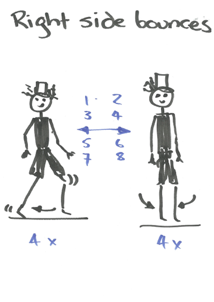
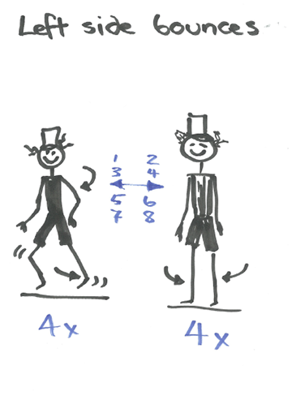
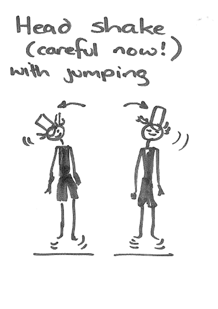
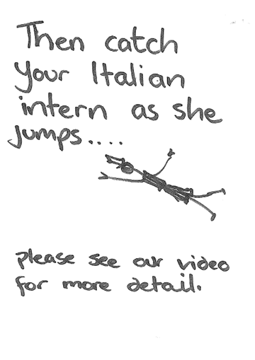

# Fabbercise

## The finest tradition

A fine tradition that began in the dawn of history. Many myths and legends surround the mysterious beginnings of this practice but the team at Fab Lab Wgtn believes that Frosti may have been the instigator of the original performance. Please, others, correct us if we are wrong. At every Fab gathering, we make our moves, guided by an international cast of talented fabbercise leaders. Selecting the ideal video and music is crucial, and challenging. We think we might have succeeded here. A tutorial and video are below.

### VIDEOS

* [FAB LAB Wgtn](https://vimeo.com/158287252)
* Your lab here (go on! take the challenge)

### Deceptacon by Le Tigre

*Watch it in full resolution*
[Youtube Link](https://www.youtube.com/watch?v=EU1CDSP7FRk)

### Tutorial
 

 

 

 

 

 

 

 

 

 

<iframe src="https://player.vimeo.com/video/158287252" width="640" height="360" frameborder="0" webkitallowfullscreen mozallowfullscreen allowfullscreen></iframe>

<a href="https://vimeo.com/158287252">2016 Fab Academy Fabbercise</a> from <a href="https://vimeo.com/user23516913">FabLabWellington</a> on <a href="https://vimeo.com">Vimeo</a>.

**Original tutorial by:**

* [Fab Lab Wellington](https://www.fablabwgtn.co.nz/)

Licensed under a [Commons Attribution 4.0 International License](http://creativecommons.org/licenses/by/4.0/)
