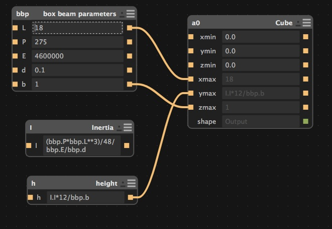

# Parametric Modeling of a Box Beam in Antimony

**Summary:**

Parametric design is paramount when designing items for individuals of different likes. The parametric process works like this. The designers sets the prime movers as inputs and writes functions to drive the end result. Once this is complete anyone can change the values of the prime movers to change the outcome of the item.

### Introduction
This tutorial’s prime motivation is to show a simple example of parametric design. The below example is a simply supported beam with a concentrated load in the center of the beam. You can read more about the analysis [HERE](http://www.efunda.com/formulae/solid_mechanics/beams/casestudy_display.cfm?case=simple_centerload). The height is parametrized given the function below. The reason why the height is parametrized for the example is it is the most important value when trying to figure out the beam’s configuration. Furthermore, this is an simple example, you can parametrize other values as well, but this is outside the scope of this example.

Antimony allows the designer to use parametric design easily.

### Prime Movers

Creatre a Script and replace what is in there with the below script. The variables are the input of the beam. Also, rename to bbp

      from fab import shapes
      title('box beam parameters')

      input('L',float) # span of the beam in inches
      input('P',float) # Force applied to beam in lbf
      input('E',float) # Modulus of Elasticity in lbf/in^2
      input('d',float) # deflection in inches
      input('b',float) # base of the beam in inches

Set your parameters to these inputs

**Function One - Area Moment of Inertia**

    from fab import shapes

    title('Inertia')
    input('I',float) # Area Moment of Inertia

The area moment of inertia for a box beam is

    I = (bh^3)/12

        b is the base of the beam
        h is this heigh of the beam

Rearrange the equation to look like this:

      h = (12*b*I)^(1/3)

**Function Two - Rearranged Deflection Equation**

    from fab import shapes
    title('height')
    input('h',float) # height of the beam in inches

The deflection equation for this particular simply supported beam and center force concentration is:

    d = (P*L^3)/(48*E*I)

Solve for I:

    I = (P*L^3)/(48*E*d)

Now connect the box beam parameters shown below:

Congratulations you made a parametric model using geometric and material input. You can change the length, force, elasticity, deflection and the base. These inputs drive the height geometry of the beam.

  **Original tutorial by:**

  * [Terence J Fagan - tjfagan (at) creatrex.com ](http://www.kaziunas.com/site/404.php)

  Licensed under a [Creative Commons Attribution-NonCommercial-ShareAlike 3.0](https://creativecommons.org/licenses/by-nc-sa/3.0/) Unported License
