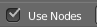
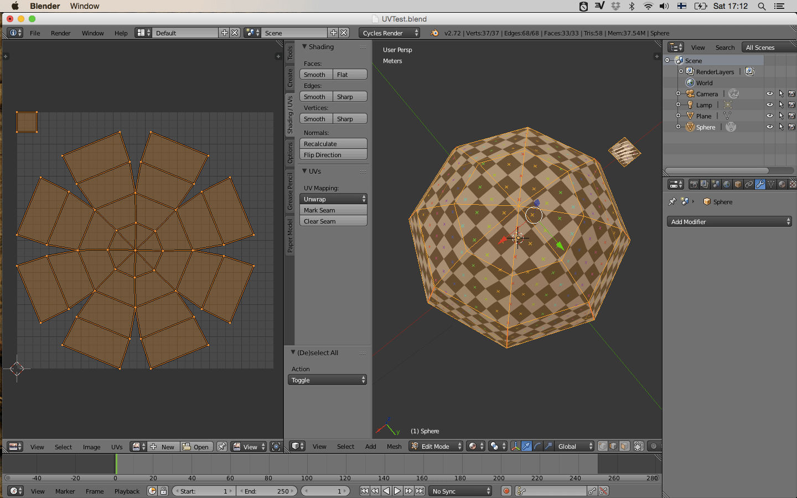

# UV MAPPING IN BLENDER

We can use UV mapping to unroll a 3D surface to a 2D plane. Apart for applying textures to your model we can use the UV´s to cut fabric for our composites.

## SET UP

We will apply a checker pattern to our model as a visual reference. This helps us to verify that the proportions and resolution is the same on all UV’s.

First change render mode from Blender Render to **Cycles Render**

Add material to your mesh. Under surface make sure it is a Diffuse BSDF

We want to creat a temporary unwrap so we can see the generated texture we are about to apply.

 Select your mesh,

<ul>**TAB **to enter edit mode,
**a ** to select all  
**u **and select unwrap .</ul>

Drag out a new work window by click and drag on the diagonal stripes in the Bottom left corner and change it to UV/Image Editor

> To close a workspace click and drag on the same diagonal stripes, Depending on what direction you drag the window you see an arrow indicating what workspace will collapse.

In UV editor create a new image. **Image/new image (ALT N), **name it and choose Generate Type UV Grid.

Change To Node Editor

Check Use Nodes to display selected mesh nodes. You might have to enlarge the UV window to see it. (Make sure your mesh is selected)

Next we want to add the texture we just created. **Add/Texture/ImageTexture** and select your newly created UV image

Connect Image texture color to Diffuse BSDF Color

Change display objects to material

You are now ready to start unwrapping using the checker pattern as reference

* * *

## WORKFLOW

Before working with the UV´s it is a good habit to reset/freeze your transformations. Go **Object /Apply/Rotate & Scale.**

<ul>

**TAB** to enter edit mode
**CTRL TAB** and select edges

</ul>

Now you can start to select you seams. Think of it as cutting fabric for a shirt. You can select your seams by clicking or use option keys to speed up the process:

> **CTRL CLICK** goes point to point
> **SHIFT CLICK** select or deselect individual edge
> **ALT CLICK** select an edge loop

**CTRL E ** to mark you selected edges as seam (or select it in Shading UV Tab click mark Seam)

When done or want to se your result so far:

<ul>**a** to select all
**u** to unwrap  (or from the Shading UV Tab )</ul>> Options tab  or in UV menu select **live unwrap**
>
>   This keeps UV and editmode mesh in sync while working.

## UV EDITOR WORKFLOW

If you got several pieces you can manipulate them with your standard Blender short cuts.

**a** select all
**g** to move everything
**b** to box select
**r** rotate
**s** scale
**l** select element (hover over piece, not if keep UV and editmode mesh in sync)

But the most useful option in our case is Pack Islands:
**UVs/Pack Islands**  places all the UV within the workspace while keeping the proportion and proportional scale relative to each other.

## EXPORT UV MAP

When you are happy with your seams and UV layout:

<ul>**a ** to select all

go **UV/ Export UV Layout**</ul>

## IMAGE TRACING AND SCALE

Now the UV are proportional right but not in the right scale. When doing a Pack Islands Blender will scale the UV to get maximum resolution. To make sure you get the right scale for your cut file I add a 1cm x 1cm plan in my model as a reference.

For the image trace it works best if the image is a solid color and ndt just lines. Easiest way to do this is in your image editing software select the transparency, invert selection and do a fill. Now tracing the image is a breaze.

> **MORE INTERFACE SHORTCUTS**
> **n** toggel properties panel
> **t** toggle tools pannel

