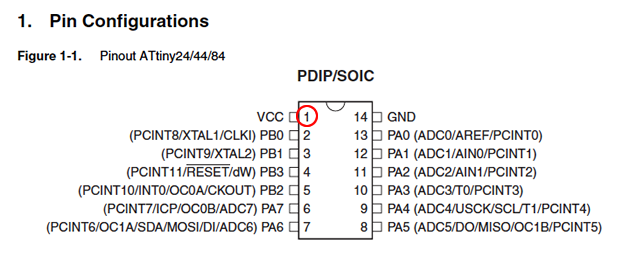

# FabISP Production and programming

### Guide for cutting, assembling and programming your first FabISP

**Summary**

* What is the FabISP?
* Genealogy
* Download the Board Files and Mill the Board
* Components
* "Smoke Test"
* Troubleshooting  Short Circuits

* Install Necessary Software for AVR Programming
* Power the FabISP Board
* Edit the Makefile
* Program the FabISP (All OS)
* After You Have Programmed the Board

## What is the FabISP?

The FabISP is an in-system programmer for AVR microcontrollers, designed  for production within a FabLab.  It allows you to program the  microcontrollers on other boards you make.

The [Electronics Production](http://academy.cba.mit.edu/classes/electronics_production/index.html) assignment is to mill the board, stuff it with components and program it. We will be using these programmers through the semester to program the other boards we create.

* This one uses a mini Usb connector to make durable

## Genealogy

The geneology of the FabISP design is interesting in its own right; Neil's [FabISP](http://academy.cba.mit.edu/classes/electronics_production/index.html) is based on David Mellis's [FabISP](http://fab.cba.mit.edu/content/projects/fabisp/) which is based on Limor's [USBTinyISP](http://www.ladyada.net/make/usbtinyisp/index.html) which is based on Dick Streefland's [USBTiny](http://dicks.home.xs4all.nl/avr/usbtiny/).

## Download the Board Files and Mill the Board

](http://academy.cba.mit.edu/classes/embedded_programming/hello.ISP.44.traces.png)

#### Circuit Board Traces

*   [Download the traces png.](http://academy.cba.mit.edu/classes/embedded_programming/hello.ISP.44.traces.png)
*   Mill using the fab modules and a 1/64" bit.

#### Board Outline

*   [Download the outline png.](http://academy.cba.mit.edu/classes/embedded_programming/hello.ISP.44.interior.png)
*   Mill using the fab modules and a 1/32" bit.

### Milled FabISP Board

#### Stuff Board

[Download the FabISP labeled board diagram ](http://academy.cba.mit.edu/classes/embedded_programming/hello.ISP.44.png)so that you can see what components you need to and where to place them on the board.

Solder the components to the board using a soldering iron and solder (or solder paste and then baking.)

## Components

##### These are the all the parts you need to build the board.

*   1 ATTiny 44 microcontroller
*   1 Capacitor 1uF
*   2 Capacitor 10 pF
*   2 Resistor 100 ohm
*   1 Resistor 499 ohm
*   1 Resistor 1K ohm
*   1 Resistor 10K
*   one 6 pin header
*   1 USB connector
*   2 jumpers - 0 ohm resistors
*   1 Crystal 20MHz
*   two Zener Diode 3.3 V
*   one usb mini cable
*   one ribbon cable
*   two 6 pin connectors

##### Mini USB Header

*   Solder the mini USB header first.
>This is the most difficult part and if you are going to destroy the board, you are going to do it here.
*   J2 USB is the mini USB header
*   Solder with a blob, then wick solder away with desoldering braid.

##### Microcontroller

*   Solder the microcontroller second.
*   "IC1 t44" in the diagram is an attiny44a chip.
*   *There is a little circle on the chip that should be facing to the top left* if your board is oriented in the same direction [as Neil's diagram.](http://academy.cba.mit.edu/classes/embedded_programming/hello.ISP.44.png)
*   I have marked the circle on the pinout diagram below
*   [Here is the  datasheet for the attiny44.](http://www.google.com/url?sa=t&rct=j&q=&esrc=s&source=web&cd=1&ved=0CCIQFjAA&url=http%3A//www.atmel.com/dyn/resources/prod_documents/doc8006.pdf&ei=--46T52mCYe62wWv0ZCtCg&usg=AFQjCNGOlt6q-mlk4OSX5vtxbZr9Pc7RMw)

##### Crystal

*   Marked as "20 MHz" on board diagram.
*   Tin the pads first, then place the component on top.
*   Hold component down with tweezers, the reflow solder at either end.

>NOTE:  crystals do not have polarity,  orientation does not matter.

##### Diodes *(warning)*

*   Diodes have polarity the "C" or cathode end is marked with **a tiny line**.
*   Place the side with the line on it over the "C" side pad in the diagram.
*   You may need a magnifing glass.

>NOTE: it is helpful to solder the 1K resistor first, otherwise it is hard to get to after you have soldered the diodes.

##### Resistors

*   Components marked with an "R" (R1, R2, etc) are resistors.
*   Here is a handy SMD (surface mount) [resistor code calculator.](http://www.hobby-hour.com/electronics/smdcalc.html)

>NOTE:  resistors do not have polarity,  orientation does not matter.

Diagram-----Component Value-----Part

* R1-----1 K ohm -----1001
* R2-----499 ohm -----4990
* R3-----100 ohm -----1000
* R4-----100 ohm -----1000
* R5-----10k ohm -----1002

##### Capacitors

*   Components marked with a "C" (C1, C2, etc) are capacitors.
*   Capacitors are not marked, be careful not to mix them up.
>NOTE:  capacitors do not have polarity,  orientation does not matter.

Diagram-----Component Value-----Part
* C1-----1 uf -----
* C2-----10 pf -----
* C3-----10 pf -----

##### Jumpers

*   The components marked SJ1 and SJ2 are solder jumpers.
*   SJ1 can be bridged with solder.
*   Put a 0 ohm resistor over SJ2  on this board

##### 6 pin programming header

*   The components marked J1 ISP is the 6 pin programming header.
*   Orientation does not matter.

## 

## "Smoke Test"

Plug the FabISP into your computer via the mini USB cable.

*   If you get an error message from your computer that the board is drawing too much power and that the computer is shutting down the USB port.

>You have a short somewhere on your board. See (Troubleshooting Short Circuits).

If you do not recieve any messages, proceed to "Install the necessary software for AVR programming."

### Troubleshooting  Short Circuits

1.  First, do a visual inspection of the board and reflow any solder joints that look cold (not shiny and smooth).

2.  Then, get out your multimeter and check all the connections to make sure that:

                - power and ground are not connected

                - there is not a short on the power line.
3.  **Common problem areas on the FabISP are:**

                - the pins on the 6-pin programming header are connected to each other.

                - the tiny pins on the front of the mini USB header are connected to each other.

                - none of these pins should be connected.

                -
                use your meter to determine which pins are connected.

                -
                use flux and desoldering braid to remove the excess solder and disconnect the pins.

# FabISP: Programming

1.  [ To program the FabISP, you first need to install the necessary software for your operating system and download the firmware. ](#install)
2.  [Then you edit the Makefile ](#edit_makefile)
3.  [Set the fuses / program the board](#program)
4.  [Verify that the board is working properly](#verify)
5.  [Then you need to open up the jumpers to make it a programmer. ](#open)

## Install Necessary Software for AVR Programming:

For the electronics units in the Fab Academy, you will need:

1.  Avrdude (for programming AVR microcontrollers)
2.  GCC (to compile  C code)

##### Jump to the instructions for your Operating System:

*   [Ubuntu](#ubuntu)
*   [Mac OS](#mac)
*   [Windows](#windows)

### Ubuntu Software Install

##### Get and install avrdude / GCC software and dependencies:

Open Terminal and type:

        sudo apt-get install flex byacc bison gcc libusb-dev avrdude   

Then type:

      sudo apt-get install gcc-avr

_- type "y" when asked to do so by your system_

Then type:

      sudo apt-get install avr-libc

Then type (may already be installed):

      sudo apt-get install libc6-dev

##### Download and Unzip the Firmware:

Move to the desktop

    cd ~/Desktop  

Download the firmware from the Fab Academy Electronics Production page.

    wget http://academy.cba.mit.edu/classes/embedded_programming/firmware.zip

Unzip the firmware

    unzip firmware.zip

### Mac OS Software Install

##### Get and install avrdude / GCC software and dependencies:

1.  [**Download and Install Crosspack AVR**](http://www.obdev.at/products/crosspack/index.html) - Has an installer.
2.  **Get Make (via XCode):**
    *   If you are running Lion or higher - you can [download XCode from the Apple App store. ](http://itunes.apple.com/us/app/xcode/id497799835?ls=1&mt=12)
    *   If you are running a pre-Lion OSX - Get the install disks that came with your mac and install the developer tools.

Download the firmware (right click on the link below and save it to your desktop):

[FabISP Firmware](https://github.com/Academany/FabAcademany-Resources/blob/master/files/firmware_44.zip) (right click save as)

Open terminal navigate to the desktop:

      cd ~/Desktop/

Unzip the firmware.zip directory (the directory will be "firmware.zip" if you downloaded the earlier version):

      unzip fabISP_mac.0.8.2_firmware.zip

Move into the newly created firmware directory on your desktop

      cd ~/Desktop/firmware

### Windows Software / Drivers Install

##### Get and install avrdude / GCC software and dependencies and drivers:

1.  **Warning, WinAVR is abandoned.**
    *Installing it can destroy your systems path variable!*
                  You can use the installer, but before you start, [take note of your current system path.](https://stackoverflow.com/questions/559816/how-to-export-and-import-environment-variables-in-windowse-g-xp)
3.  [**Download and Install WinAVR**](http://winavr.sourceforge.net/download.html) - Has a (broken) installer.

                  - Here is a [step-by-step set of instructions](http://www.ladyada.net/learn/avr/setup-win.html)
4.  After installing check your systems path variable, if it only contains the path to the winavr installation:
    *   copy those values
    *   restore your old path
    *   add the windavr path back to it
    *   close any commandprompt window you may have open
5.  [Download the drivers for your version of Windows](https://learn.adafruit.com/usbtinyisp/drivers)
6.  [Download the FabISP Firmware](http://academy.cba.mit.edu/classes/embedded_programming/firmware.zip)
7.  Plug in another FabISP or USBtiny programmer.
8.  Install the drivers:

Go to the Start menu -> Control Panel -> Device Manager (or run "mmc devmgmt.msc")
  *   Locate "FabISP" under "Other Devices"
  *   Right click on the "FabISP"
  *   Select "Update Driver Software.."
  *   Select "Browse my computer"
  *   Navigate to the drivers folder you downloaded at step 4 and click on the folder.
  *   Hit "ok" to install the drivers for the USBtiny / FabISP

## Power the FabISP Board

**The board needs power**:

*   Make sure that the mini USB connector for the FabISP you are trying to program is plugged into your computer.
*   **AND** that a separate pogramer is plugged in to the 6-pin programming header. (this could be another working FabISP or the ATAVRISP2, a USBtiny, an AVR Dragon, etc.)

**Shown with a USBtiny programmer **

If you are using the [ATAVRISP2 programmer](http://search.digikey.com/scripts/DkSearch/dksus.dll?lang=en&site=US&KeyWords=avrisp2&x=0&y=0), you can skip step 7, you do not need to edit the Makefile, it is already set up to work with the [ATAVRISP2](http://search.digikey.com/scripts/DkSearch/dksus.dll?lang=en&site=US&KeyWords=avrisp2&x=0&y=0) If you are using another programmer you will need to edit the Makefile.

**Helpful ATAVRISP2 Programmer Light Indicator Messages**

        If you are using the ATAVRISP2 programmer only. If you connect the programmer to the 6-pin programming header on your FabISP board and you get:
*   **Green Light: **means that the header is soldered correctly, the board is getting power.
*   **Yellow Light:** means that the board is getting power, but most likely the 6-pin programming header is not soldered correctly (re-flow your solder joints / check for cold joints, check for shorts).
*   **Red Light:** means that the board is not getting power - check for shorts.

## Edit the Makefile

        The Makefile is in the firmware directory that you downloaded. The Makefile is set up to work with the AVRISP2 by default. If you are using another programmer, you will need to edit the Makefile. 

### Ubuntu:
        nano Makefile
### Mac:

Open the Makefile with TextEdit.

### Windows:

Open the Makefile with [Notepad++](http://notepad-plus-plus.org/.).

### Make Changes - All OS:

A window will open containing the Makefile.  Go to the line that says:

          #AVRDUDE = avrdude -c usbtiny -p $(DEVICE) # edit this line for your programmer

          AVRDUDE = avrdude -c avrisp2 -P usb -p $(DEVICE) # edit this line for your programmer

  - If using the USBtiny programmer or another FabISP

  - Remove the "#" in front of the line with "usbtiny" in it

  - Add a "#" to beginning the line with the "avrisp2" in it to comment it out.

  - save the Makefile

## </a>Program the FabISP (All OS):

Navigate to the directory where you saved the FabISP firmware. If you followed the instructions above, this will be the desktop.

##### Open your terminal / command line interface and move to the firmware directory.

**Ubuntu / Windows type:**

      cd Desktop/firmware

**For Mac users who downloaded the modified firmware:**

      cd Desktop/fabISP_mac.0.8.2_firmware

##### Next you need to compile the firmware.

Type:

      make clean    
If you are successful - you will see this response from the system:

    akaziuna@Titan:~/Desktop/firmware$ make clean
      rm -f main.hex main.lst main.obj main.cof main.list main.map main.eep.hex
      main.elf *.o usbdrv/*.o main.s usbdrv/oddebug.s usbdrv/usbdrv.s

Type:

      make hex

If you are successful - you will see this response from the system:

      akaziuna@Titan:~/Desktop/firmware$ make hex
      avr-gcc -Wall -Os -DF_CPU=20000000	 -Iusbdrv -I.       -DDEBUG_LEVEL=0
      -mmcu=attiny44 -c usbdrv/usbdrv.c -o usbdrv/usbdrv.o
      avr-gcc -Wall -Os -DF_CPU=20000000	 -Iusbdrv -I.       -DDEBUG_LEVEL=0
      -mmcu=attiny44 -x assembler-with-cpp -c usbdrv/usbdrvasm.S -o usbdrv/usbdrvasm.o
      avr-gcc -Wall -Os -DF_CPU=20000000	 -Iusbdrv -I. -DDEBUG_LEVEL=0
      -mmcu=attiny44 -c usbdrv/oddebug.c -o usbdrv/oddebug.o
      avr-gcc -Wall -Os -DF_CPU=20000000	 -Iusbdrv -I. -DDEBUG_LEVEL=0
      -mmcu=attiny44 -c main.c -o main.o
      avr-gcc -Wall -Os -DF_CPU=20000000	 -Iusbdrv -I. -DDEBUG_LEVEL=0
      -mmcu=attiny44 -o main.elf usbdrv/usbdrv.o usbdrv/usbdrvasm.o usbdrv/oddebug.o
      main.o
      rm -f main.hex main.eep.hex
      avr-objcopy -j .text -j .data -O ihex main.elf main.hex
      avr-size main.hex
         text	   data	    bss	    dec	    hex	filename
            0	   2020	      0	   2020	    7e4	main.hex

##### Next, you need to set the fuses so your board will use the external clock (crystal)

Type:

      make fuse

**If you are successful - you will see the following response from the system:**

    akaziuna@Titan:~/Desktop/firmware$ sudo make fuse
    avrdude -c usbtiny -p attiny44  -U hfuse:w:0xDF:m -U lfuse:w:0xFF:m

    avrdude: AVR device initialized and ready to accept instructions

    Reading | ################################################## | 100% 0.01s

    avrdude: Device signature = 0x1e9207
    avrdude: reading input file "0xDF"
    avrdude: writing hfuse (1 bytes):

    Writing | ################################################## | 100% 0.00s

    avrdude: 1 bytes of hfuse written
    avrdude: verifying hfuse memory against 0xDF:
    avrdude: load data hfuse data from input file 0xDF:
    avrdude: input file 0xDF contains 1 bytes
    avrdude: reading on-chip hfuse data:

    Reading | ################################################## | 100% 0.00s

    avrdude: verifying ...
    avrdude: 1 bytes of hfuse verified
    avrdude: reading input file "0xFF"
    avrdude: writing lfuse (1 bytes):

    Writing | ################################################## | 100% 0.01s

    avrdude: 1 bytes of lfuse written
    avrdude: verifying lfuse memory against 0xFF:
    avrdude: load data lfuse data from input file 0xFF:
    avrdude: input file 0xFF contains 1 bytes
    avrdude: reading on-chip lfuse data:

    Reading | ################################################## | 100% 0.00s

    avrdude: verifying ...
    avrdude: 1 bytes of lfuse verified

    avrdude: safemode: Fuses OK

    avrdude done.  Thank you.

##### Next you want to program the board to be an ISP.

Then type:

    make program

If you are successful - you will see the following response from the system.

    akaziuna@Titan:~/Desktop/firmware$ sudo make program
    [sudo] password for akaziuna:
    avrdude -c usbtiny -p attiny44  -U flash:w:main.hex:i

        avrdude: AVR device initialized and ready to accept instructions

    Reading | ################################################## | 100% 0.01s

    avrdude: Device signature = 0x1e9207
    avrdude: NOTE: FLASH memory has been specified, an erase cycle will be performed
     To disable this feature, specify the -D option.
    avrdude: erasing chip
    avrdude: reading input file "main.hex"
    avrdude: writing flash (2020 bytes):

    Writing | ################################################## | 100% 5.68s

    avrdude: 2020 bytes of flash written
    avrdude: verifying flash memory against main.hex:
    avrdude: load data flash data from input file main.hex:
    avrdude: input file main.hex contains 2020 bytes
    avrdude: reading on-chip flash data:

    Reading | ################################################## | 100% 3.36s

    avrdude: verifying ...
    avrdude: 2020 bytes of flash verified

    avrdude: safemode: Fuses OK

    avrdude done.  Thank you.

    avrdude -c usbtiny -p attiny44  -U hfuse:w:0xDF:m -U lfuse:w:0xFF:m

    avrdude: AVR device initialized and ready to accept instructions

    Reading | ################################################## | 100% 0.01s

    avrdude: Device signature = 0x1e9207
    avrdude: reading input file "0xDF"
    avrdude: writing hfuse (1 bytes):

    Writing | ################################################## | 100% 0.00s

    avrdude: 1 bytes of hfuse written
    avrdude: verifying hfuse memory against 0xDF:
    avrdude: load data hfuse data from input file 0xDF:
    avrdude: input file 0xDF contains 1 bytes
        avrdude: reading on-chip hfuse data:

    Reading | ################################################## | 100% 0.00s

    avrdude: verifying ...
    avrdude: 1 bytes of hfuse verified
    avrdude: reading input file "0xFF"avrdude: writing lfuse (1 bytes):

    Writing | ################################################## | 100% 0.00s

    avrdude: 1 bytes of lfuse written
    avrdude: verifying lfuse memory against 0xFF:
    avrdude: load data lfuse data from input file 0xFF:
    avrdude: input file 0xFF contains 1 bytes
    avrdude: reading on-chip lfuse data:

    Reading | ################################################## | 100% 0.00s

    avrdude: verifying ...
    avrdude: 1 bytes of lfuse verified

    avrdude: safemode: Fuses OK

    avrdude done.  Thank you.

### Wooo! Success you are the best!

### Errors

*   If you get errors - read the errors and follow instructions.
*   If avrdude cannot connect to your board's microcontroller - you should follow the "[Troubleshooting Short Circuits](#troubleshooting)" instructions and ask your instructor for help.

### To Verify That Your ISP is working correctly:

### **Ubuntu 11.10:**

Type:

      lsusb

If your FabISP has been successfully programmed, you should see a list of the USB devices plugged into your computer. The FabISP will be listed in a line like the following:

      Bus 002 Device 004: ID 1781:0c9f Multiple Vendors USBtiny

* Note: Ubuntu 10.10 lists the device as something like:

      Bus 002 Device 004: ID 1781:0c9f Multiple Vendors

### Mac:

Go to the System Profiler > Hardware > USB > Hub:**         
 Step - By - Step: **

1.  Click  the "apple" menu in your main toolbar
2.  Select "about this mac"
3.  Select "more info"
4.  Under the "Contents" menu in the left hand navigation

                - Click "Hardware" to expand the hardware menu (if not already expanded)

                - Click "USB"

                - Under the "USB Device Tree"

                - Click "Hub" to expand the hub menu (if not already expanded)

                - "FabISP" should be listed in the hub menu
5.  Your FabISP device has been successfully programmed and is recognized by your computer.

### Windows:

Go to the Start Menu > Hardware and Sound. The FabISP should be listed.

## After You Have Programmed the Board

* Remove the solder bridge as shown in the picture below. Now you can use it as a programmer to program other boards.

* You have to remove the 0 ohm resistor if you want to program target boards that don't use 5v voltage.
>Removing that resistor you will not supply power to the target board,so you will have to power it with another power supply.

**Original tutorial by:**

* All content © 2013 [Anna Kaziunas France ](http://www.kaziunas.com/site/bio.html)(except where otherwise noted) Some rights reserved.

* Remixed/Updated by [Eduardo Chamorro](http://eduardochamorro.github.io/beansreels/index.html), Fab Lab Seoul 01.2017

Licensed under a [Creative Commons Attribution-NonCommercial-ShareAlike 3.0 Unported License](http://creativecommons.org/licenses/by-nc-sa/3.0/)
