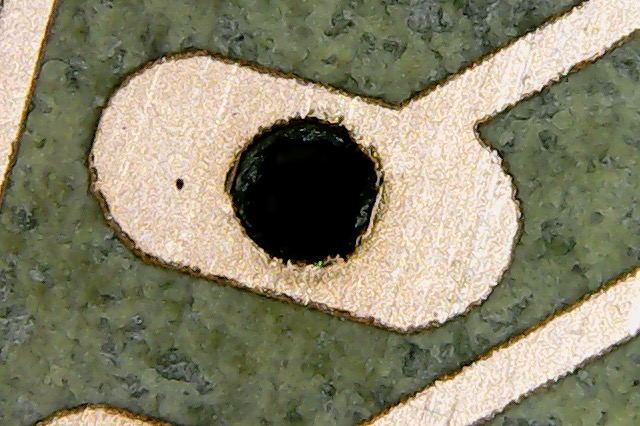
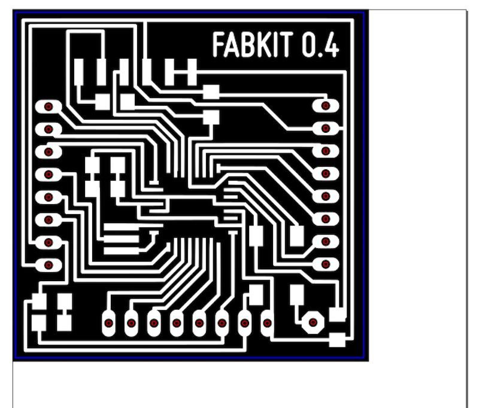
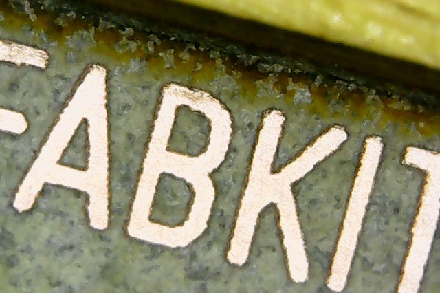
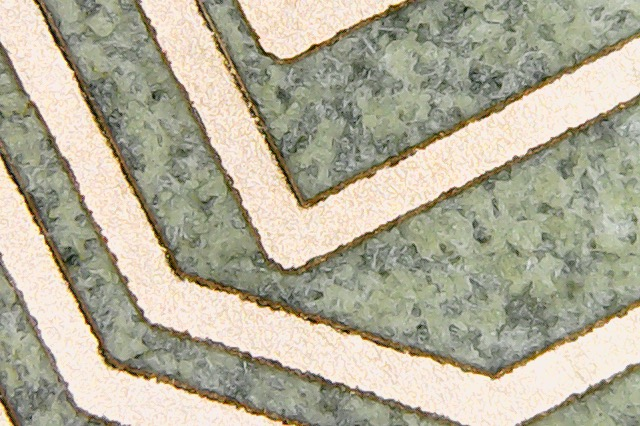
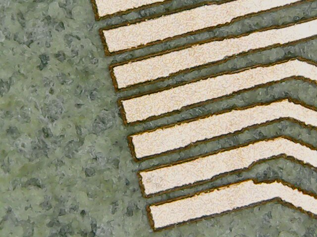
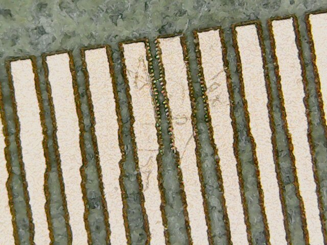
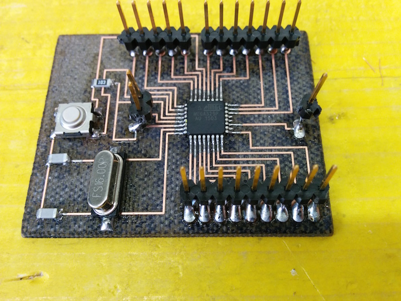

# Laser Cutting a PCB with a CO2 / Fiber Trotec laser cutter

The fiber laser enables us to engrave the copper layer of the FR1, and once it has been removed, we can cut the board with the CO2 laser.

**Summary:**

* Introduction
* 01.Experimentation process
* 02.Optimal Settings
* 03.Printing process
* 04.Results
* 05.Precision
* 06.FR4

## Introduction

For the Fab Academy 2015, at [Opendot](http://www.fabacademy.org/archives/2015/eu/labs/milan_od/index.html) in Milan, we have a new laser cutting machine, a [Trotec Speedy 100 flexx](http://www.troteclaser.com/en-US/Laser-Machines/Compact/Pages/Speedy-100-flexx.aspx). The _flexx_ line of laser cutters has both [CO2](http://en.wikipedia.org/wiki/Carbon_dioxide_laser) and [fiber](http://en.wikipedia.org/wiki/Fiber_laser) laser technologies: 60 watt CO2 laser, 30 watt fiber laser.

<iframe src="https://www.youtube.com/embed/WzmuVM-uKcg" allowfullscreen="" width="800" height="480" frameborder="0"></iframe>

## 01 Experimentation process

The first experimentations were done by [Enrico Bassi](http://www.fabacademy.org/archives/2015/eu/students/bassi.enrico/exercise04.html) who is the lab manager at Opendot. Enrico worked experimenting the basic settings for engraving the copper and the first tests for cutting the board. Using an [USB microscope](http://www.amazon.com/Plugable-Handheld-Digital-Microscope-Magnification/dp/B00AFH3IN4/) brought by another student, [Simone Boasso](http://www.fabacademy.org/archives/2015/eu/students/boasso.simone/index.html), he was also able to see that we need to engrave the FR1 with a resolution of 1000 dpi, otherwise the traces will have rough borders: see the picture below taken by Enrico:

Later, Simone and two other students, [Daniele Ingrassia](http://www.fabacademy.org/archives/2015/eu/students/ingrassia.daniele/index.html) and [Mattia Ciurnelli](http://www.fabacademy.org/archives/2015/eu/students/ciurnelli.mattia/index.html), improved the settings for the engraving and the cutting. The USB microscope proved a very cheap, useful and popular tool for checking the quality of the fabricated objects.

Meanwhile, I worked on experimenting the settings for cutting successfully the holes in the FR1, which proved quite difficult to achieve: if the size of the holes and the settings for cutting are not tested well, the traces tend to break away (see the picture):

This happens when the holes are lasered on top or too close to the traces. As you can seen in the next picture, even with better settings you can get damaged holes:

With more experimentation, this is the best I managed to achieve:

## 02 Optimal Settings

After a lot of collaborative experimentation, we ended up with these settings that seems the best at the moment:

The **black color** is used for the first pass, and it is needed for engraving the copper away (otherwise we cannot cut the FR1 board). These are the settings:

1.  Type: fiber laser.
2.  Power: 80.00.
3.  Speed: 20.00.
4.  PPI/Hz: 20000.
5.  Passes: 9.
6.  Advanced:
    1.  Correction: 10.
    2.  High quality: yes.
    3.  Raster correction: yes.

The **red color** is used for the second pass, for cutting the holes in the FR1 board. These are the settings:

1.  Type: CO2.
3.  Power: 50.00.
4.  Speed: 0.60.
5.  PPI/Hz: 5000.
6.  Passes: 3.
7.  Advanced: Default

The **blue color** is used for the third pass, for cutting the border in the FR1 board. These are the settings:

1.  Type: CO2.
3.  Power: 80.00.
4.  Speed: 0.60.
5.  PPI/Hz: 5000.
6.  Passes: 2.
7.  Advanced: Default

## 03 Printing process

It's very simple: we print from [Inkscape](https://inkscape.org/en/). But you need the **version 0.91** or above (the latest version at the time of writing this page), because in the previous versions the software converts everything to raster when printing. From 0.91 onwards, vectors are preserved when printing. This is important because **we need vectors for cutting the board**. I suggest you this process:

1.  **Export a monochrome .png of the PCB from Eagle** (I've worked with a 2000 dpi resolution just to be sure, but a lower resolution should work).
2.  **Import** the .png into Inkscape, and **convert it into a vector** with _Path > Trace Bitmap_. Default settings work perfectly.
3.  **Delete the .png inside the Inkscape file**: the black and white vector drawing will be engraved at the highest resolution and you can also edit it as a vector (actually, the black part will be engraved).
4.  In another layer, **create the holes** in pure RGB red color as circles. The width of the stroke style is not important, just keep it low as a visual reference. The size of the **diameter must be 0.55 mm** (with a bigger size, the traces will be damaged because of the kerf: the laser will engrave on top of the traces as well). The circle must be on top of a black area, i.e. an area that was already engraved and therefore there is no copper (otherwise we cannot cut the FR1 board).
6.  In another layer, **create the border** in a pure RGB blue color. Here again the width of the stroke style is not important. Here as well, the vector must be on top of a black area, i.e. an area that was already engraved and therefore there is no copper (otherwise we cannot cut the FR1 board).
8.  Print it at **1000 dpi**.
9.  **Wash** the board with water.

For example, for [an improved version of the Fabkit](fabkit-0.4.html), you should get something like [this file](fabkit/fabkit-0.4-fiberlaser.svg) (please note: everything is aligned to the left top corner of the document, in order to be sure it will be lasered where the cursor of the laser cutter is positioned):

Another student, [Pierluigi De Palo](http://www.fabacademy.org/archives/2015/eu/students/de_palo.pierluigi/index.html), did a series of great timelapse videos of the process:

<iframe src="https://www.youtube.com/embed/HMdX2siVev0" allowfullscreen="" width="800" height="480" frameborder="0"></iframe>

Another student, [Saverio Silli](http://www.fabacademy.org/archives/2015/eu/students/silli.saverio/index.html), created this video of the process:

<iframe src="https://www.youtube.com/embed/pXH49ZWdGrA" allowfullscreen="" width="800" height="480" frameborder="0"></iframe>

## 04 Results

Here are some final results of what has been achieved with this machine. With a 1000 dpi resolution, text and details can be very nicely detailed. Check [all the exercises of the students at Opendot](http://www.fabacademy.org/archives/2015/eu/labs/milan_od/index.html) for a sample of what's possible with this process.

And the final board (a working one!):

Another example: the [amazing result](http://www.fabacademy.org/archives/2015/eu/students/silli.saverio/exercise07.html) obtained by Saverio:

## 05 Precision

Daniele did more experimentation on the size of the traces, and from his pictures you can see that the orientation of the traces counts. If the traces are horizontally aligned, the engraved traces are very smooth:

If the traces are not horizontally aligned (and too close), you can see the artifacts of the 1000 dpi resolution:

Even at such a high resolution, the artifacts can be potentially negative for the final board:

## 06 FR4

Daniele is also experimenting with FR4 boards: same settings, only more cut passes in order to be sure the board will be cut. Even [the documentation from Trotec](http://www.troteclaser.com/en-US/laser_systems/Documents/Product_range_email.pdf) says it's possible. See one example here:

**Original tutorial by:**

* Massimo Menichinelli - [info at openp2pdesign.org](mailto:info@openp2pdesign.org) - [massimo.menichinelli at aalto.fi](mailto:massimo.menichinelli@aalto.fi)

* Remixed/Updated by [Eduardo Chamorro](http://eduardochamorro.github.io/beansreels/index.html), Fab Lab Seoul 01.2017

This work is licensed under a [Creative Commons Attribution 4.0 International License](http://creativecommons.org/licenses/by/4.0/)
