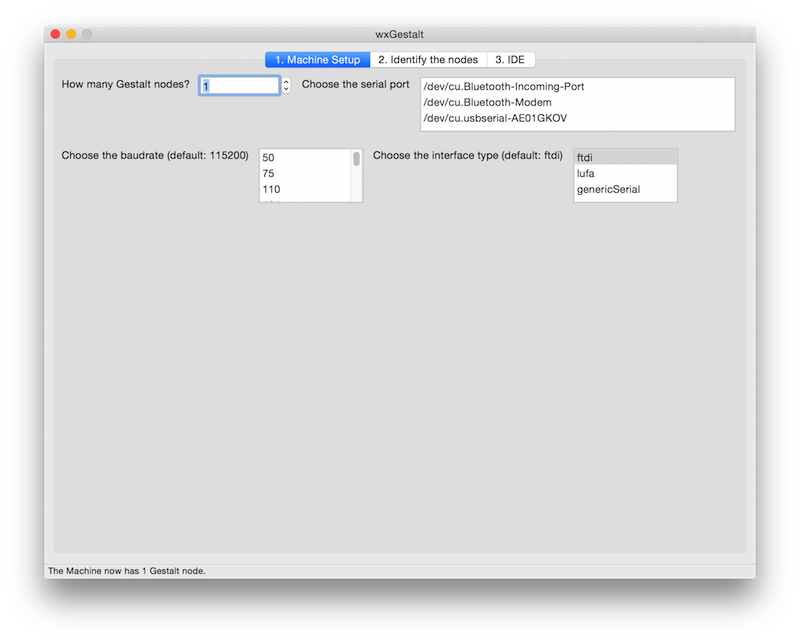

# wxGestalt

wxGestalt is a very, very simple IDE for controlling Gestalt nodes in Python. The IDE lets you (more easily) configure the machine, connect to it, and create a GUI for controlling it. It is very, very experimental, so if you experiment with it, please share your impressions as Issues on its [GitHub repository.](https://github.com/openp2pdesign/wxGestalt)

In order to develop it, I studied a bit the [Gestalt](https://github.com/imoyer/gestalt) library, so I extracted its basic documentation with [Sphinx](http://sphinx-doc.org/); it is available [here](gestalt-doc/index.html) if you want to know how it works. The library is very powerful, but it seems that for what we need to do in the Fab Academy [this example](https://github.com/imoyer/gestalt/tree/master/examples/machines/htmaa) has everything.

### Please note #01:

With Gestalt nodes you can create _**endless configurations**_, so the IDE will just make it easier for you to create your own script that controls the machine. It is impossible to create a "universal" app for the Gestalt... or it would take too much time at the moment. Furthermore, it should be part of your exercise to write code for it! :)

### Please note #02:

The code that you have to write in the IDE is [Python](http://openbookproject.net/thinkcs/python/english3e/) + [wxPython](http://www.wxpython.org/onlinedocs.php). You just have to write a wx.Panel object, see the template for an example.

### Please note #03:

Currently wxGestalt lets you add only 4 nodes. This can be easily modified in the GUI code of wxGestalt. If you need more nodes, let me know and I'll fix it.

## 01\. Install wxGestalt

Most likely wxGestalt won't have any packaged installer for a while. For the moment, you should jump in its development directly! wxGestalt uses at the moment Ilan Moyer's Gestalt, installed as a [Git submodule](https://git-scm.com/book/it/v2/Git-Tools-Submodules). So, you will have to install it in this way:

1.  _git clone https://github.com/openp2pdesign/wxGestalt.git_
2.  _cd wxGestalt_
3.  _git submodule update --init gestalt_

Git will then dowload the Gestalt library inside the wxGestalt folder. You then have to install the dependencies for wxGestalt:

*   [wxPython: check for your OS](http://wiki.wxpython.org/How%20to%20install%20wxPython)
*   _pip install PySerial_
*   _pip install unidecode_
*   _pip install jsonpickle_

## 01 How it works

There are many tabs in wxGestalt, **they are supposed to be used according to the number**, so let's start with the first tab. It is needed in order to configure the machine. At the moment it is very simple, but there are more settings under development:

In the second tab you can identify the nodes, as you would do in any of examples. It basically redirects the terminal to the screen. Click on the "Initialize the machine" button to launch the identification.

The third tab is the IDE: you can write the Python code that will control the machine. The IDE loads by default a template (see below), but you can open any Python file and save your script as a Python file. When you save the machine (File > Save the machine) the code will be embedded in the machine file, so you can reload in the future. The machine file is a JSON file, so if you want to edit your Python file in another IDE, you'd probably want to save the script as an external file and then load it. When you click on the "Launch the script", a new tab will be opened. That tab will be generated from your code!

## 02 Template

wxGestalt provides you a template file (in Python) for developing a wxPython panel that will control the machine. The file can be accessed [here](https://github.com/openp2pdesign/wxGestalt/blob/master/CAM/template.py) or [here](https://gist.github.com/openp2pdesign/a468f3fd2e5db8e2f78e).
## 03 moves

The moves data to be sent to machine is just a Python list, where each element is another list. The number of the elements inside this second list is determined by the number of nodes. See for example:

1.  **1 node: **_moves = [[10],[20],[10],[0]]_
2.  **2 nodes: **_moves = [[10,10],[20,20],[10,10],[0,0]]_
3.  **3 nodes: **_moves = [[10,10,10],[20,20,20],[10,10,10],[0,0,0]]_
4.  **4 nodes: **_moves = [[10,10,10,10],[20,20,20,20],[10,10,10,10],[0,0,0,0]]_

## 04 Repository

Clone, forks, pull requests, issues on [https://github.com/openp2pdesign/wxGestalt](https://github.com/openp2pdesign/wxGestalt)

**Original tutorial by:**

* Massimo Menichinelli - [info at openp2pdesign.org](mailto:info@openp2pdesign.org) - [massimo.menichinelli at aalto.fi](mailto:massimo.menichinelli@aalto.fi)

* Remixed to markdown by [Eduardo Chamorro](http://eduardochamorro.github.io/beansreels/index.html), Fab Lab Seoul 01.2017

This work is licensed under a [Creative Commons Attribution 4.0 International License](http://creativecommons.org/licenses/by/4.0/).
