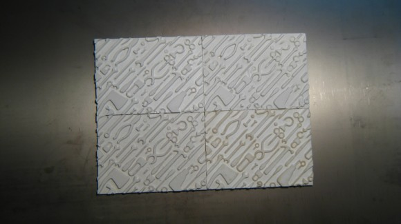
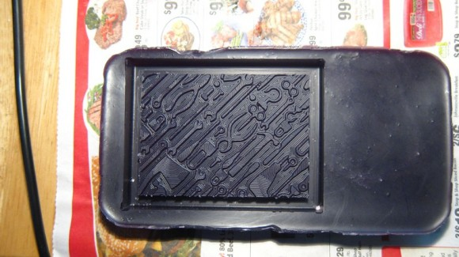
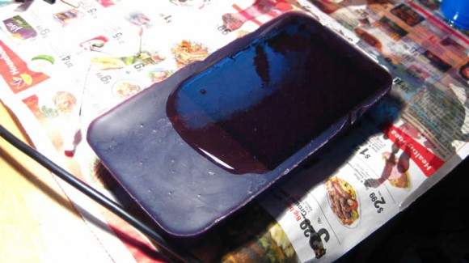
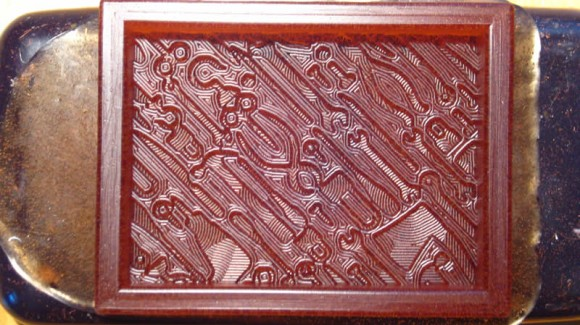
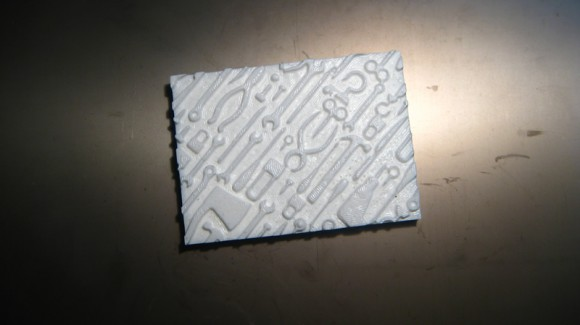
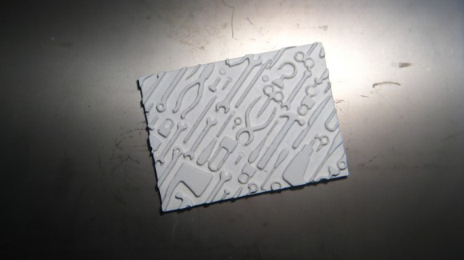

# Molding and Casting Tips / Using Fab Modules

## Short description from cutting your mold with a cnc to cast your design.

**Summary**

* Step 1. Create a Positive Mold Model
    * General Tips
    * 3D Models - STL Files
    * 2D Models - PNG Images

* Step 2: Mill the Wax on the Modella
  * Selecting the Appropiate Bit
  * Setting Up Wax for Milling
  * Bit Diameters in MIlimeters
  * General Fab Modules Workflow for Wax (General Setup / Steps)
  * Fab Modules Settings (Both Rough and Finishing Cuts)
  * Workflow for PNG to Modela
  * Workfow for STL to Modela

* Step 3: Make a Mold from the Wax
* Step 4: Cast Final Object
* Tips and Tricks

### Step 1 Create a Positive Mold Model

*Create a model of the final part you want to make. You can create a 2D or a 3D file as a starting point for your mold*

**General Tips**

* MAKE SURE YOU ACTUALLY DESIGN A POSITIVE MOLD!
* No Undercuts - the Modella / Shopbot plunges straight down.
* Flat bottom single sided molds will work best if you are casting in flexible silicone rubber (OOMOO), as the OOMOO tends to bow out at the sides.
* Make thick walls if using a two sided mold.

#### 2D Model (image) Molds

* To make a one-part 2-dimesional relief mold (the simplest thing to do for this assignment), you create a image in a drawing program (The Gimp, Photoshop, Inkscape).
* Your image must be grayscale.
* Create your image at a high resolution more than 500 dpi.
* You must save or export the file as a .png.
* The fab modules read colors the .png image as a depth.
    >Black = bottom of the part

    >White = top of the part

* You will define the height of the model and the bottom and the top settings for milling placement in the wax in the fab modules.
* Shades of Grey = somewhere in between the heights you define in the Fab Modules for black and white.
>For example 50% grey is halfway between black and white, if you set the bottom of your model as 3mm, then 50% grey = 1.5mm deep.

* We have experienced some resizing / changing from grayscale to color, etc when exporting PNGs.
* Make sure to open your file up in The Gimp to check resolution, color mode (grayscale) and image size before opening the image up in the Fab Modules.
>If you experience any errors or problems with double check your image. You may need to add a white border around the image as a last resort.

#### 3D Model Molds
If you create a 3D file, you need to decide if you want to make a 1 or a 2 part mold.

3D MODEL TIPS
>Your model must be exported as a binary .stl file. Make sure that the file extension is lowercase (.stl) NOT uppercase (.STL). The Fab Modules will not recognize an uppercase extension.

3D 1-PART MOLD

>* If you want to create a 1 part mold - design a 3D file with a flat back side.
* The flat back side can rest on the ground in the final cast.

3D 2-PART MOLD

>* You will need to make two models; one for each side of the mold.
* It is also possible to do more than 2 part molds, it just takes more design work and planning.
* Include registration keys / marks.
    Registration marks are used to fit the parts of the mold together - usually they're half-spheres / cylinders, where one side has the stub and the other has the indentation.
 Make sure to design a pour spout and sprues.
* Model each side separately and include registration marks, as well as a vent.
* Make it AS BIG AS POSSIBLE! It will make your life easier when you need to pour and then you can vent out of the same hole you pour in (you can make separate holes too if you need to).
* Place the vent on an axis of symmetry so that you don't also have to worry about lining up the vents when you make the molds.
* Place the vent at the top of the part! You don't want to vent out of the bottom of the part because then material will just pour out!
* Make sure there are no parts of the mold that will obstruct the path of the Hydrostone (or whatever material you are using) as you pour it into the mold - you want to be sure that you can completely fill the mold, which is harder if you have bits sticking up in the path of the HydroStone.

**EXAMPLES**
* [REPLICATING PARTS](http://fab.cba.mit.edu/classes/863.14/tutorials/MoldMaking/MoldingCasting.html)
* [CASTING METAL](http://fabacademy.org/archives/2015/as/students/wang.tse-kang/week09.html)
* [3D SCANNING TO MOLD](http://archive.fabacademy.org/archives/2016/fablabseoul/students/366/week13.html)
* [2D PART MOLD EXAMPLE](http://archive.fabacademy.org/archives/2016/fablabseoul/students/208/12.html)

### Step 2: Mill the Wax on the Modela
#### Selecting The Appropate Bit

In the computer model / file you created, use a measuring tool (or estimate) the spacing between the parts or detail where you want the bit to pass through.

You need to make sure that the bit is small enough to cut out the detail in your model. You can preview the toolpath in the Fab Modules before you cut it.
Blue lines are the cutting parts and red "movements in the air"

Also pay attention to the depth of your model:
* Smaller diameter bits have shorter cutting depths and are easier to break.
* Larger diameter bits (1/8") - standard size used in the fab modules - has a longer shank and can reach deeper into the wax.

> For curvy models - use ballnose bits

> For mostly flat parts / straight angles - use endmill bits

#### Setting up your wax for milling
Secure your wax to the Modela

* Use double sided tape to adhere your wax to the Modela platform.
* Sometimes Double sided tape is not enough by itself!
* Use hot glue along the sides to improve adhesion.

#### General Fab Modules Workflow for Wax (General Setup / Steps)

* Open the Fab Modules.
    Choose the appropiate file type:

        If you are using a PNG: select PNG to Roland Modela
        fab modules opened

        if you are using a STL: select STL to Roland Modela
        stl to roland
* Insert the appropiate bit into the Modela. The default size is 1/8".
* Position the bit onto the wax using the "move to xmin, ymin" button (just like we did for milling circuit boards.)
>Depends on your machine you may have to do it in your machine control panel

* Zero out your Z axis to the top of the wax. Stop when a few shavings of wax come up.

* Calculate and run your rough cut.

**DO NOT turn the machine off and on between cuts!**

* Set up the finishing toolpath
* Calculate and run the finishing toolpath.
* Remove the wax from the machine.

#### Glossary

- Diameter

    The diameter of your tool in milimeters.
    If you are using a different size bit, make sure to change this value to match your bit diameter in milimeters.
- Overlap

    How closely the toolpaths overlap each other
- Speed

  How fast the machine moves.
  This setting is under "Maker RML"
  Make sure to crank it up to 20.
  The default is 20 for both rough and finish cuts if using a STL.

- Top height

  - This setting tells the Modela where to begin milling your material.
  - The default setting is: 0 for both rough and finish cuts
  - Starting at zero will begin milling your model at the very top of the wax, where you zeroed the Z axis.

- Bottom height
  - This must be a negative value or you will get an error.
  - STL: If you are using a .stl file - this setting should be the height of the model in milimeters.
        >For example: if the height of your stl model is 31.75, you enter -31.75 into the z bottom field. This "should" come up by default when you import your model, but double check it.

  - PNG: If you are using an image (.png file) set the z bottom to how deep you want the bottom of the object to be.

- Cut depth
  - This setting determines how deep each individual cutting pass will be.
  - You can make this smaller (for a finer cut) or bigger (for a rougher cut), depending on your model.
    The finer the cut, the longer it will take to mill the model.

- Path

  - This tells the Fab Modlules which plane to use to create the toolpaths for milling.
  - You only need to change this if you modeled a 3D object on a different plane

#### Workflow for PNG to ModelaWorkflow for PNG to Modela

* Open Fab Modules
    Select PNG to Roland Modela

* Click "load PNG" to load your image. The PNG will load in the window.

* Select "rough cut" from the drop down menu.

>The interface will populate with the default settings for a rough cut using a 1/8" bit. If you are not using a 1/8" bit change the diameter. The bit size must be in milimeters. The other settings should be fine.

* You need to change the 3D settings to work for your model. Click the 3D settings button and a new menu will pop up.
    png 3d default

* The top height setting tells the machine where to start milling the top of your file.
        Since the blocks of wax have an uneven top surface, it is wise to start at least -1 mm below the surface, mabye more.
        The top height value must be 0 or negative. A positive value will result in a error.

* The bottom height setting is the how tall / deep you want your model to be. This must also be a negative number or you will get an error.

* You can see from the toolpath generated that this bit is a little too big to get all the detail in this model. Use a smaller bit diameter and generate the toolpath again. You can do this to preview the path. After you can see the detail, you can put the appropiate bit in the Modela.

* Zero out your Z axis to the top of the wax. Stop when a few shavings of wax come up.
    Click "make rml" and then send it to the machine.
    After the job completes, create a finishing pass - select "finishing pass" from the dropdown.

>If you changed the bit diameter, make sure to change it again.
follow the steps above for the finishing pass.

#### Workflow for STL to Modela

* Open Fab Modules (from terminal > type "fab)
    Select STL to Roland Modela
    stl to roland

* A new window will open. Just like milling circuit boards, work from left to right. Select "Load STL"
    stl to modela
    No image will load - just text with the name of the file and the number of triangles.
    load stl

* Then click "make png". A PNG representation of your STL will appear. If your model is not showing up, try changing the "side" axis. This depends on how you set up your model.
>Your dpi resolution is very important,too low the model will not be smooth enough, to much and [it will take years](https://en.wikipedia.org/wiki/The_NeverEnding_Story_(film)) to calculate

* First do a rough cut. Select your settings from the dropdown menu for the units in your STL, (mm or inches).
    **rough cut**

* The default settings will load for a rough cut with a 1/8" bit in millimeters. If you want to use a smaller sized bit, you can change this value. Make sure the value is in millimeters.
    **to path diameter**

* Use the settings chart above to adjust the settings. The top height of the wax is uneven, so make the top height at least -1 mm or more to make sure the top of the wax is machined away. The bottom height should be the height of your STL model. When you are finished, click "close".

    Next - click "calculate" to generate the toolpath. You can have to wait,depending on your model to view the path in greater detail.

* Before cutting we need to do "X" and "Y" origin to setup the start point in our piece of wax.

* Manually zero out the Z axis until the endmill touch the wax smoothly.
    >Click "calculate"
    And then send the job to the machine / Save the file and load with the machine control panel

**Do not turn off the machine**

* After the job completes,we create a finishing pass - select "finishing pass" from the dropdown.

* You do not need to import / make a .png again.

* If you changed the original bit diameter, for the rough cut, make sure to change it again. (it will default back to 1/8" when you change to the finishing cut settings.)

>IF YOU CHANGED THE ENDMILL FOR A ROUND TYPE OR SMALLER ONE FOR THE FINISH CUT PASS YOU HAVE TO SETUP THE "Z" ORIGIN AGAIN.

* Follow the steps above to set up and execute the finishing pass using the finishing pass settings.

#### Milled Wax

### Step 3: Make a Mold from the Wax

Mix silicone and pour into the wax mold - this will form a NEGATIVE mold with POSITIVE space
Oomoo

    Equal parts A&B by volume
    Mix, mix, mix
    Demold in 75 minutes

**ALWAYS READ THE INSTRUCTIONS AND THE [MSDS](https://us.vwr.com/store/search/searchMSDS.jsp?tabId=msdsSearch)** of your choosen material.

Example of Molding in Urathane Rubber ([OOMOO](https://www.smooth-on.com/product-line/oomoo/) mold will be blue)

### Step 4: Cast Final Object

Fill the silicone mold with your casting material to make the final **POSITIVE** piece.
This example shows two different castable materials:

* Hydrostone

    Mixing instructions: http://plaster.com/mixing.html

* SmoothCast 305 - Plastic - read the instructions for the material (on the box)- use mold release if casting in urathane rubber, if using OOMOO, you do not need a mold release.

#### Final Cast in SmoothCast 305 (white plastic)

#### Final Cast in Hydrostone

### Tips and Tricks

  * Don't forget that complex geometry will generate complex tool paths. Complex tool paths can take a very long time.
  * It seems that bubbles form at right angles. Keep this in mind during design. Also, lots of 'local minimum' (aka lots of different dips and valleys) probably lend themselves to bubbles. Be aware!
  * The walls of a flexible mold (aprox 0.3" thick) can bow outward when the material is poured in and can this give your final piece slightly rounded edges. If you are trying to assemble multiple pieces and tolerances are important, you might want to use a very thick flexible mold wall or consider other options.
  * .stl not .STL

**Original tutorial by:**

* [Anna Kaziunas France](http://www.kaziunas.com/site/404.php)
| v1.0 | 2012

* Updated by [Eduardo Chamorro](http://eduardochamorro.github.io/beansreels/index.html), Fab Lab Seoul 01.2017

Licensed under a [Creative Commons Attribution-NonCommercial-ShareAlike 3.0](https://creativecommons.org/licenses/by-nc-sa/3.0/) Unported License
