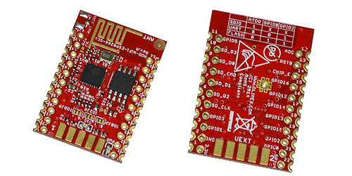

# ESP8266 Introduction

## ESP8266 is a wifi SOC (system on a chip) produced by [Espressif Systems](http://espressif.com/) . It is an highly integrated chip designed to provide full internet connectivity in a small package.

### What is it good for?

ESP8266 can be used as an external Wifi module, using the standard AT Command set Firmware by connecting it to any microcontroller using the serial UART, or directly serve as a Wifi-enabled micro controller, by programming a new firmware using the provided SDK.

The GPIO pins allow Analog and Digital IO, plus PWM, SPI, I2C, etc.

This board has been around for almost a year now, and has been used mostly in IoT contexts, where we want to add connectivity for example to an Arduino project. A wide adoption has been facilitated by the very modest price, ranging from 2.50 to 10 USD depending on the features offered by the manufacturers.

Some example projects:

* [Temperature logging and Web UI](https://github.com/mathew-hall/esp8266-dht)
* [Retro Web Browser](https://hackaday.io/project/3072-esp8266-retro-browser)
* [Internet Enabled Smoke alarm](https://hackaday.io/project/5472-internet-enabled-smoke-alarm)

### Technical Features

* 802.11 b / g / n
* Wi-Fi Direct (P2P), soft-AP
* Built-in TCP / IP protocol stack
* Built-in TR switch, balun, LNA, power amplifier and matching network
* Built-in PLL, voltage regulator and power management components
* 802.11b mode + 19.5dBm output power
* Built-in temperature sensor
* Support antenna diversity
* off leakage current is less than 10uA
* Built-in low-power 32-bit CPU: can double as an application processor
* SDIO 2.0, SPI, UART
* STBC, 1×1 MIMO, 2×1 MIMO
* A-MPDU, A-MSDU aggregation and the 0.4 Within wake
* 2ms, connect and transfer data packets
* standby power consumption of less than 1.0mW (DTIM3)

### Variants

ESP8266-based boards are available from several vendors and with different breakout boards. Most of the boards differ in the number of pins made available, the amount of Flash memory for storing program and data, and the shielding on the SOC for certified boards.

Some boards also support an external uFL antenna connector as well as the buil-in on-chip antenna.

The most common variants are:

**ESP-01**

This is the first and simplest board using the ESP8266. It allows to attach serial lines, and only breaks out two GPIO pins for native usage. This is also the cheapest and can be purchased from many chinese suppliers at 2.5 dollars.

**ESP-03**

This is the second generation board, breaking out more GPIO pins, and using a different antenna, plus an external antenna connector.

**Olimex ESP8266 Eval Board**

This board, produced by Olimex, breaks out all the ESP8266 pins in breadboard headers, but can also be soldered as a module.
It contains 2Mb of flash memory, four times that available on the ESP-01 and ESP-03, for larger firmware and space for files useful to make a webserver.

### Using the ESP8266 with Arduino

Several [Libraries](https://github.com/sleemanj/ESP8266_Simple) have been developed to use ESP8266 as a module for Arduinos.

Also there is a port of the Arduino IDE for programming the ESP Directly, see below.

### Using the ESP8266 via Serial port

You can interact with the ESP8266 sending AT Commands via the provided TX and RX pins by using another microcontroller.

**Pay attention to the voltage of your signal lines, as the ESP8266 only works with 3.3v and pins are not 5V tolerant.**

I.e. if you want to attach it to an Arduino clone you must use a logic level converter such as [this](https://www.sparkfun.com/products/12009) .

An alternative to the logic level converter is to build a [voltage divider circuit](https://learn.sparkfun.com/tutorials/voltage-dividers) for each
signal line.

### Programming the ESP8266 Directly

In order to program the ESP directly you need to install a toolchain and firmware upload utility.

The [ESP8266](https://github.com/esp8266/esp8266-wiki/wiki/Toolchain) Wiki explains the process in detail.

You should use the [ESP Open SDK](https://github.com/pfalcon/esp-open-sdk) to build your toolchain.

Espressif also provides an [SDK](https://github.com/esp8266/esp8266-wiki/tree/master/sdk) containing the AT Firmware and the proprietary libraries.

Finally a ready to use VirtualBox virtual machine is available [here](http://bbs.espressif.com/viewtopic.php?f=5&t=2).

As an alternative you might want to program the ESP using the Arduino libraries. A port of the Arduino IDE 1.6.x is available [here](https://github.com/esp8266/arduino).

### Documentation

[English Datasheet](https://github.com/esp8266/esp8266-wiki/tree/master/sdk)

### Resources

[NURDSpace ESP8266](https://nurdspace.nl/ESP8266)
[Community Wiki](https://github.com/esp8266/esp8266-wiki/wiki)
[Vendor Wiki](https://github.com/espressif/esp8266_at)
[Peter Scargill Blog](https://scargill.wordpress.com/)

**Original tutorial by:**

* [Fiore Basile]()
 | v1.0 | 2015

Licensed under a [Creative Commons Attribution-NonCommercial-ShareAlike 3.0](https://creativecommons.org/licenses/by-nc-sa/3.0/) Unported License
