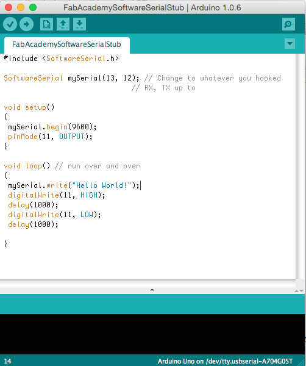
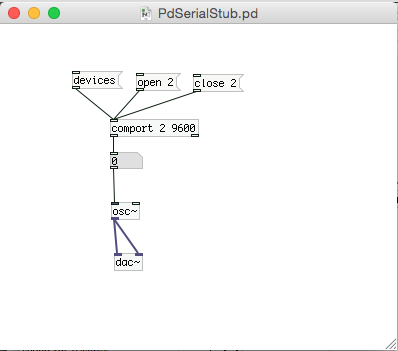

# Pure Data to Arduino Over Serial

### Contents:

*   [**To Get this Example Working**](#running)
*   **[Pure Data to Arduino over serial in Action](#pure)**

A basic example of getting the Arduino to make music using Pure Data.
*   First, get the extended version of Pure Data here: [http://puredata.info/community/projects/software/pd-extended](http://puredata.info/community/projects/software/pd-extended)
*   NOTE: You need the exended version with the comport object, used to talk to the serial port.

*   Next, flash your Arduino with the following code:

        #include <SoftwareSerial.h>

        SoftwareSerial mySerial(0, 1); // Change to whatever you hooked
                                         // RX, TX up to

        void setup() {
         mySerial.begin(9600);
        }

        void loop() {
         for (int i=0; i<255; i++) {
         mySerial.write(i);
         delay(100);
         }
         for (int i=255; i>0; i--) {
         mySerial.write(i);
         delay(100);
         }
        }

*   Then, save this Pure Data patch to a text file, name it **SimpleExample.pd**, and open it up in Pure Data:

        #N canvas 499 140 450 300 10;
        #X msg -158 30 devices;
        #X floatatom -120 111 5 0 0 0 - - -;
        #X msg -94 32 open 2;
        #X obj -120 78 comport 2 9600;
        #X msg -37 33 close 2;
        #X obj -117 177 osc~;
        #X obj -116 212 dac~;
        #X obj -120 140 * 10;
        #X connect 0 0 3 0;
        #X connect 1 0 7 0;
        #X connect 2 0 3 0;
        #X connect 3 0 1 0;
        #X connect 4 0 3 0;
        #X connect 5 0 6 0;
        #X connect 5 0 6 1;
        #X connect 7 0 5 0;

A nice feature of Pd is that all the patches are in a simple text format.

## To Get this Example Working:

*   Open Pure Data
*   Open the "SimpleExample.pd" file in Pure Data
*   Click on the "devices" message box:  This will list any available serial ports in a numbered list.
*   On my Mac, the usb port connected to the microcontroller was on port 2; (it may be different on your computer)
*   Find the correct port number and change the "open" message from "open 2" to "open (your port # here)".
    *   To do that, enter Edit mode under the Edit menu.
    *   Now you can type directly into the message boxes.
    *   After you change the "open" message, leave edit mode and do the following:
    *   1\. Select "compute audio" in the main Pd window
    *   2\. Click on the "open" message to open the serial connection

**You should see output of the comport changing, and should hear a rising and falling tone. **

**Original tutorial by:**

* [Anna Kaziunas France ](http://www.kaziunas.com/site/bio.html)(except where otherwise noted) Some rights reserved. 2013

Licensed under a [Creative Commons Attribution-NonCommercial-ShareAlike 3.0 Unported License](http://creativecommons.org/licenses/by-nc-sa/3.0/)
