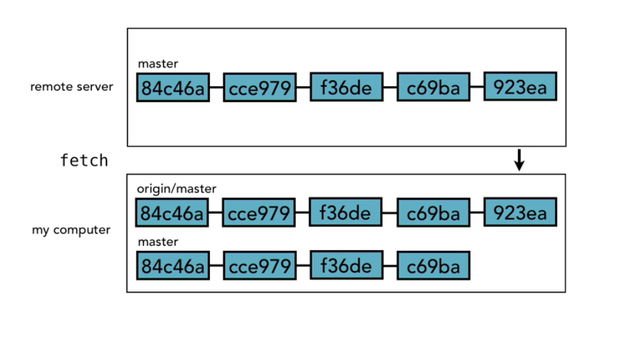
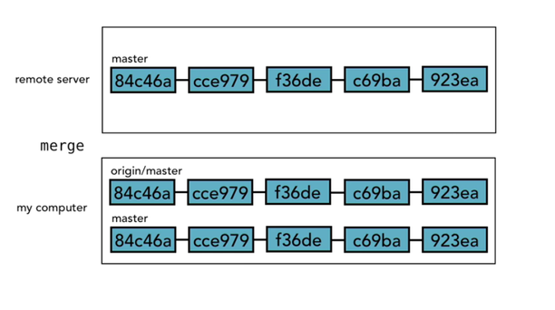
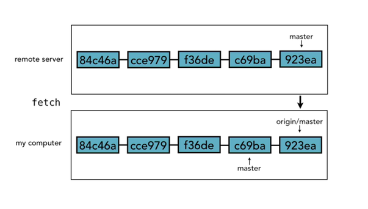
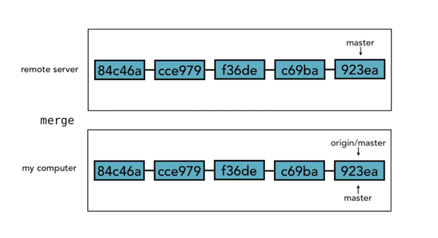

# GIT EXTENDED CHEAT SHEET

## Full guide to GIT for Fab Academy
* * *

## SETUP GIT

> git config –global user.name “Joe Smith”
>
>   git config –global user.email “jSmith@mail.com”
>
>   git config –global credential.helper osxkeychain
>
>   (MAC Only or use SSH Key)

**git config –list**

> git config –global core.editor “nameOfTextEditor -wl1”
>
>   (‘-w’  wait, ‘l1’ cursor at line 1)

**git config –global color.ui true**

Set color in command line

**cat .gitconfig**

Shows all the settings in the config file that just have been set

* * *

## SETUP LOCAL GIT PROJECT WITH TERMINAL.

> Create folder in desired location and in that folder:
> **git init**
> **ls -a**  (list all)
> **git status**
> **git add ‘filename’**
> **git commit -m “ commit message here”**
>
>   No more then 50 characters, MUST be specific of what has been change!
> **git log**
>
>   Show a log of all commits.

## PUSHING TO REMOTE REPOSITORIES

Remote repositories works exactly like a branch, it just stores them in a on a remote server.

> Create repository on git hub and copy the link.
>
> git remote add origin [http://github](http://github)… (links to the remote repro.)
>
>   git push -u origin master  (pushing master to origin    -u upstream )
> **git pull**
>
>   (+ git fetch)
>
>   (+ git merge)
> **git status**
> **git add** .
> **git commit -m ” descriptive commit message here”**
> **git push**

* * *

## HOW REMOTE REPOSITORIES WORKS

Think of it as origin/master is a separate branch form you master branch. When we do a **git fetch** all the changes get copied in the origin/master branch but not merger in to our master branch

We have to do a **git merge** for these changes get stored in out master branch.

> **git pull** include both _git fetch_ and _git merge_ in one handy short cut. Sometimes however, you might want to wait with the merge but keep your origin master in sync with the remote repository.

But in reality the origin/master and master are not duplicates they are actually the same but with different head pointers. It would look something like this:

And when we merge git will move the head pointer of the master to the head pointer for the origin/master.

* * *

## FILE MANAGEMENT

**git status**

Gives a status of project, changes, and untracked files.

#### **ADD**

**git add .**

Add all changed files to the stage.
**git add ‘filename’**
**git add ‘filename’ ‘filename’ ‘filename’**

For selecting files, remove ”
**git *.html**

Add all html files
**git add ‘folderName/*’**

Add folder and everything inside of it.

#### **COMMIT**

**git commit -m “commit message here”**

or short version:
**git commit -am “commit message”**

Stage and commits files in one go. Does not include rename and deleted files.

Make commits that are related otherwise split them up in separate commits!

#### **REMOVE**

**git rm ‘filename’**

Move removed file to the stage. HAVE TO COMMIT to actually delete it.
**git rm –cashed filename**

To un-stage a file.

#### **RENAME**

If file name changed in browser, it shows up as 2 files (delete and untracked) do an add and in stages it knows it is a rename (data 50% the same)

Rename and move is the same in git.

**git mv ‘filename’ ‘filename’**

Rename and moves it to the stage area.

#### **MOVE FILES**

**git mv ‘filename’ ‘folderName/filename’**

Can be re-named at the same time if name is changed. Shows up as renamed in stage area.

#### **SHOW CHANGES**

**git diff**

Show changes between repository version and local version. Only before files are un-stage.
**git diff ‘filename’**

Shows only changes in that file.
**git diff –staged**

Show changes between repository version and files that are staged.
**git diff –color-words ‘filename’**

Show changes side by side.

* * *

### VERSIONS OF LOG COMMAND

**git log -n 5**

Shows the last five commits.

**git log –since=2016-01-15**

Log from a specific date.

**git log –until=2016-01-15**

Log from a specific date.

**git log –autor=”NAME”**

Only shows commits form specific person.

**git log –grep=”Inint”**

Search for any commits that contains Inint in the commit message.

**git log –oneline**

Display short version of S-H-A and commit message in one line.

**git log “SHA-1 of commit”.. “fileName”**

Shows what has happened to that file since the commit. remove the “”

**git log -p “SHA-1 of commit”.. “fileName”**

Shows what has happened to that file since the commit and what changes. remove the “”

**git log –graph**

Shows graph of commit tree

**git log –oneline –graph –decorate**

* * *

## UNDO CHANGES, REVERT

**git checkout – ‘filename or directory’**

Will blow away the local version and restore what is in the repository – tells that we are not checking out an new branch just a file just in case we have a branch with same name.

#### **UNDO FROM STAGES AREA **

**git reset HEAD ‘filename’**

Good when assembling files for a commit and need to remove one file that don't belongs to current commit.

#### **UNDO AMEND TO LAST COMMIT **

**git commit –amend -m “message”**

Reverts back to edit last commit, add changes or edit commit message. This will amend to last commit, and not create a new log entry.)

#### **RETRIVING A PREVIOUS VERSION OF FILE**

**git checkout ‘S-H-A number of the commit you want to take it from’ – ‘filename’**

(S-H-A number is the unique ‘commit nr’ for each commit found in the git log. This puts it in the stage area, do a commit to keep changes)

#### **REVERING ALL TO A PREVIOUS COMMIT**

git revert ‘S-H-A number of the commit you want to take it from’

(Edit commit message and save. This will commit the reverted changes straight away. You can pass in the ‘-in’ option with revert, and then it won't actually do the commit, it will just stage it and then wait for you to actually do the commit yourself. )

#### **SOFT RESET**

The soft reset moves the HEAD pointer but don't do anything else. It left our staging index and our working directory alone.)

> It is good idea to copy paste the last couple of commits from log in to a text file to refer back to when doing resets.

**git reset –soft ‘SHA nr. of the commit you want to go back to’**

Basically take the HEAD pointer from one commit to an other commit but not committing the change.

> cat .git/refs/heads/master (to see what SHA nr. head is currently pointing at)

#### **MIXED RESET**

Mixed reset works exactly the same as the soft reset with one additional thing, which is that it makes the staging index look the same as what's in the repository)

**git reset –mixed ‘SHA nr. of the commit you want to go back to’**

have to re-staged and re-commit the changes.

#### **HARD RESET**

Makes our staging index and our working directory exactly match the repo. It throws out everything that happened after that.

**git reset –hard ‘SHA nr. of the commit you want to go back to’**

#### **REMOVE UNTRACKED FILES**

**git clean -n**

Preview the files that are going to be deleted.
**git clean -f**

Force remove but not files that are on the stage.

* * *

## BRANCH MANAGEMENT

#### **CREATE BRANCHES**

**git branch**

Shows current branch.
**git branch ‘name’**

Creates new branch, no spaces or . in branch name)
**git checkout ‘name’**

Switch to branch.
**git checkout -b ‘name’**

Switch automatic to the new branch.
**git checkout master**

Goes back to master branch

#### **COMPARE BRANCHES**

**git diff ‘branchName’..’branchName’**

Shows difference between branches, 2 lines.
**git diff –color-words ‘branchName’..’branchName’**

Shows difference between branches color coded and on the same line.
**git branch –merged**

Shows all branches that completely contains another branch or not. That is whether or not everything in it has been merged into the current branch.

#### **RENAME BRANCH**

**git branch -m ‘oldBranchName’ ‘newBranchName’**

-m for move or full version –move. Move and rename is the same in git

#### **DELETE BRANCH**

**git branch -d ‘branchName’**

-d for delete or full version –delete, can't be on the branch you are deleting.
**git branch -D ‘branch name’**

force delete branch.

#### **MERGE BRANCHES**

**Work-flow**

  Be on the branch you want to merge in to.

  Both branches can not have any depending ot untracked files

**git merge ‘branch name to be merge’**
**git commit -a -m “message here”**

  Add all and commit with message.

> **Fast Forward:**
>
>   If branch is ahead of master and no changes have been made to master the brand is just moved in the master time line and and move the head along to it. There will be no commit message/log written)

**git merge –no-ff ‘branchName’**

Forces git to make a new commit with commit message. If want to document that you did a merge.

**git merge –ff-only ‘branchName’**

Do a merge ONLY if you can do a fast forward, if not abort merge.

> **True Merge:**
>
>   This opens up a text editor for you to write the commit message. After save log should say: Merge made by ‘recursive’ strategy  …and list of files being merged)

#### **MERGE CONFLICTS**

3 options: abort - manually merge - merge tool

**git merge –abort**

Abort a merge

> git show ‘6 first numbers in S-H-A ID’ (to see changes)
>
>   In text file git puts in to indicate conflicts with:
>
> <<<<<<< HEAD
>
> ==========
>
> >>>>>> text edits

**git branch –merged**

Shows all the branches that have been merged at some point.

**git branch –no –merge**

**git log –graph –oneline –all –decorate**

Graphical representation of merges)

> #### **TOP TIP FOR EASY MERGE**
>
> *   keeps commits small
>     
>     
> *   merge often
>     
>     
> *   track changers to master (so your branch keeps in sync with master

* * *

## STASHING CHANGES

The stash is a place where we can store changes temporarily without having to commit them to the repository. It's a lot like putting something into a drawer to save it for later. The stash is not part of the repository, the staging index or the working directory, it's a special fourth area in Git, separate from the others. And the things that we put into it aren't commits, but they're a lot like commits, they work in a very similar way. They're still a snapshot of the changes that we were in the process of making, just like a commit is

**git stash save “message”**

#### **VIEWING STASHED CHANGES**

**git stash list**

Referrers to it by its ID ‘stash@{0}’ Stash is always available on all branches.

**git stash show ‘stash@{0}’**

Remove single quotes.
**git stash show -p ‘stash@{0}’**

Shows more information.

#### **RETRIEVING STASHED CHANGES**

**git stash pop ‘stash@{0}’**

Removes it from stash. Numbering start at 0 so the third stash is number {2})

**git stash apply ‘stash@{0}’**

Leaves a copy in the stash.

#### **DELETING STASHED CHANGES**

**git stash drop ‘stash@{0}’**

**git stash clear**

Delete everything in the stash.

* * *

# [MORE INFO ](http://www.git-scm.com/book)
