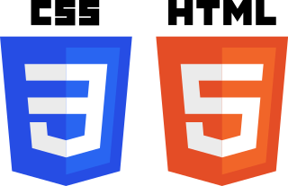

# HTML+CSS

## Here you can find more resources about working with HTML+CSS.

**Summary:**

### Video Lecture
An improvised and incomplete introduction to HTML+CSS was recorded during Fab Academy 2015 at [Opendot](http://fabacademy.org/archives/2015/eu/labs/milan_od/index.html)+[Wemake](http://fabacademy.org/archives/2015/eu/labs/milan_wm/index.html) in Milan.
*Watch it in full resolution*
[Youtube Link](https://www.youtube.com/watch?v=PeWIU7UQ_rc)

### Editors

* Open source HTML5+CSS3 multiplatform editors with Live Preview (in Chrome)
* [Brackets](http://brackets.io/)
* [Atom](https://atom.io/)
* [Sublime](https://www.sublimetext.com/)

### Reference

The starting point for reference, tutorials and interactive tests regarding HTML+CSS+Javascript is [w3schools.com](https://www.w3schools.com/)

### Template

>Your webpage is the first thing you show to the world an the rest of your Academy mates. So try to make it personal and show how you are.

Since in 2015 it is easier to develop a website from a framework rather than from scratch, learning from my own Fab Academy in 2012 I created an MIT-licensed [template](https://github.com/openp2pdesign/FabAcademy_Template) based on [Bootstrap](http://getbootstrap.com/) but with more technical things already set up for a typical Fab Academy website.

**Features:**

    -Code highlight
    -Image format
    -3D Model (.stl/.obj) embedded in the page
    -Download button
    -Gantt chart for planning the final project
    -process
    -Automatic Ajax menu
    -Basic structure ready

**It is not meant for being used as it is, but for being modified into a personal website and for taking inspiration from its solutions for other templates.**
I did not touch the style from Bootstrap for this reason, I only tried to solve some typical Fab Academy issues.

So, please note that this doesn't save you from:

    Learning HTML and editing it
    Learning CSS and editing it
    Learning Javascript and editing it
    Choosing and adding your own licenses
    Adding your own pages

You can download it here: https://github.com/openp2pdesign/FabAcademy_Template/releases

Just note that for "safety" settings some Javascript parts don't work locally (on your computer) on Chrome, but work perfectly once online and on your computer with Firefox.

**Original tutorial by:**

* [Massimo Menichinelli ](mailto:massimo.menichinelli@aalto.fi)
[openp2pdesign](mailto:info@openp2pdesign.org) | v1.0 | date

* Updated by [Eduardo Chamorro](http://eduardochamorro.github.io/beansreels/index.html), Fab Lab Seoul 01.2017

Licensed under a [Commons Attribution 4.0 International License](http://creativecommons.org/licenses/by/4.0/) 
