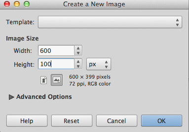
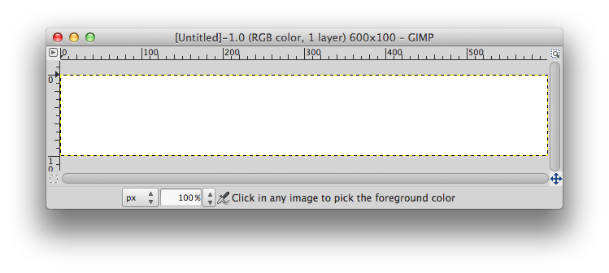
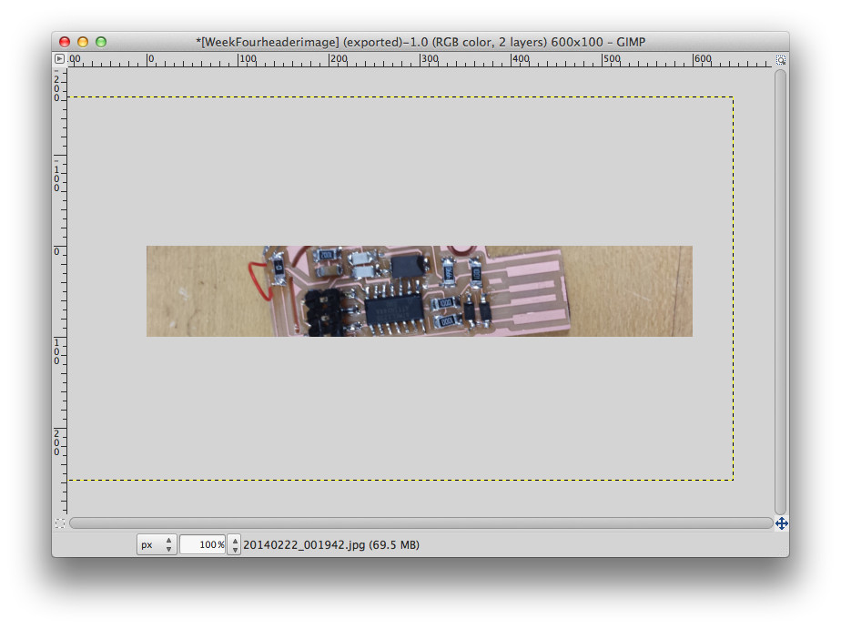

# Resize Images using Gimp

## Tutorial for compressing many image files to web siz.

For documenting all the academy you need lot of images that without compression are heavy and excessively big.Here you will learn how to resize them to keep a *light* webpage.

**[Gimp is a GNU Image Manipulation program](https://www.gimp.org/). It is free to download and is good for compressing many image files to web size.**

* [Step 1: Create and Resize New File](#Step 1: Create and Resize New File)
* [Step 2: Import Uncompressed Image](#Step 2: Import Uncompressed Image)
* [Step 3: Scale and Move Image](#Step 3: Scale and Move Image)
* [Step 4: Export Image to jpg](#Step 4: Export Image to jpg)
* [Step 5 Check Image for resizing](#Step 5 Check Image for resizing)

### Step 1: Create and Resize New File

Start Gimp

Press Command N to open a new file and a "Create New Image" window appears.

Choose the image size width and height. For our example, width = 600 and height is 100. This is a header image size I commonly use.

Then press OK

Resize the window to see more of the gray area.

>Note: The white box is the only part of the image you will be able to see and export

### Step 2: Import Uncompressed Image
Go to the folder you have your uncompressed image stored.

Drag the image to the Gimp window.

If it is like my images it will come in huge and you will only be able to see small portion of it.

### Step 3: Scale and Move Image

Start at the top left and drag to bottom right, you may need to do this multiple times. Keep doing this unitl you see the top let corner of the image. You can see the boundary of the image is a dashed line.

Choose the scale button on the toolbar to scale the image.

Scale to the desired size. For this example, lock the width and height together by clicking on the broken chain, and choose 750 px.

>Note: Gimp will save/export only what you see on the screen.

Move image so you are satisfied with what you see, as seen below.

### Step 4: Export Image to jpg
Press Command E to export image

Select File Type to ...

For the example select jpeg image

Then click Export on the right botttom side of the window and export the image where you want to.

### Step 5 Check Image for resizing

Go to Finder or terminal and go to where you exported the image to check size. The size of this image is 22 kB.

>Note: an image of a few MB is a image not well optimized for the web.

**Original tutorial by:**

* [Terence J Fagan ](https://terencefagan.wordpress.com/)
| v1.0 | 2014

* Remixed and updated by [Eduardo Chamorro](http://eduardochamorro.github.io/beansreels/index.html), Fab Lab Seoul 01.2017

Licensed under a [Creative Commons Attribution-NonCommercial-ShareAlike 3.0](https://creativecommons.org/licenses/by-nc-sa/3.0/) Unported License
