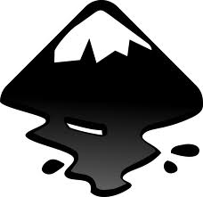

# 2D Design Tools and Tutorials

## Short introduction to the main strategies for geometric modeling, in 2D. Most of them are open source / freeware.

### Vector vs Bitmap
**Bitmap / Pixelmap / Raster Graphics**

>Loses Resolution When Resized

[Pixels](https://en.wikipedia.org/wiki/Pixel) (or "picture elements") are the smallest controllable unit of a digital image. Bitmap / pixel map images are made up a rectangular grid of pixels.

[Bitmap](https://en.wikipedia.org/wiki/Bitmap)images are comprised of mapped [bits](https://en.wikipedia.org/wiki/Bit). This means that the image information is stored as a series of values that are either zeros or ones. This gives a computer a way to store a [binary image](https://en.wikipedia.org/wiki/Binary_image) made up of black and white pixels.

Pixel maps can store more than one bit (color) per pixel. In computer graphics the two terms are often used interchangeably.

The term "raster" is used to describe both bitmaps and pixelmaps and indicates that these graphics are resoultion dependent. If you resize a raster graphic to a larger size, the square pixels will become apparent.

>When discussing vector images vs. bitmap images, the terms pixemaps, bitmats, and raster graphics can be used interchangably.

**Vector Graphics**

>Able to Resize Without Losing Resolution.

[Vector graphics](https://en.wikipedia.org/wiki/Vector_graphics) are resolution independent. They are based on mathematical expressions and use points, lines, curves and polygons to represent images. Because they use mathmatical formulas, they can be resized, bent and stretched without losing resolution. Lines remain crisp and sharp when the size of the drawing is increased.

###  GIMP

**Gimp is a free and open source raster graphics editor that is available for all platforms.**

[Youtube Link](https://www.youtube.com/watch?v=wLSvubMGb8A)

###  INKSCAPE

**Inkscape is a free and open source scalable vector graphics editor that is available for all platforms.**

[Youtube Link](https://www.youtube.com/watch?v=ylHJbLId2cg)

Download and Install Inkscape

[Download Inkscape](https://inkscape.org/en/download/?lang=en)

* **Ubuntu** - Install from the Ubuntu software center
* **Windows** - Download and install using the installer.
* **Mac** - Download and install using the installer.
>Note for Mac: XQuartz / X11 is needed to run Inkscape and is installed by default on 10.5 and later). If you have an earlier OS, [download and install XQuartz](xquartz.macosforge.org/landing/)

#### Getting Aquainted with Inkscape

*Basic Inkscape tutorials*

* [Elements](https://inkscape.org/en/doc/elements/tutorial-elements.html)
* [Basics ](https://inkscape.org/en/doc/shapes/tutorial-shapes.html)
* [Shapes ](https://inkscape.org/en/doc/shapes/tutorial-shapes.html)

#### Grids / Resizing Units

**Setting grids**

If you would like a grid for visual layout purposes, you can turn it on by:

* Going to the "View" menu
* Selecting the "Grid" option

**Setting Units/ Resizing - Canvas**

Use the "Document Properties" (see the Page Sizing section above). Note that document properties controls the units for the canvas, but not the individual shapes drawn.

**Setting Units/ Resizing - Items Drawn on the Canvas**

To change the units / size for items that are drawn on the canvas:

* First select the selection tool (looks like a black arrow)
* Select the item or items you want to re-size / change the units

*To change the units / re-size the object you can either:*

>Modify the units / re-size the shape width and height in to top toolbar
* With the object or objects selected:
* From the Main (top) Toolbar > select

### *Additional Topics*

- [Tracing Bitmaps](http://inkscape.org/doc/tracing/tutorial-tracing.html)

- [Paths / Pen Tool / Lines](https://inkscape.org/en/doc/advanced/tutorial-advanced.html)
- [Tips and Tricks](http://inkscape.org/doc/tips/tutorial-tips.html)

- [Calligraphy](http://inkscape.org/doc/calligraphy/tutorial-calligraphy.html)

- Other Tutorials
> * [Inkscape Blog](inkscapetutorials.wordpress.com)
>* [Lightbulb Icon](inkscapetutorials.wordpress.com)
>* [Cool Text Example](http://troy-sobotka.blogspot.kr/2008/04/inkscape-tutorial-2-text-and-simple.html)

**Original tutorial by:**

* [Anna Kaziunas France](http://www.kaziunas.com/site/404.php)
| v1.0 | 2013

* [Massimo Menichinelli ](mailto:massimo.menichinelli@aalto.fi)
[openp2pdesign](mailto:info@openp2pdesign.org) | v1.0 |

* Remixed and updated by [Eduardo Chamorro](http://eduardochamorro.github.io/beansreels/index.html), Fab Lab Seoul 01.2017

Licensed under a [Creative Commons Attribution-NonCommercial-ShareAlike 3.0](https://creativecommons.org/licenses/by-nc-sa/3.0/) Unported License
