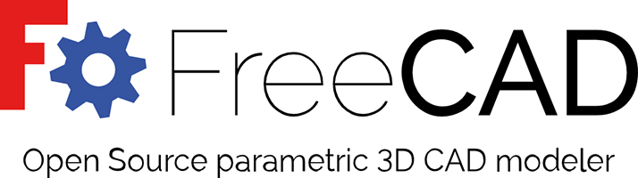
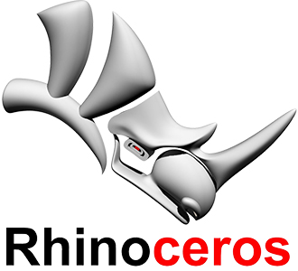
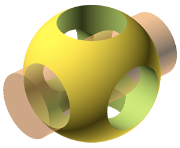
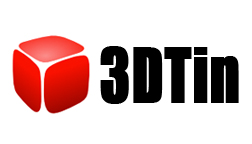

# 3D Modeling Tools and video tutorials

## Here's a series of short introduction to the main strategies for 3d geometric modeling. Most of them are open source / freeware.

### Fusion 360

Fusion 360 (works cloud based)
http://www.autodesk.com/products/fusion-360/overview
Free as educational software.

### TinkerCAD

TinkerCAD (online - no download)
http://www.tinkercad.com/

TinkerCAD Tutorial
Pages 96-110 (PDF) "Chapter 8: Designing for the MakerBot", [Getting Started with MakerBot](http://shop.oreilly.com/product/0636920026723.do)

### CAD: QCAD + Draftsight

Download QCAD
https://qcad.org/en/

[Youtube Link](https://www.youtube.com/watch?v=doDway3Cq1c)

### Mesh: Blender

Download BLENDER
https://www.blender.org/

[Youtube Link](https://www.youtube.com/watch?v=e5XORqVkVlE)

### Solid+Parametric: FreeCAD

Download FreeCad
https://www.freecadweb.org/

[Youtube Link](https://www.youtube.com/watch?v=7nTPc4zFd9w)

### NURBS: Rhinoceros 3D

Download Rhino
https://www.rhino3d.com/

[Youtube Link](https://www.youtube.com/watch?v=SXReLvfCA_Y)

### SketchUp  

Download Google SketchUp
http://sketchup.google.com/

Google SketchUp Tutorial
Pages 110-117 (PDF) "Chapter 8: Designing for the MakerBot", [Getting Started with MakerBot](http://shop.oreilly.com/product/0636920026723.do)

### OpenSCAD

Download OpenSCAD
http://www.openscad.org/
OpenSCAD Modeling Tutorial
Read "Parametric Modeling with Solid Geometries", Getting Started with MakerBot, Chapter 8: Desinging for the MakerBot, pages 193-204
OpenSCAD DXF Extrusion & Exporting from Inkscape
DXF Extrusion can be tricky. This is completely optional.
Read "Parametric Modeling with Solid Geometries", Getting Started with MakerBot, Chapter 8: Desinging for the MakerBot, pages 204-212

### Autodesk 123D Design
>This program has been deprecated for FUSION 360

Download Autodesk 123D Design
http://www.123dapp.com/design

123D Make Tutorial
Pages 110-117 (PDF) "Chapter 8: Designing for the MakerBot", [Getting Started with MakerBot](http://shop.oreilly.com/product/0636920026723.do)
### 3D Tin
*Bitmap / Pixelmap / Raster Graphics*

3D Tin (online - no download)

http://www.3dtin.com/

3D Tin Tutorial
Pages 90-95 (PDF), "Chapter 8: Designing for the MakerBot", [Getting Started with MakerBot](http://shop.oreilly.com/product/0636920026723.do)

### Data workflow among these softwares

[Youtube Link](https://www.youtube.com/watch?v=3j0bXVD3KZE)

## Note

There are several places in the text where the command line code could not fit on one line.
When you see something like this in the text:

>sudo cp ~/Desktop/Inkscape-OpenSCAD-DXF-Export/* \
/usr/share/inkscape/extensions/

You should ignore the "\" at the end of the first line and paste the first line in, followed by a space. Then pase the second line of code.

For example - this code:

>sudo cp ~/Desktop/Inkscape-OpenSCAD-DXF-Export/* \
/usr/share/inkscape/extensions/     

Should look like this when you paste it into the terminal:

>sudo cp ~/Desktop/Inkscape-OpenSCAD-DXF-Export/* /usr/share/inkscape/extensions/

**Original tutorial by:**

* [Anna Kaziunas France](http://www.kaziunas.com/site/404.php)
| v1.0 | 2013

* Updated by [Eduardo Chamorro](http://eduardochamorro.github.io/beansreels/index.html), Fab Lab Seoul 01.2017

Licensed under a [Creative Commons Attribution-NonCommercial-ShareAlike 3.0](https://creativecommons.org/licenses/by-nc-sa/3.0/) Unported License
