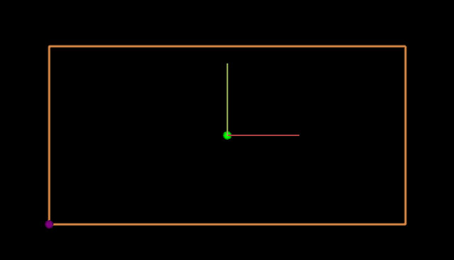
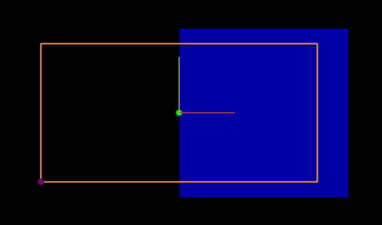
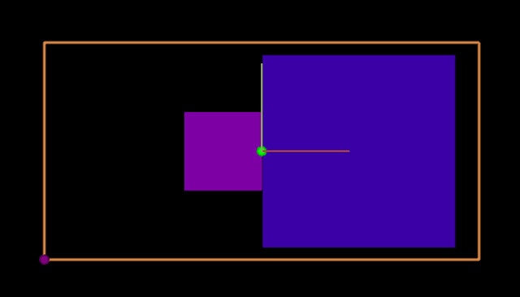

# YOUR TUTORIAL TITLE

## In this tutorial we will add a dragging function to a point. It will change the size of two squares when dragging in the x direction. Their colour will change when dragging in the y direction. This is inspired by the [Processing Mouse1D example](https://processing.org/examples/mouse1d.html).

* [Download example file](antimony_drag/drag_func_example.sb)

**Here is an example of what we will be making! The white arrows represent what direction the point is being dragged with the mouse:**

### Step 1
Create a new file in Antimony and add a script node.

First add our inputs and shapes:

    import fab

    title('Script')

    width = 5
    height = width/2

    input('x', float)
    input('y', float)
    input('_s1', float)
    input('_s2', float)
    input('_c1', float)
    input('_c2', float)

    rectangle_left = fab.shapes.rectangle(x-_s1, x, y-_s1/2, y+_s1/2)
    rectangle_right = fab.shapes.rectangle(x, x+_s2, y-_s2/2, y+_s2/2)

_s1 and _s2 are scales for the squares. By having an underscore (_) in front of the input name, it hides it as an input from the node.

  _c1 and _c2 will be used for the colour of the squares.

  The two squares are next to each other on x, and centered on y/2. This will make more sense when the bounding box is created in the next step.

### Step 2

Now add two points and a wireframe:

    fab.ui.point(x, y, color=(0,255,0))

    fab.ui.wireframe([(x-width/2, y-height/2, 0), (x+width/2, y-height/2, 0),
                  (x+width/2, y+height/2, 0), (x-width/2, y+height/2, 0)], close=True, color=fab.color.orange)

    fab.ui.point(x-width/2, y-height/2, color=(128,0,128))

The first point (green) is in the middle of the bounding box.

The bounding box is a wireframe in orange.

The second point (purple) is at the lower left corner

### Step 3.

We want the purple point to be able to move the x & y coordinates- effectively moving the position of everything.

Add a drag function to the purple point:

    fab.ui.point(x-width/2, y-height/2, drag=(x,y,None), color=(128,0,128))

It’s an inline drag function- so when we move the point in the x direction, it will change the x input. Same for y. We don’t have a z point, so it’s set to None.

### Step 4.

Dragging the green point should be able to change the size and colour of the squares. This is a bit more involved than using an inline function.

Add a call to a drag function for the green point:

    fab.ui.point(x, y, drag=drag_middle, relative=True, color=(0,255,0))

drag=drag_middle is passing what function we want to handle the action

relative=True means that the coordinates in the function will be relative to that point.

### Step 5.

Add the drag_middle function above the UI lines:

    def drag_middle(this,x,y,z):

    if x > 0:
    this._s1 -= x
    this._s2 += x
    if y > 0:
      this._c2 += y
    elif y < 0:
      this._c2 -= math.fabs(y)

      elif x < 0:
      this._s1 += math.fabs(x)
      this._s2 -= math.fabs(x)
      if y > 0:
        this._c1 += y
      elif y < 0:
        this._c1 -= math.fabs(y)

The drag function parameters are itself the node, and the coordinates of the mouse.

Input variables are able to be set by using this._s1 (for whatever input).

What is happening here is it's asking if the drag is to the left or the right of the point. Depending on whichever, it adds the x value to _s1 or _s2 (taking the absolute value if x is negative). Similar for y and _c1 and _c2.

### Step 6.

Time to output the squares. Add this above drag_middle:

    val1 = int(_c1)
    val2 = int(_c2)

    output('left', fab.shapes.set_color(rectangle_left, val1, 0, 200))
    output('right', fab.shapes.set_color(rectangle_right, val2, 0, 200))

### Step 7.

Right now when the mouse is dragging the green point, the squares can extend beyond the bounding box.

Add this to the bottom of drag_middle:

    if this._s1 < width/8:
      this._s1 = width/8
    elif this._s1 > width/2:
      this._s1 = width/2

    if this._s2 < width/8:
      this._s2 = width/8
    elif this._s2 > width/2:
      this._s2 = width/2

It is setting the maximum and minimum values for the scale.

We can do the same thing for the colours too:

    if this._c1 > height/2:
      this._c1 = height/2
    elif this._c1 < -height/2:
      this._c1 = -height/2

    if this._c2 > height/2:
      this._c2 = height/2
    elif this._c2 < -height/2:
      this._c2 = -height/2

### Step 8.

Next up the values of _c1 and _c2 have to be mapped from 0-255 instead of -height/2 to height/2.

Replace the val1 and val2 with this:

    def map_nums(val, from_nums, to_nums):
      return to_nums[0] + (to_nums[1] - to_nums[0]) * ((val -   from_nums[0]) / (from_nums[1] - from_nums[0]))

    val1 = int(map_nums(_c1, [-height/2, height/2], [0, 255]))
    val2 = int(map_nums(_c2, [-height/2, height/2], [0, 255]))

### Step 9.

Now when you move the green point in the x direction, the squares change size.

If you’re on the left or right side of the green point and move in the y direction, the square will change its colour.

The colour change is just the red value being more or less, which lets the blue ‘mix in’.

By having two of the scale (_s1 and _s2) and the colour (_c1 and _c2), you can make fun adjustments for each shape. For example, try multiplying _s2 by 2 in the drag_middle function and see what happens.

This is just the start- lots of cool things you can do with dragging functions and points!

**Original tutorial by:**
  * [Erin RobotGrrl]()

  Licensed under a [Creative Commons Attribution-NonCommercial-ShareAlike 3.0](https://creativecommons.org/licenses/by-nc-sa/3.0/) Unported License
