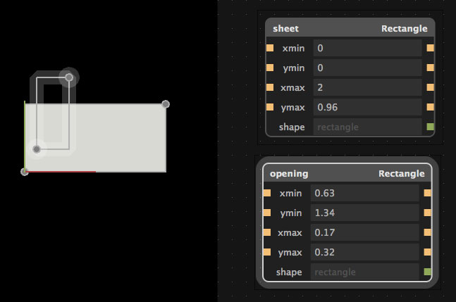
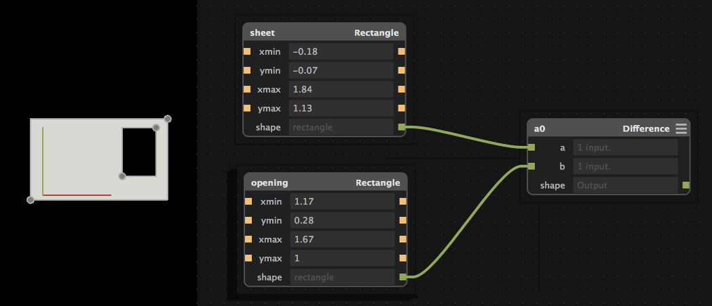
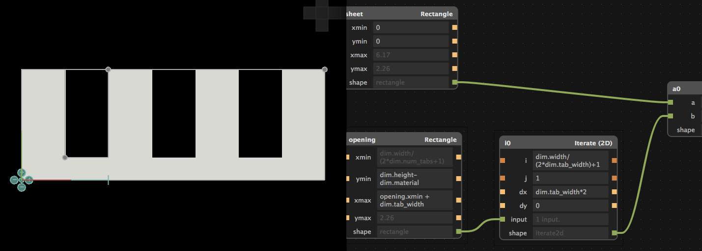

# Antimony Tabs

## In this tutorial we will be creating a rectangle with open tabs on one side that are able to be adjusted from input dimensions. It is an example of a tab design for basic interlocking laser cut pieces.

* [Download example file](antimony_tabs/tabs.sb)

**Here is an example of what we will be making**

### 1. Shape: Rectangles

First we need to add two rectangles. In the graph view (the window with the dots on it), press Shift + A, or in the menu go to Add. Select Rectangle.

You can move the rectangles around in the model view. Switch to the graph view and try adjusting the inputs (the fields with the yellow squares next to them) by typing in a number. Now try adjusting them by holding Shift + clicking on the field. Drag left or right to change the value.

Rename the rectangles by clicking on the text in the upper left corner on its node. We will name our two rectangles *sheet and opening.*

### 2. CSG: Difference

Now we want to remove opening from sheet. We can do this using a *difference* node. This is under CSG - which stands for Constructive Solid Geometry.

Press Shift + A, and add CSG > Difference. There are two fields with green squares next to them. These are for shape inputs.

The two rectangles we added output a shape. Link them to the difference node by dragging the green square from the rectangle's output named shape to the green square input named *a* on the difference node.

Do the same for the other rectangle. You should see two green 'wires' going to difference from the rectangles. In the model view, the opening should be cutting through sheet.

### Script: Dimensions

Now let's create a new node where we can input our own custom dimensions that we need for the design. We will do this by adding a script and creating a few inputs.

Add a Script node. Change the namespace to *dim*, by editing the text in the top left corner of the node. Press the three lines in the top right to open the scripting window. Here is the code that we will be adding:
from fab import shapes

    title('Dimensions')

    input('material', float)

    input('width', float)
    input('height', float)
    input('num_tabs', int)
    input('tab_width', float)

What we are doing is setting the title of this node, and adding inputs that we can use to later adjust the two rectangles. The name of the input can also be accessed from the namespace (we'll go in to this later on). With the exception of *num_tabs* , the types of the inputs are floats.

Here is what we will be using the inputs for:

  * material: The thickness of the material. For example, thin mdf hobby board is ~3mm.
  * width: How long our sheet is
  * height: How tall our sheet is
  * num_tabs: How many tabs (openings) we want
  * tab_width: How wide the tabs should be

With *tab_width*, instead of setting it to a number we will set it to an expression:

dim.width / (2*dim.num_tabs+1)

What does this mean? We are setting the tab width to equal amounts through the width of the sheet with a space at the end (that's the 1). The value will change as we change the width or the num_tabs, as we are accessing it with the namespace dim.

If the field is outlined in red, make sure that num_tabs is not 0.

*Aside: The units do not matter at this point (cm, mm, inches), but as long as it is consistent across all of the fields.*

### 4. Connecting: GUI and Namespaces

Now for a fun part, we are going to connect some of the inputs together. Drag the yellow square on the right hand side of the dimensions node to the orange square to the left of the specified field and node in the list below.

Dimensions

* width -> sheet: xmax
* height -> sheet: ymax
* height -> opening: ymax
* tab_width -> opening: xmin

We also need to add some functions:
opening ymin: dim.height-dim.material
opening xmax: opening.xmin+dim.tab_width

What we just did was attach the fields from the dimensions node to the opening and sheet rectangles. This way when we adjust them, the shapes will also change. Try it out by Shift + Click + Drag 'ing on the fields in Dimensions and see how the model changes.

### 5. Repeat: Iterate 2D

Now we will add an iterate node to repeat the opening rectangle. Add > Iterate > Iterate (2D).

Delete the output of the opening rectangle, and add it to the input of the Iterate 2D. Add the output shape of the Iterate to the Difference node.

Now we have to adjust the inputs of the Iterate node.

* i: dim.width/(2*dim.tab_width)+1
* dx: dim.tab_width*2

You should now see tabs across the rectangle like in the screenshot above. Now when you play with the fields in the Dimension node, they will change the tabs in the model view.

### Conclusion

To export the design, go Export > Height Map (.png). Select your units, the same ones you used for the dimensions.

If you want the tabs to be facing the other way, delete the connection between dim tab_width and opening xmin. Set opening xmin to 0. Now the ends of the sheet will be open with tabs.

Our example did not account for kerf- so if you want to experiment with this more, be sure to add in kerf.

**Original tutorial by:**

* [Erin RobotGrrl]()

Licensed under a [Creative Commons Attribution-NonCommercial-ShareAlike 3.0](https://creativecommons.org/licenses/by-nc-sa/3.0/) Unported License
