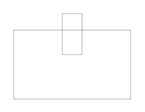
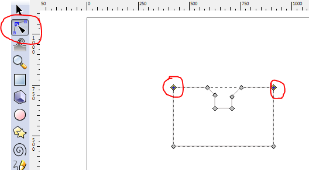
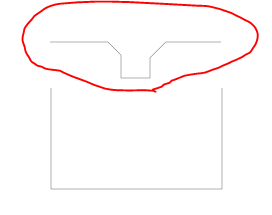

# Create a press fit feature in Inkscape

## Short Guide to create elements for allowing a parametric design using a non parametric program.

### Step 1
Create a large box
Create a smaller box, overlap and place on top (Object, Raise to Top)
Center the 2 boxes (Object, Align and Distribute)

Select both boxes then Path, Difference
You should now have this....

### Step 2

Create another small box and rotate 45 degrees or preferred angle (Object, Transform, Rotate, Enter angle)
Overlay rotated box on corner as shown
Ensure rotated box is on top (Object, Raise to Top)

Select both boxes then Path, Difference
You should now have this....

Repeat on other side

### Step 3

Use the Edit Path by Nodes button and select the 2 points shown

Select Path, Break Apart to isolate the edge with the press fit feature

**You can now clone or duplicate this feature e.g.**

>I used it to create a hexagon with a press fit feature on each of the 6 sides.**
