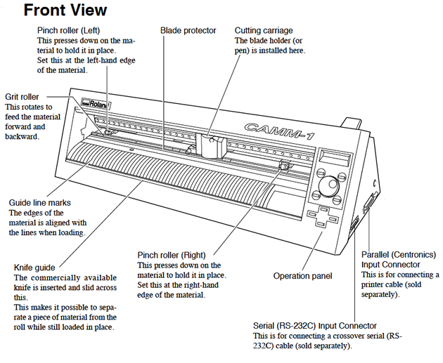
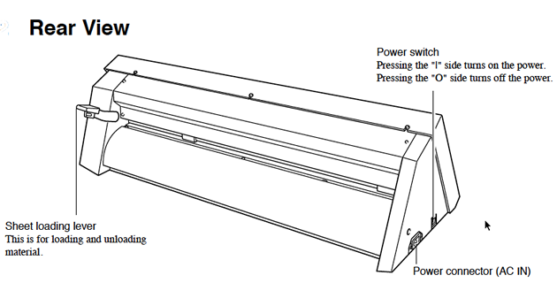
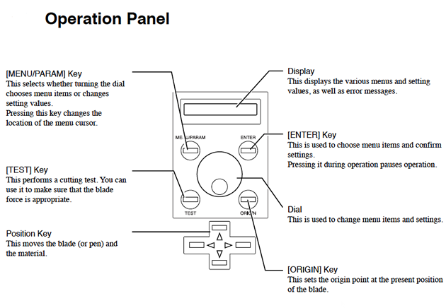
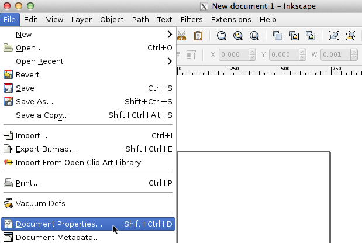
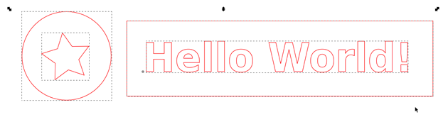
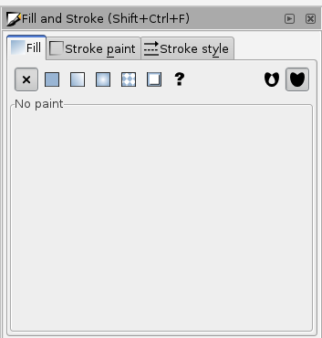
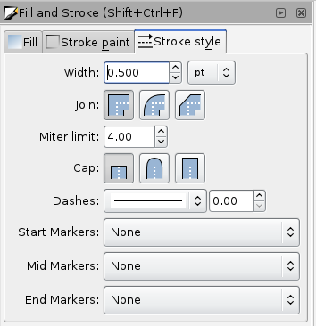

# Vinyl Cutter

## How to use Vinyl Cutter and make the files with Inkscape

A vinyl cutter is a uses a computer-controlled blade to cut out shapes designed using vector graphics. The vinyl cutter is primarily used for cutting vinyl into signs or stickers, but can also be used to cut copper tape into circuit traces.

* This tutorial uses [inkscape]() to prepare the files for the vinyl cutter **Roland Camm-1 CX-24** but most of the instructions will be similar if you have another machine.

## File Preparation

#### Overview

*   Your vinyl cutter files must contain only [vectors. ](www.as220.org/fabacademy/tutorials/inkscape.html/#vector)
*   The vectors must be lines only, with no fill.
*   The vinyl cutter drivers can only interpret cut lines.
*   All vectors must be contained within the bounds of the document canvas.

#### Document Setup

        You will need to size your page in your drawing program appropriately for the width of vinyl that you are using. Vinyl comes in two widths, 24" and 15".

##### **Wide Vinyl (24")**

*   Machine rollers will take up 1" on either side of the vinyl.
*   Set Document Width to 22"
*   Set Document Height to a minimum of 23"

##### **Narrow Vinyl (15")**

*   Machine rollers will take up 1" on either side of the vinyl.
*   Set Document Width to 13"
*   Set Document Height to a minimum 14".

Warning: the document height is must be larger than the document width. If the width is larger than the height, the machine may rotate your design by 90 degrees.

#### Step 1: From the "File" menu > select "Document Properties"

#### Step 2: Modify the Document Width

The document properties dialog box will open.

*   Set the units to inches.
*   Set the document width the  vinyl width (22" or 13").

#### Step 3: Modify the Document Height

Vinyl is on a roll - so the max height _could_ be as long as the
          length of vinyl on the rolll.

Set the document height to a minimum of 24" (if using wide vinyl) or to a larger value that whatever value works for your drawing.

Make sure you hit the <ENTER> key after each entry to
          ensure Inkscape registers your changes.

Warning: the document height is must be larger than the document width. If the width is larger than the height, the machine may rotate your design by 90 degrees.

#### Step 4: Create a Vector Drawing

#### Step 5: Select all Vectors

#### Step 6: Then click "Object" menu > Fill and Stroke.

>The fill and stroke panel will appear to on the right of the screen.

#### Step 7: Make sure there is no fill by clicking on the "X" button in the             "Fill" menu.

#### Step 8: Click the stroke paint tab. Make sure             "R" is at the max - "255".

#### Step 9: Go to stroke style and make sure width is set to 0.500 pt.

## Loading Vinyl

1.  Select a roll of vinyl and place it on the rollers behind the machine.
2.  On the back right of the machine you will see a lever; place
  it in the "down" position so you can load the vinyl.
3.  Make sure the vinyl side is facing up as you feed it through the rollers into the vinyl cutter.
4. Under the rubber wheels there is a white sticker indicator.
    *   Ensure that the vinyl is aligned  properly under the rubber wheels.
    *   The left wheel must always be  under the wide white sticker on the left.
    *   The right rubber wheel must be under any one of the three white stickers on the right, depending on the width of your vinyl.
    *   Make sure your vinyl is straight and about 2-3 inches past
   the rubber wheels.
5.  After inserting the vinyl into the machine, pull up the lever at the back of the machine to ensure that the vinyl is securely loaded.

## Turn On the  Vinyl Cutter / Final Steps

On the left side of the vinyl cutter is the power button.

* Turn it on.

Now you will notice on the screen it says "select roll".

* Press the enter button.

The vinyl cutter will measure the width of the roll (in mm). Take note of the measurement, you many need to adjust the width of your file depending on the measured width of the vinyl.

* Set the origin by pressing the "Origin" button on the control panel.

## Print to the Vinyl Cutter

To print the file, go to File > Print > select the "vinyl cuter" driver from the print menu.

Hit the "print" button to send the file to the vinyl cutter.

The vinyl cutter will begin printing once you send the print job.

After the vinyl cutter is done cutting your file, use scissors to cut off the section with your cut design.

## Weed the Vinyl

"Weeding" the cut vinyl is the process of removing the unwanted areas from the final cut design.

##### Gather Your Tools

*   Transfer Tape

*   Scissors
*   X-Acto knife
*   Tweezers

##### Trim

After cutting, trim area you want to keep with scissors.

##### Weed

Then remove the unwanted parts of vinyl with an X-Axcto knife and / or tweezers.

## Transfer to the Desired Surface

Carefully apply transfer tape to the surface of the weeded vinyl. Rub the transfer tape onto the vinyl to form a strong bond between the tape and the top surface of the vinyl design.

After rubbing, carefully pull the transfer tape (with the vinyl adhering to it) away from the vinyl paper backing.

After you have removed the vinyl from the paper backing and it is attached to the transfer tape, apply it to the desired surface. Rub the surface of the transfer tape to ensure that the vinyl will adhere to the new surface.

Carefully pull the transfer tape away from the vinyl, leaving the vinyl attached to the desired surface.

## Troubleshooting

* The vinyl pressure must be adequate to cut through the vinyl, but too much force will tear up the paper under the vinyl.

* The thicker the material, the more pressure (force) you need to apply to cut through it.  

>However, if you are ripping up the vinyl or paper under the vinyl, your force setting is too high.

#### There are two factors that affect your cuts: force and speed.

**To adjust the force: **

1.  Rotate the wheel under the LCD screen on the vinyl cutter to the right.
2.  When the menu reads "Force", then press the menu buton.
3.  To reduce / increase the force setting, rotate the wheel up or down, you will see the values change in the LCD screen.
4.  When finished, press the enter button.
5.  Next, preform a test cut by pressing the "test" button on the vinyl cutter.

#### **To adjust the speed:**

If your file has lots of small curves or tiny details, you may need to slow down the speed. The slower the speed of the machine, the more precisely it will cut.

1.  Rotate the wheel under the LCD screen on the vinyl cutter to the right until the the menu reads "Speed", then press the menu buton.
2.  To reduce / increase the speed setting, rotate the wheel up or down, you will see the values change in the LCD screen.
3.  When finished, press the enter button.
4.  Next, preform a test of a small section of a file with tiny details or small curves to test your settings.

**Original tutorial by:**

* [Anna Kaziunas France](http://www.kaziunas.com/site/404.php)| 2013

* Remixed/Updated by [Eduardo Chamorro](http://eduardochamorro.github.io/beansreels/index.html), Fab Lab Seoul 01.2017

Licensed under a [Creative Commons Attribution-NonCommercial-ShareAlike 3.0](https://creativecommons.org/licenses/by-nc-sa/3.0/) Unported License
