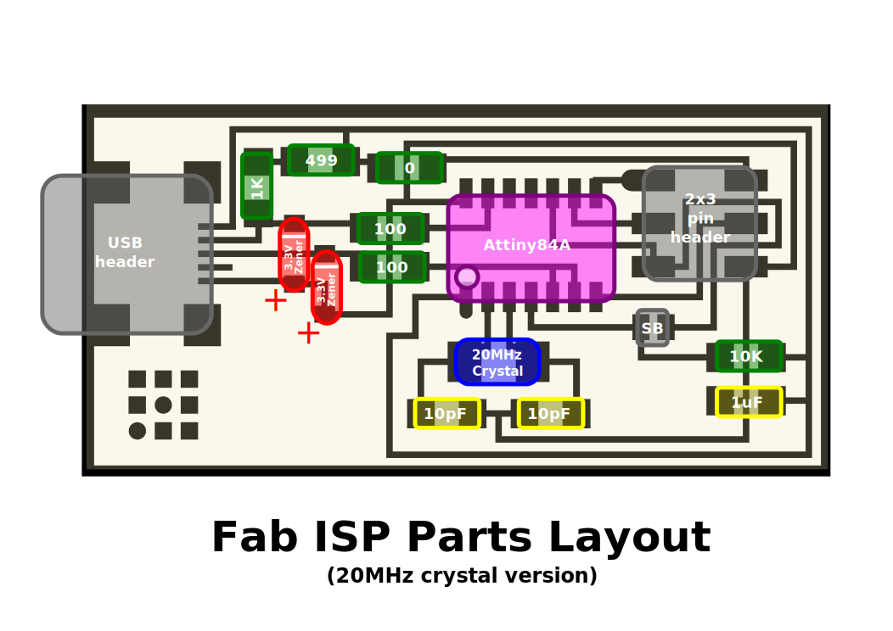
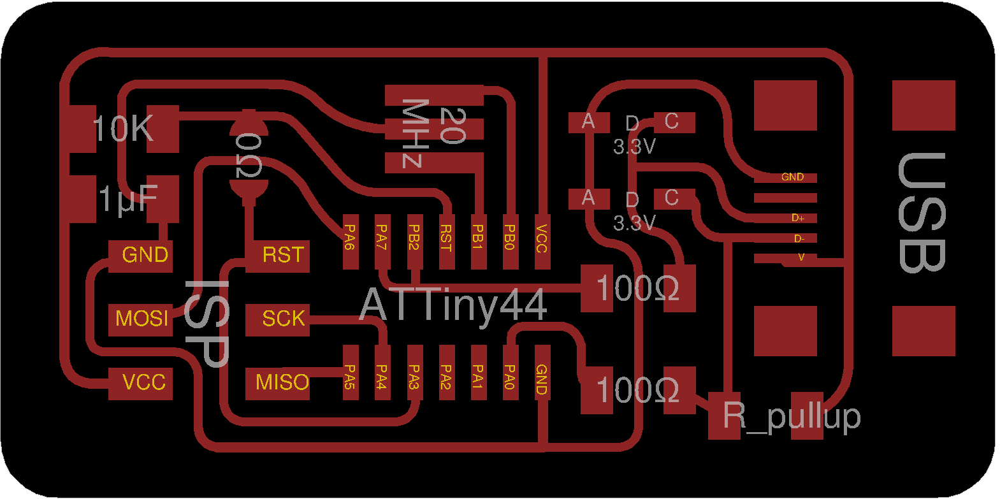
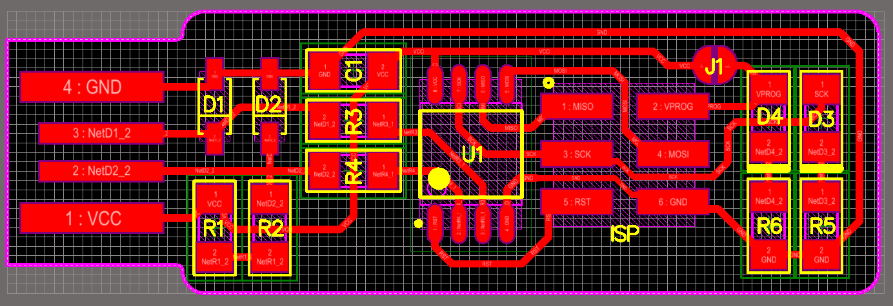

# Fab ISP Models compilation

### A collection of all the fabIsp you can produce for the academy and their resources.

**Summary:**

* [Fab ISP "NEIL"](http://academy.cba.mit.edu/classes/electronics_production/index.html)

  Parts Layout (20MHz crystal)

* [Fab ISP "ALI"](http://fab.cba.mit.edu/classes/863.16/doc/tutorials/FabISP/FabISP_Demystified.html)

  Parts Layout

* [FabTINYISP "Brian"](http://fab.cba.mit.edu/classes/863.16/doc/projects/ftsmin/index.html)

  Parts Layout

* [Fab ISP key "ANDY" ](http://fab.cba.mit.edu/content/projects/fabispkey/index.html)

  Parts Layout

* [Fab ISP key "VALENTIN"](http://fab.cba.mit.edu/classes/863.11/people/valentin.heun/2.htm)

**Original tutorial by:**

* [Eduardo Chamorro](http://eduardochamorro.github.io/beansreels/index.html), Fab Lab Seoul 01.2017

Licensed under a [Creative Commons Attribution-NonCommercial-ShareAlike 3.0](https://creativecommons.org/licenses/by-nc-sa/3.0/) Unported License
