# Making flexible PCBs with a Vinyl Cutter

## How to use a vinyl cutter to cut your flexible circuit boards!
*Most of vinyl cutter work really similar to the machine used in this tutorial (Silhouette-Cameo) so most of the steps shown here can be applied to other machines.*

We can even make them with a modest vinyl cutter as [Silhouette-Cameo](https://www.silhouetteamerica.com/) (aprox. 200$)the one we have in [Fab Lab Seoul](http://fablab-seoul.org/).

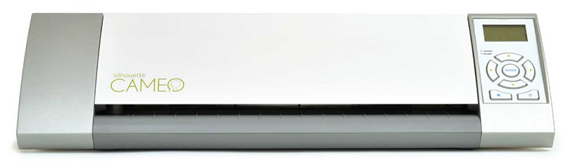

 As a rule of thumb, anything that you can cut with a lot of time and effort with an x-acto can be cut by the Roland, but if there are things that are too small for that they will probably also be too small for the vinyl cutter.

**Summary:**

* [Turn on Vinyl Cutter](https://www.silhouetteamerica.com/), turn on the computer near it. Connect if needed.
* Create and save file of circuit board traces and outcut.
* Physically load conductive tape to the vinyl cutter.
* Find start position and set the correct settings.
* Cut your PCBs
* Remove the excess of tape from your board, cut out if desired, cut apart any areas that didn’t make it.
* Finally, solder your components to your freshly made board!

### Step 1: Material setup
You might need some material that could not be in your la, you will need:

* [3M 1126 conductive adhesive tape](http://multimedia.3m.com/mws/media/104361O/tape-1126-copper-foil-with-conductive-adhesive.pdf)
* [Kapton Tape](http://www.dupont.com/products-and-services/membranes-films/polyimide-films/brands/kapton-polyimide-film.html)
* Flexible Support, we used a thin PVC sheet
* [Cutting mat for vinylcutter](https://www.amazon.co.uk/Silhouette-Cameo-12-inch-Replacement-Cutting/dp/B005VPVW3I)
* Electronic components for your board

>Kapton Tape is not obligatory but highly recommended, as it will protect your Pvc sheet from overheating while your solder the electronic components.

As an example of an PCB this tutorial will use the standard FabISP others FabIsp option can be found [here](http://academy.cba.mit.edu/classes/electronics_production/index.html)
A handy free program to do design circuits yourself, is [Eagle](http://www.autodesk.com/products/eagle/overview).
>If you design the board make the traces wider so you will get better  cut and result.

### Step 2: material loading **(copper tape)**

Stick the copper adhesive tape to the pvc surface, use a plastic ruler to glue it correctly and avoid bubbles that will ruin your cut.
Stick you pvc to your cutting mat to get more "grip" during the cut as if you were cutting cardboard.
>If you use Kapton tape the layer order is Cutting mat-PVC-KAPTON-COPPER TAPE

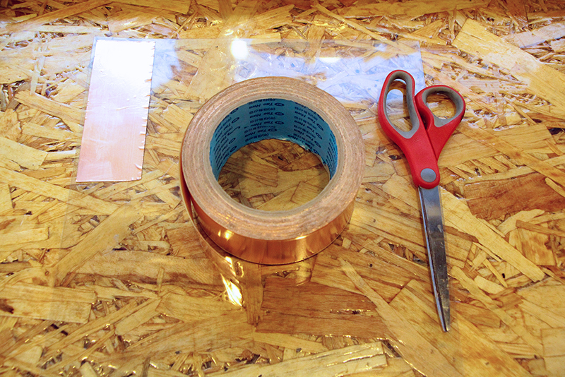

Load the material in the vinyl cutter, be sure to put the release lever down to help you loading the material and remember to put it up to lock again.

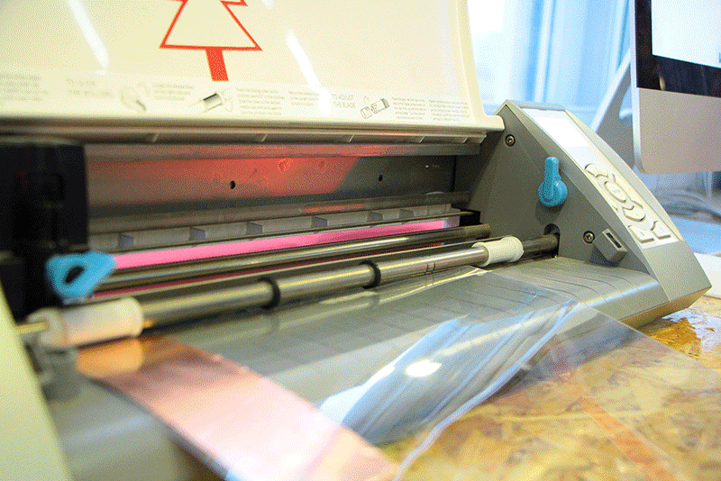

For loading the material follow the instructions on the machine screen. We sure that the white rollers grip the material.

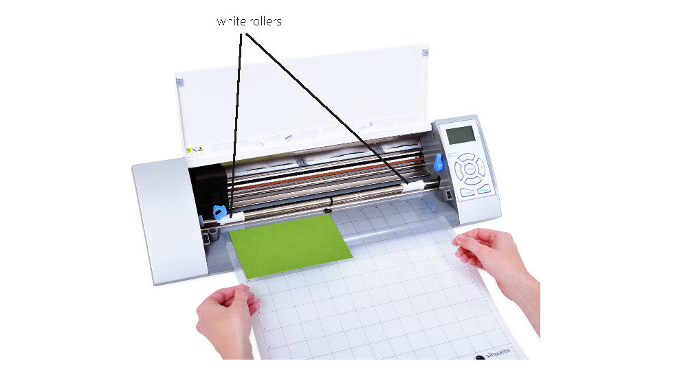

### Step 3: setting the files

This tutorial uses [Inkscape](week2_computer_aided_design/inkscape.md) to prepare files for the vinyl cutter.

In the first case we are going to use the main machine software [Silhoutte Studio](https://www.silhouetteamerica.com/) for all the steps as we found this method shorter in steps and with similar results.

First thing to check is our board dimensions the be sure the traces are on scale. For that you can use any raster program, our choice was to use fabmodules as it also shows the dimensions and pixel density of our PNG

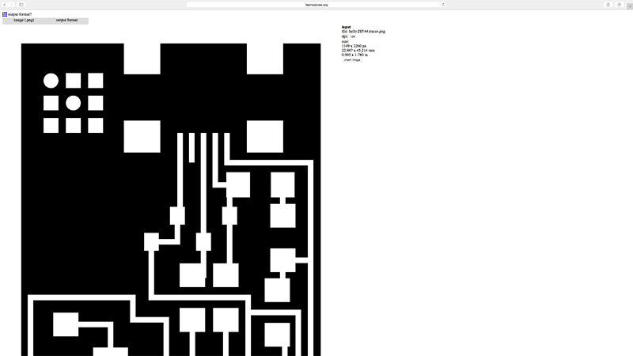

In this case we where making the FabISP SMDCrystal type. It dimensions as we can see are : 22.98x45.21mm

We open the traces PNG with Silhouette Studio and check the PNG size. If it doesn't keep the correct dimensions, we have to scale it, to change it use (SCALE/MOVE on the up right menu)

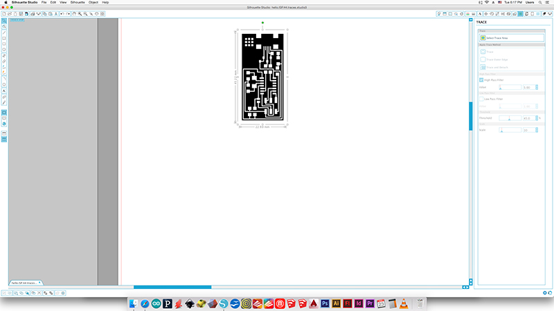

For the vinyl cutter you only need one contour so after checking the correct scale we can transform the PNG in to a vector path so the machine can cut it properly.

Click the TRACE button (up right menu)

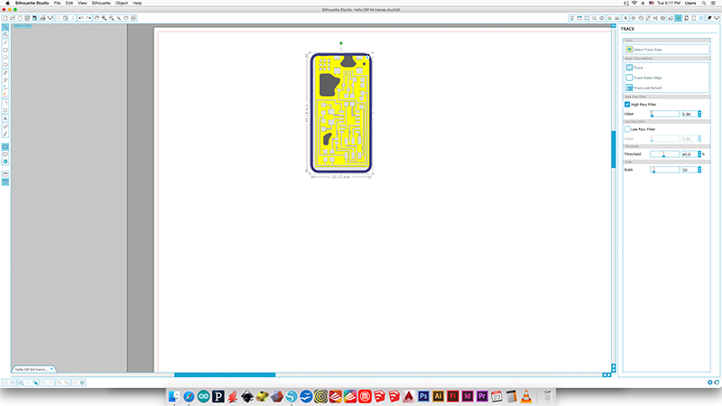

Select the area to TRACE in this case we want to cut the whole board so select it all, nothing happens if you select more space as we are going to transform the PNG by color contrast white/black of the own PNG.

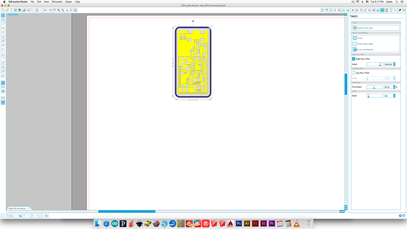

Move the sliders on the right (HIGH/LOW PASS FILTER) until the board is correctly defined.

You should get something like this.
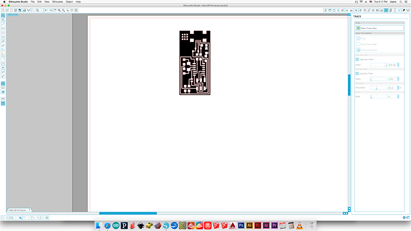

Right now the paths are on the top of your PNG image, so we click on it to select it and move it. Like this.

NOW IS VERY IMPORTANT TO CHECK THAT ALL THE TRACES ARE CONNECTED CORRECTLY BY VISUAL MAKING THE COMPARISON WITH BETWEEN BOTH. If everything is fine we can erase now the PNG.

>Move the board to the top left corner so the PCB will be cutted next to the origin point of your Vinylcutter.

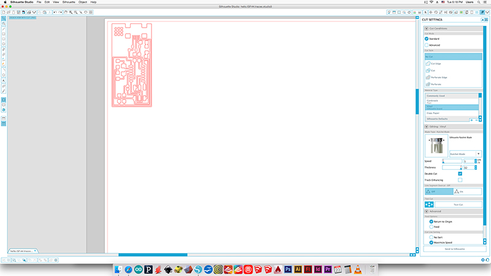

>There is a test cut on the menu so you can make different material/force trials.

Check the correct connection between the program and the machine and send the file.

### Step 3: cutting parameters

You want enough force in your circuit to cut through the copper, but not through the backing. **If you use too much force, the traces will also be dragged up with the cutting.**

For Silhouette Cameo case we have to adjust the force value via hardware or software depends on the model you have.

How to do it? Open the Vinyl front door and pick up the blade by opening the looking mechanism.

To adjust the force you have to rotate the blade setting the number from 1 to 10 (low to maximum force)

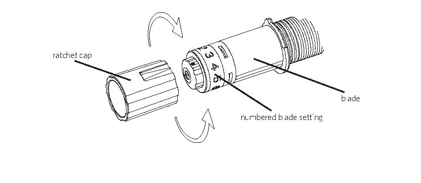

We find out that the best values in our case where:

>It is essential to do some test runs before running your file.

VINYL MATERIAL (preset)
with custom settings

* FORCE 6-8
* THICKNESS 27-30
* SPEED 1 cm/s
* Double Cut
* Line segment overcut: off

After a few shots you should get something like this.

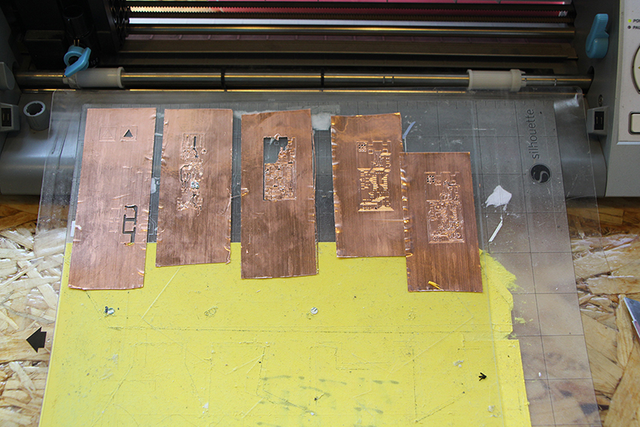

### Step 4: cleaning the board

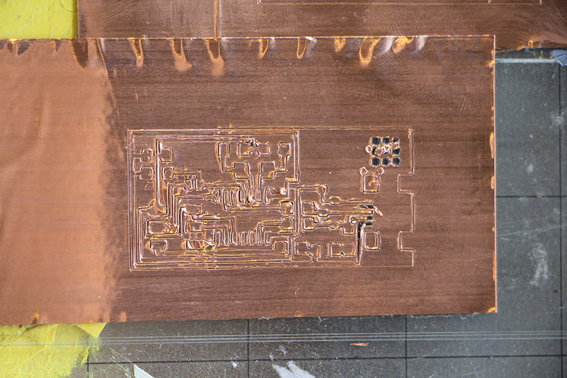

It is time to pull apart the cutting mat and the PVC sheet.

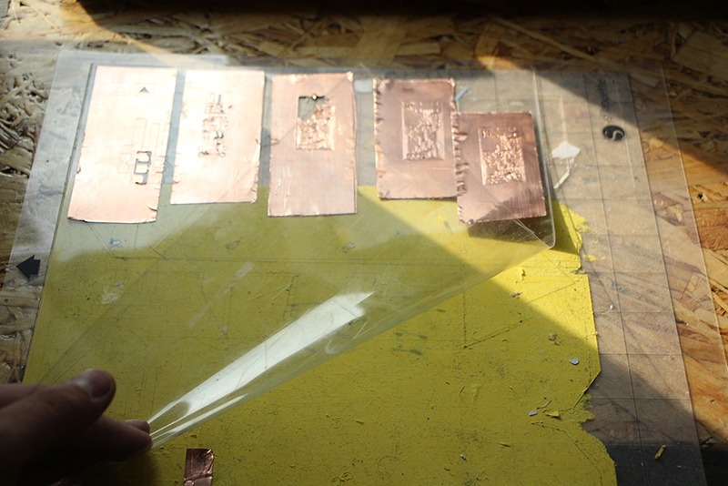

Cut the PVC around your board, remember to let enough space on the side so you can work with it easier.

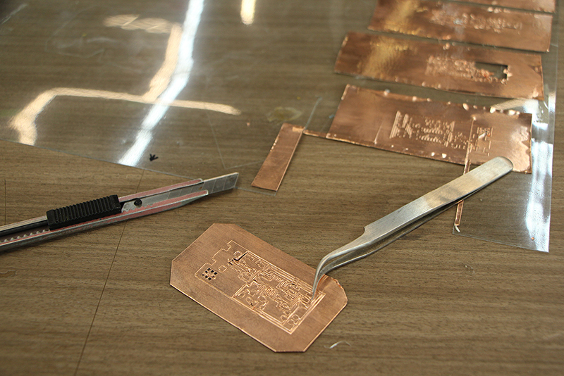

Remove the excess of tape of your board with the help of good pair of tweezers, don't be [Hulk](https://www.google.co.kr/search?q=hulk&biw=1408&bih=691&source=lnms&tbm=isch&sa=X&ved=0ahUKEwjw6Jq1_dzRAhUDzbwKHXA3A0IQ_AUIBigB) or you will break the board. Do it slowly and help you with a x-acto knife.

Clean completely the board and time to bend!

### Step 4: soldering

Soldering is the same as soldering on any other PCB. However, while soldering you might find that some of your traces are looser than need be. Fix these by adding extra pressure to the trace.

>If you don't use Kapton tape, we recommend to set a high temperature on your solder iron to solder all the components fast. Spend a short time in each pad.(Be carefull to don't melt the support material or you components as you will waste your board)

**Solder tips**
* You will find some "moving traces" make extra pressure on them to glue them correctly.
* Use a higher soldering temperature than usual but spend less time on each pad.
* Let the material cool down so you don't melt the PVC base.
* Use hot glue around the connectors to avoid breaking them while unpluging

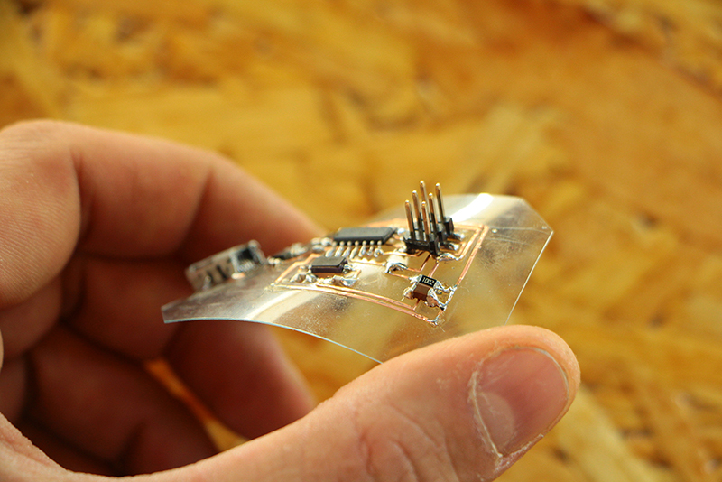

### *Enjoy your PCB and clean your mess and files after you're done working!**

### COMMON PROBLEMS/SOLUTIONS

- The traces have broken

  >As they are flexible try to move and solder them, if not you can cut a little piece of tape and stick them together.

- The traces are not being cut.

  >Show more blade while cutting and apply more force*

- The traces are being "lifted"

  >Use less force and show less blade.

- I want to move the traces to another support

  >Use transfer paper for it.

**Original tutorial by:**

* [Eduardo Chamorro](http://eduardochamorro.github.io/beansreels/index.html), Fab Lab Seoul 01.2017

Licensed under a [Creative Commons Attribution-NonCommercial-ShareAlike 3.0](https://creativecommons.org/licenses/by-nc-sa/3.0/) Unported License
