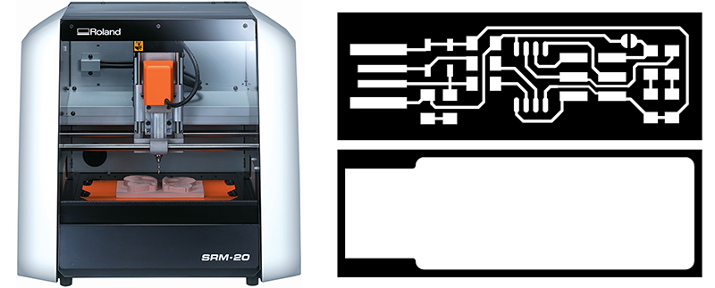
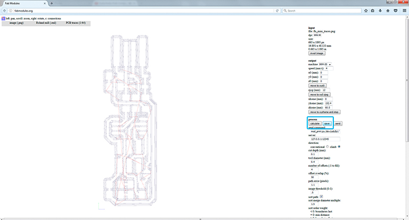
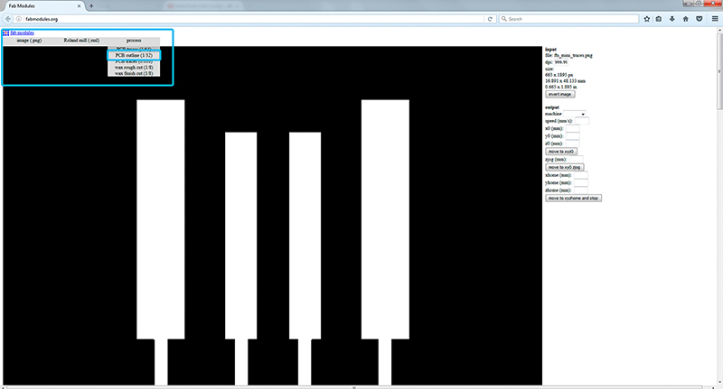
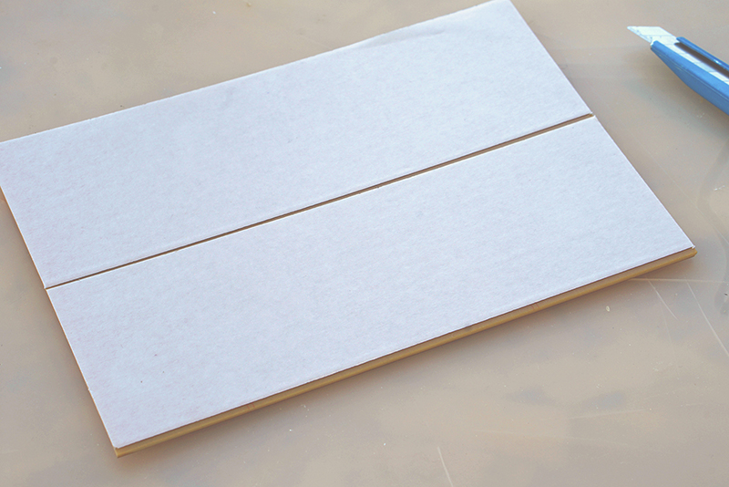
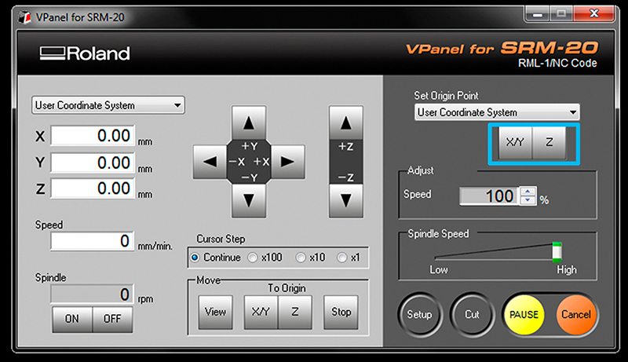
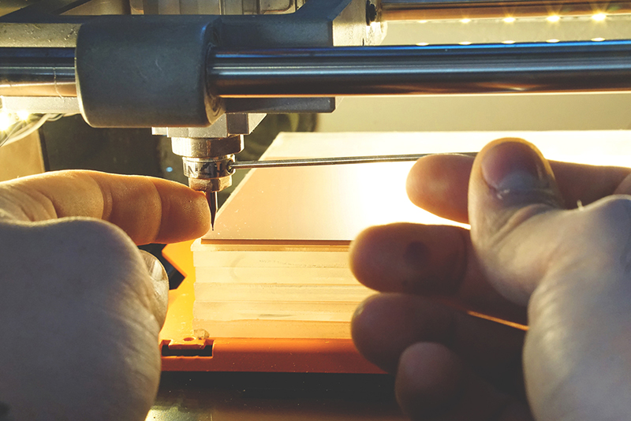
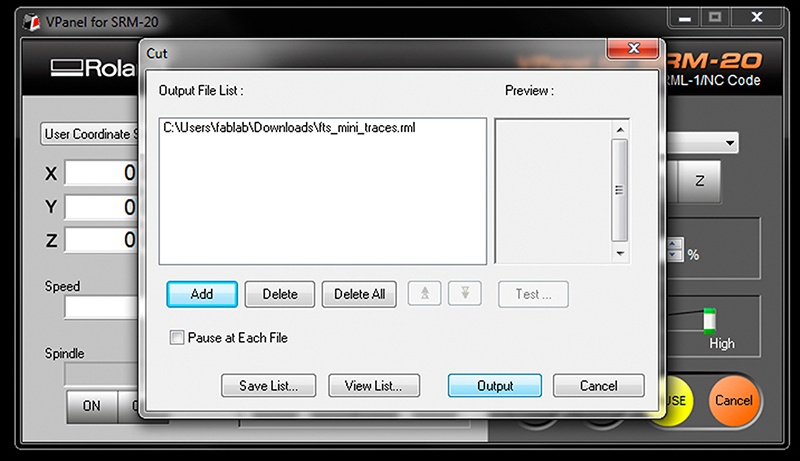

# PCBs with SRM-20

## How to use the fab module for Roland Modela (SRM-20) to make files and mill your own circuit boards!

**Summary:**

* [Turn on Modela](http://support.rolanddga.com/docs/documents/departments/technical%20services/manuals%20and%20guides/srm-20_use_en.pdf), turn on the windows computer near it. Connect if needed.
* Create and save file of circuit board traces and outcut.
* Physically load circuit board and 1/64” endmill to Modela.
* Find zero for x, y, and z.
Set settings on the computer to mill then send to Modela.
* Mill your PCBs
* Remove board, cut out if desired, cut apart any areas that didn’t make it.
* Finally, solder your components to your freshly made board!

### Step 1 obtain the files:: Find or Design a Circuit Board

Export/save your board design as .png, You should have two or three images, depending on your PCB:
* traces
* holes drill
* outline

As an example of an PCB this tutorial will use the new [FabTinyISP](http://fab.cba.mit.edu/classes/863.16/doc/projects/ftsmin/index.html) others FabIsp option can be found [here](http://academy.cba.mit.edu/classes/electronics_production/index.html)
A handy free program to do design circuits yourself, is [Eagle](http://www.autodesk.com/products/eagle/overview).

### Step 2: fab modules - Traces **(1/64)**

Open  [fab modules](http://fabmodules.org) in your browser *recommended firefox/chrome*
Open your traces image file (This is the one with lines that will form the wires between your components.)
* *input format - PNG* - select your traces image
* *output format - roland mill (.rml)*
* *process - PCB traces (1/64)*

>Always check the real size and resolution of your board.

* Machine - *SRM-20*
* x0(mm)  - *0*  
* y0(mm)  - *0*
* z0(mm)  - *0*
These x0,y0,z0 are for setting up an offset from the origin save in V-Panel
* zjopg   - *12*  
* Speed   - *4 or 3 mm/s for new end mills*

*x/y/x home is the parking position after finishing the cut*

Click **"calculate"**
 >Now you can see the tool path (blue lines for cut,red for movements in the air), this should outline all your traces. Iterate your design if you see something wrong with them.

 and after **"save"**

### Step 3: fab modules - Outcut/Holes

Refresh  [fab modules](http://fabmodules.org)

Now your outline/holes image file
* *input format - PNG* - select your traces image
* *output format - roland mill (.rml)*
* *process - PCB outline (1/32)*

>Always use the same x0,y0,zO that you used for the trace files or both cuts will not match.

* Machine - *SRM-20*
* x0(mm)  - *0*  
* y0(mm)  - *0*
* z0(mm)  - *0*
* zjopg   - *12*  
* Speed   - *0.5*

Click **"calculate"**(you should see a blue path) and after **"save"**

### Step 4: Tape down your board in the Modela.

Turn on Roland Modela and the computer and open [VPanel for SRM-20](https://www.rolanddga.com/products/3d/srm-20-small-milling-machine/features)
*A nice tip is to warm the spindle for 10 min at mid Rpm before using it.*

>Machine Setup should be configured to "understand" the G-CODE generated by [fab modules](http://fabmodules.org), so before cutting go to **setup** and check **RML-1/NC CODE** and **mm** are selected.

* Get a circuit board blank ready. Clean off the dust and fingerprints. No, for real, go do that. Then avoid getting more fingerprints on them.

>If there are any smudges then wash them in a sink with some soap and water then dry well. If it seems clean like it’s right out of the bag then it’s probably OK. Fingerprints make it harder to solder onto once the board is done.
Press the “view” button on the Modela to toggle between loading and loaded positions.

* There should be a piece of wood/acryl taped down on the machine securely already.
*This is known as the “sacrificial board” because you mill into it so you don’t mill the own machine.*
Make sure it's steady and flat.
**Clean the residues** of any dust or particles. Help you with a spatula for that task.

*  Apply double sided tape all the way across (see photo).
*Make sure it’s flat as well, with no folds, particles or overlaps under or on it.*

* Place and press your board down on the sacrificial board securely. Use a paper towel or something to avoid leaving fingerprints.

### Step 5: Set the X/Y/Z zeros

You may want to start your file slightly inside your physical board. The (0,0) of your file created in [fab modules](http://fabmodules.org) is in the bottom left corner.

A good starting point is just a few milimiters inside. Move the machine to its position by using the X/Y arrows in [VPanel for SRM-20](https://www.rolanddga.com/products/3d/srm-20-small-milling-machine/features)

Decide where to set the origin on your board.It depends on where you taped your board. When you have choosen the position click on **Set origin X/Y in Vpanel**

>Be carefull to don't touch the PCB with the end mill while moving or it will break.

**Set Z zero**,*the Z is slightly more complicated*

* Move the Z slowly with the control panel around 3-5 mm above the PCB plate.
Now we are going to do the Z manually by loosing the collect screw and land the endmill on the surface.
* Slowly loosen the mill bit with an allen wrench so that it
drops gently to the surface of your board.

>Don't let the endmill fall free on the surface or it can break.(help you with a finger pressing on the side of the endmill)

* Press “slightly down” the PCB board, around 0.5mm and tight the endmill with the screw on the collet.

* Now save the Z origin in the Vpanel control panel.

*(You’ll find an allen wrench in the Modela box--don’t forget to put it back so it’s there next time you look! fyi, it’s 1.5 size)*

### Step 6: Send the traces!

* Click **“Cut”** on the control panel.
A new window will appear where you will select your traces cutting file, now click **Output** and the machine should start.
You can send multiples files at once if you have set differents origins in [fabmodules](http://fabmodules.org)

If you are doing a lot of offset and producing a lot of residues you may want to carefully brush away some by pausing the cut and brushing them off the bit. Otherwise sometimes it will not make clean cuts. To continue close the front panel and click "resume".

> Note that the z-zero makes more of a difference for milling than for drilling.

### Step 7: Send the outcut/holes!

When the machine stops, you will have to vacuum to see the traces.**Do not remove the board!**
* Now we are going to repeat the same Z origin procedurebut before we have to change the end mill to use the 1/32 end mill.
* After zeroing the Z (only the Z)click **"CUT"** again in the control panel but now choose your Outcut/Holes files and click **Output**.

>Only set the origin Z or you will not be able to match the last origin X/Y

When the machine stops,remove your board with the help of a spatula,don't be [Hulk](https://www.google.co.kr/search?q=hulk&biw=1408&bih=691&source=lnms&tbm=isch&sa=X&ved=0ahUKEwjw6Jq1_dzRAhUDzbwKHXA3A0IQ_AUIBigB) or you will break the board.Vacuum away the plastic and metal chips in the area.
**Enjoy your PCB and Clean your mess and files after you're done working!**

### COMMON PROBLEMS/SOLUTIONS

- The machine has stopped

  >If you open the front panel the machine pauses, close it again and press resume.

- The PCB board moved and it is vibrating

  >Press again the PCB board to the sacrificial board and restart the cut.(Next time use more double side tape)*

- The end mill broke

  >Check you are using the correct G-code (RML-1/NC-CODE)
  Check you used enough air travelling movement (Zjog),recommended at least 12mm

- The PCB is still attached to the plate

  >Recut again with the 1/32 end mill the outline doing the Z lower this time.

**Original tutorial by:**

* Champaign-Urbana Community Fab Lab
By Xinao Wang, Dean, and Virginia McCreary | v1.0 | 10.2014

* Updated by Xinao W on 5Oct2014.

* Remixed/Updated by [Eduardo Chamorro](http://eduardochamorro.github.io/beansreels/index.html), Fab Lab Seoul 01.2017
