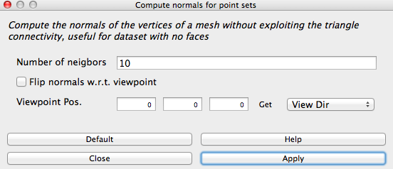
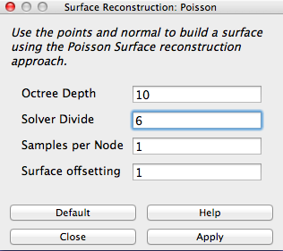
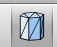
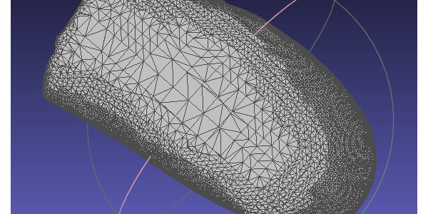

# Point Cloud to Mesh

## How to Create an STL file from a 3D scan point cloud file in MeshLab

**Summary:**

"MeshLab is an opensource, portable, and extensible system for the processing and editing of unconstructed 3D triangular meshes."This tutorial shows the workflow from how to import an XYZ 3d scan file(point cloud) and export an STL file. The input could be from a laser scanner, and the output is meant for a 3D printer.

* [Step 1 File Import](#Step 1 File Import)
* [Step 2: Create Normals and Mesh](#Step 2: Create Normals and Mesh)
* [Step 3: Export to STL](#Step 3: Export to STL)
* [Resources](#Resources)

### Step 1 File Import

* Start [MeshLab](http://www.meshlab.net/)
* File -> Import Mesh.
* Select the *.XYZ file* (in this case format of our point cloud)

Now you should see the point cloud similar to the image below.

If you zoom up, you will see it consists of a lot of points like the image below.

### Step 2: Create Normals and Mesh

* Click on Filters -> Normals, Curvatures and Orientation -> Compute Normals for Point Sets.

The window below will appear. As stated, this function is good for meshing without exploiting the triangle connectivity and is useful for datasets without faces. The 10 represents the number of points used to estimate the tangent plane at each point set. From this, normals are calculated for the mesh. In my lab experience, 10 neighbors is a good number.

* Click Apply to begin computing. This may take a little time.

* Click Filters -> Remeshing, Simplification and Reconstruction -> Surface Reconstruction: Poisson. Poisson is a common surface reconstruction algorithm. It takes the normals from each point to calculate the surface. The parameters I used in this example are below. Play around with the numbers. NOTE: If the Octree Depth is large, it may crash your computer.

* Click Apply, again the computer is working overtime and calculating many equations so it may take some time.
* Show flat lines by pressing the icon on the toolbar.

>Notice the holes are gone and the surface is filled with triangles.

### Step 3: Export to STL

* File -> Export Mesh as STL File
* Your new STL file is ready to be sliced for your 3D Printer.

### Resources

- http://meshlab.sourceforge.net/
- http://archc3d.fa.utl.pt/photogrammetry/lesson_04_Tutorial_MeshLAB.pdf
- http://www.cse.iitd.ac.in/~mcs112609/poission.pdf

**Original tutorial by:**

* [Terence J Fagan](https://terencefagan.wordpress.com/) 
| v1.0 |2014

* Remixed/Updated by [Eduardo Chamorro](http://eduardochamorro.github.io/beansreels/index.html), Fab Lab Seoul 01.2017
