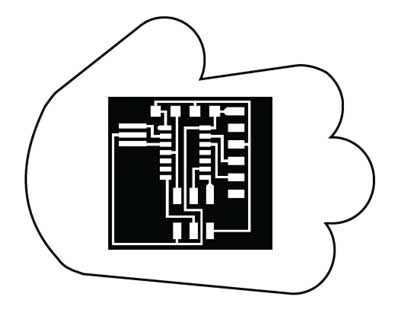
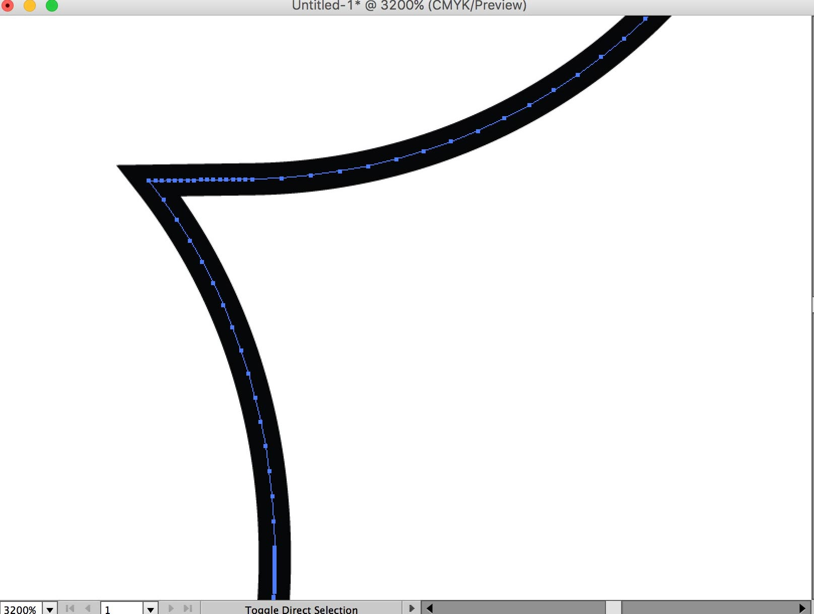
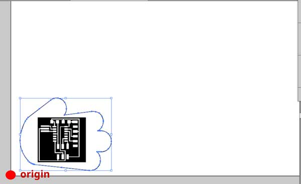
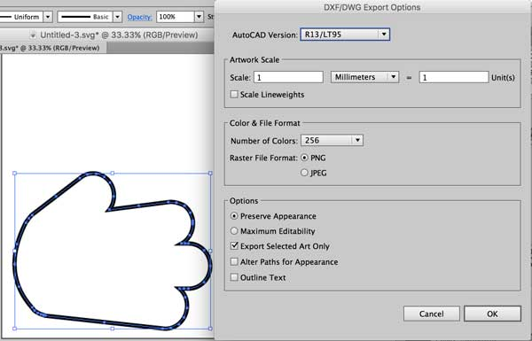
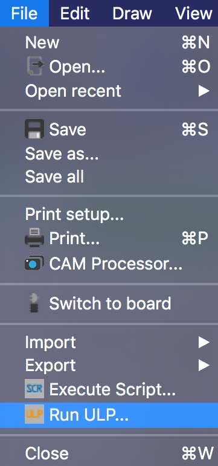
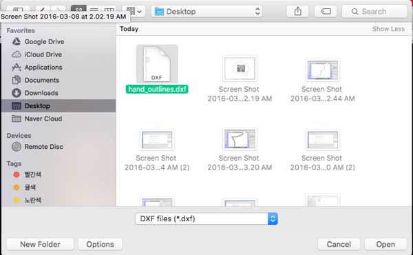
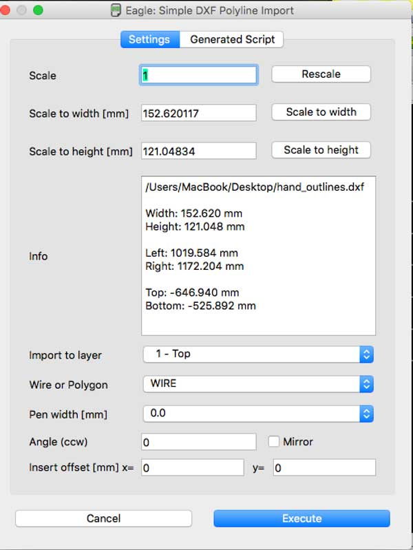
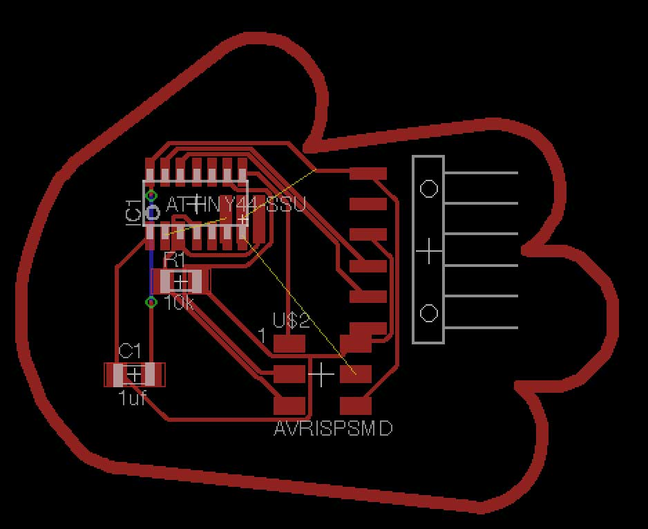
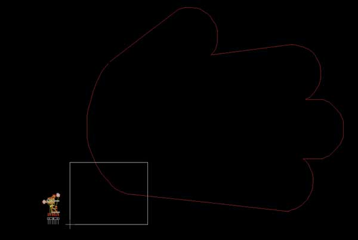

# Custom Outlines with EAGLE

We have found that while fab academy students first learn how to use Eagle and make their first hello-echo board from their assignment, they like to make modification of their board rather than making simple rectangular shapes.

**Making custom outlines for PCB is done in a few steps via vector drawing tools.**

**Summary**

* [Step 1: Add extra anchor point to the shape](#Step 1: Add extra anchor point to the shape)
* [Step 2: Export Shape as DXF](#Step 2: Export Shape as DXF)
* [Step 3: Import vectors into Eagle](#Step 3: Import vectors into Eagle)
* [Step 4: Use customized outlines in the circuit](#Step 4: Use customized outlines in the circuit)

*Robust way of making vector artwork from illustrator/inkscape to Eagle*

### Step 1: Add extra anchor point to the shape.
Think about the actual size of the board and make sure that traces aren't interfered by outlines you create with illustrator.

When doing import command in Eagle, produces only straight lines as output- any curves might seem just straight lines. To fix this problem, add extra anchor points/nodes to the shape (Object > Path > Add Anchor Points). Add enough until you feel like number of points/nodes are sufficient to descirbe the shape. Look at the image below.

oom in if necessary to check anchor points are added. Look at the difference between two objects when anchor points are added(Before & After)

*Keep in mind, that too many anchor points could make importing too much of a burden to computer. Think of each anchor points as seperate node you create in Eagle.*

> This tutorial should work for any other vector program that can export DXF format.

### Step 2: Export Shape as DXF

Example Files to Start From (Hand Outlines.svg,hello-echo board.png)

Illustrator supports DXF files. For importing DXF files into Eagle, it recommended to be oldest version as R13/LT95. (Trying the newer version is fine, check with Eagle for experimental trial)

**Position of the drawing shape must be LOWER LEFT of the page. otherwise the shape will be faraway from oring in the Eagle.**

In Options, click Export selected Art Only.

### Step 3: Import vectors into Eagle

Now we try special method to import vectors made from illustrator's DXF format (Note : it works fine with any other graphic design tools that can export DXF format). This is performed by the ULP (User language Programs) [import_dxf_polygons_v4.ulp](custom_outlines_pcb/import_dxf_polygons_v4.uplp) For any other ulps you can download from *Cadsoft Eagle userfiles* misc area.

In Eagle, from the main window of the program, click the 'ULP' button on the toolbar or 'File > Run ULP'. Eagle will open up a dialog and you will have to navigate to location where you downloaded the 'import_dxf_polygons_v4.ulp' file.
Second job is to navigate to your DXF file and open until you get the main import dialog
box.

Here you can rescale, mirror or rotate the shape by giving it a number to angle or checing the msg box which says 'Mirror'.

**Reminder for settings**

* Import to layer : 1-Top
* Wire of Polygon : WIRE (NOT POLYGON)
* Pen width [mm] : select from 0.5 ~ 1.0 to make outlines

When you are done with options press 'Execute'.

### Step 4: Use customized outlines in the circuit

Normal hello echo-board can turned into shapes with freely drawn outlines.

Now enjoy making customized pcb for your electronic design assignment.

### COMMON PROBLEMS/SOLUTIONS

- If not properly measured the dimension your outlines can outsize the canvas like above and at the same time, if you don't make appropriate pen width It's useless to make outlines.

It's not 100% accurate to make continuous outlines and there can be possibility of having not joined lines at some point. Easiest way is to make WIRES manually.

**Original tutorial by:**

* [Yongwoo Song](https://yongwoosong.github.io/)
 | v1.0 | 2016

* Remixed to markdown by [Eduardo Chamorro](http://eduardochamorro.github.io/beansreels/index.html), Fab Lab Seoul 01.2017

Licensed under a [Creative Commons Attribution-NonCommercial-ShareAlike 3.0](https://creativecommons.org/licenses/by-nc-sa/3.0/) Unported License
