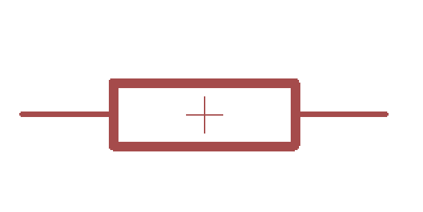
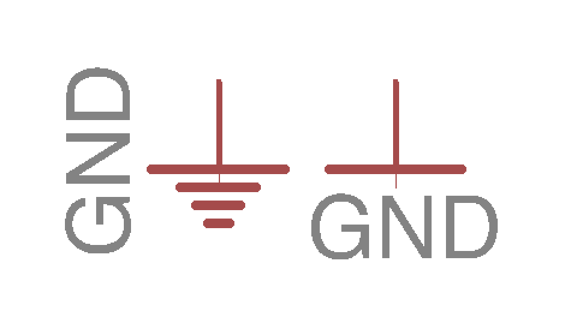
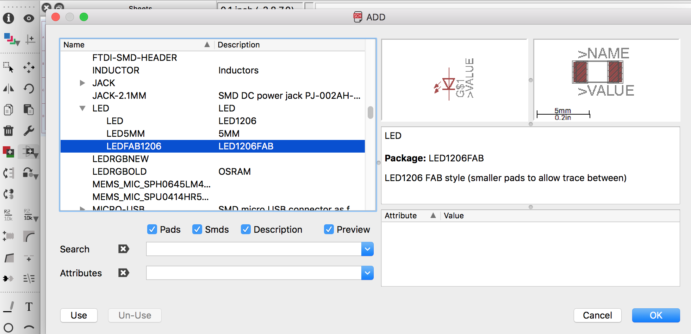
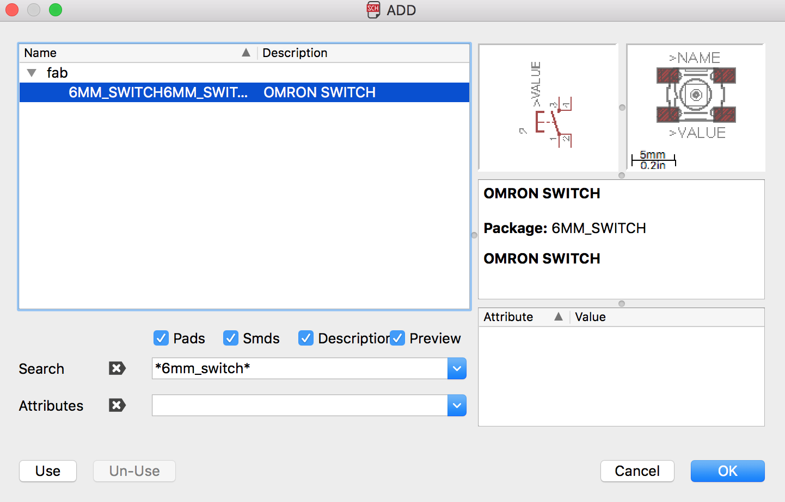
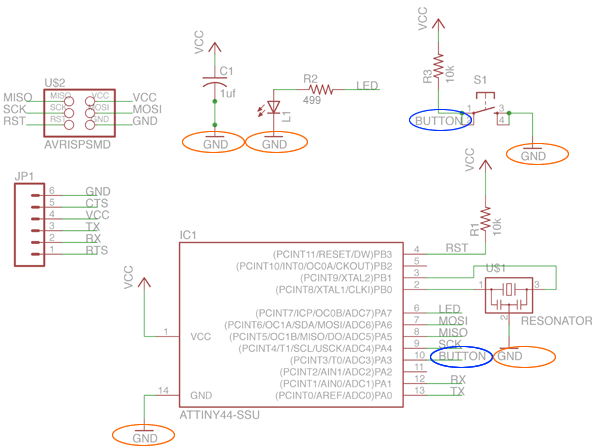
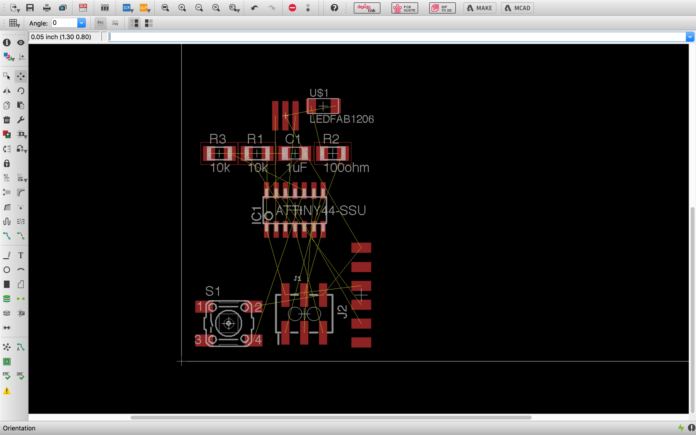
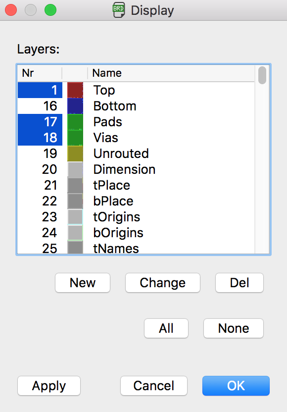
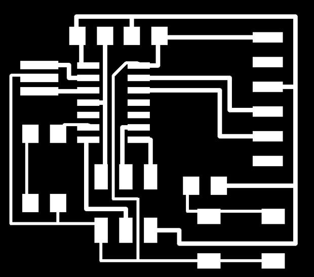

# Introduction to Eagle

**Steps:**  
* [Download and install Eagle](#download-and-install-eagle)
* [Sample echo board schematic](#sample-schematic)
* [What is a schematic?](#what-is-a-schematic)
* [What is a board layout?](#what-is-a-board-layout)
* [Download and install component Libraries](#download-and-install-the-component-libraries)
* [How to use Eagle](#how-to-use-eagle)
* [Edit the schematic](#edit-the-schematic)
* [How To add & connect components in the schematic](#how-to-add-and-connect-components-in-a-schematic)
* [How to route traces on a board](#route-traces-on-a-board)
* [Eagle tips and tricks](#tips-and-tricks)
* [Exporting a board design](#exporting-a-board-design)
* [Eagle tutorial links](#eagle-tutorial-links)

Software versions used at time of writing:  
 - Eagle 8.0.1

##Download and Install Eagle

###What is Eagle?

EAGLE (Easily Applicable Graphical Layout Editor) is a flexible and expandable [EDA](http://en.wikipedia.org/wiki/Electronic_design_automation) schematic capture, PCB layout, autorouter and CAM program. EAGLE is popular among hobbyists because of its freeware  license and rich availability of component libraries on the web.

####Download and Install

[Get Eagle here](http://www.autodesk.com/products/eagle/free-download)

There are installers for Mac, Linux and Windows. Choose the appropriate one for your operating environment and install it. Autodesk offers a 'Personal Learning License' for individuals working on non commercial projects.

##Sample Schematic

#####Example Files to Start From

To help you along, you can build off the Hello Echo example. Start by adding the necessary components to  these example files:
[hello.fdti.44 schematic](eagle_english/hello-ftdi-44.sch)

1.  Go to  documents and copy the extracted folder into your Eagle folder.
    *   **Mac**: In your "Documents" folder > eagle
    *   **Ubuntu: **In your "home directory" > eagle
    *   **Windows:** In your "Documents" folder > eagle
2.  Open Eagle
3.  Open the helloEcho schematic you downloaded

##What is a Schematic?

A schematic in electronics is a drawing representing a circuit. It uses symbols to represent real-world electronic components. The most basic symbol is a simple conductor (traces), shown simply as a line. If wires connect in a diagram, they are shown with a dot at the intersection.

This is what the schematic for "echo.ftdi.44" looks like:

### Electrical core concepts

*   CURRENT  is the directed flow of charge through a conductor.
*   VOLTAGE is the force that generates the current.
*   RESISTANCE is an opposition to current that is provided by a material, component, or circuit.

### Schematic Symbols

| Part description | Symbol |
|---|---|
| **resistor**  A _resistor_ is part of an electrical circuit that resists the flow of current. |   |
| **capacitor**  A capacitor is a device used to store an electric charge, consisting of one or more pairs of conductors separated by an insulator. [Capacitors](http://www.wisegeek.com/what-is-a-capacitor.htm) are often used as filter devices to remove voltage or signal spikes   in electronic circuits |  |
|  **LED** Light-emitting diode, a semiconductor diode that glows when a voltage is applied. |   |
| **Ground**  Ground is the reference point relative to which other voltages in the  circuit are measured.  Vcc+ is  positive relative to ground. We usually call the ground "zero volts", to  make the other measurements simpler.  Apply the black (-) end of your meter to ground on a powered circuit and the red (+) end of the meter on VCC to measure the voltage. |  |
| **VCC (power)**  Vcc+ is  positive relative to ground. |  |
| **header pins**  |   |
| **Integrated circuit**   |   |
##What is a board layout?

The board layout shows how the electrical components and traces will be laid out on the board.

A finished board might look something like this:

##Download and Install the component Libraries  

Eagle has a lot of built in libraries of components that you can  use. The fab network also maintains a library.

[fab.lbr](eagle_english/fab.lbr)  
The fab.lbr library is constantly being updated.  
(You can learn more about contributing to it [here](../contributing/))

Depending on your project you might need to find and install additional part libraries. Talk to your instructor for more specific advice.

##### Here is how to install the libraries.

*   On the **Mac**, it should be /Applications/EAGLE-8.#.#/lbr/

    On **Windows**, it is most likely C:\Program Files\EAGLE-8.#.#\lbr\

    On **Linux**,  the default install location is /opt/eagle-8.#.#/lbr/

*   Go to the top toolbar and select the "Library" menu
*   Select  "use" and `open` the .lbr file you downloaded.

  

**Now when you go to add a component - all of the libraries are available**

##How to Use Eagle

####Eagle Basics

#####Eagle has two windows that you use simultaneously to design a board:

*   **Schematic (.sch)** - logical components
*   **Board Layout (.brd)** for the actual board that we mill
*   There is a schematic / board button so you can switch between the two 

*   Don't close layout and not schematic (or vice versa) - you need to keep both open all the time!
*   Closing one view while the other view is open (and making edits) will break the link between the two

#### Working with the Eagle Interface

There are 2 ways to interact with Eagle.

*   **Graphical Icons Toolbar:** You can use the icons in the left-hand toolbar, mouse over them to see what they do. (enabled by default).
*   The list of command line commands listed below also apply to the icons.
*   ERC and DRC are under "tools" in the top menu.

*   **Command Line**: You can start typing a command at any point, then select the item in the schematic / board that you wish to interact with, see section on commands below.

##### Eagle has a command line (just start typing commands) - basic commands include:

*   **add **= opens up the libraries so that you can add components in  Schematic view
*   **move** = moves an item
*   **net **= makes a logical connection
*   **junction** = adds a junction
*   **value** = addes value to components (i.e. ohm rating)
*   **name** = names a component
*   **label **= displays the name of a component in schematic view
*   **copy** = copies an existing component on the schematic.
*   **route** = used in Layout view, this tells you if you need to add a connection (follow yellow lines)
*   **ERC** = electronic rules check; this ensures your board will actually work (use in schematic view)
*   **DRC **= design rules check (in board view) - keep all the default  settings (16 mil is fine); it should display a "no error" message in the  bottom left hand corner of the screen
*   **group **= groups components in Layout view together; if you right-click, then you can choose _Move: Group_ to move the grouping
*   **rats** = in board view, tells you if you have airwires
*   **rip** = deletes connections in layout
*   **show** = after typing this, select a component to see information  about it displayed in the bottom left corner of the screen. Also, if  you type show + [name of component] you can see that component  highlighted. You can use this to see all the ground traces, for example.
*   **text** = allows you to add text to your board. You can also edit  the exported .png file in The Gimp to give text and black and white line images. I recommend adding text in The Gimp.)
*   **info** = then click on text to get properties of the text

##Edit the Schematic

More about how to add components and work with Eagle below in the next section.
1.  We will add components to the schematic view and create connections between them.
2.  Then we verify the design using the ERC (Electrical Rules Check)
3.  After we finish connecting the components and fixing any errors, we will go into the board view and place the components and route the traces.

##### Parts Already on the Hello Echo Board

*   **6-pin programming header:** for programming the board
*   **microcontroller: **attiny44A. Once the microcontroller is programmed,  the program stored in non-volatile memory. This means that it will remember the program.
*   **FTDI header:** powers the board and allows board to talk to computer
*   **20MHz resonator:** external clock. The attiny has a 8Mhz clock but the resonator is faster (increase the clock speed of the processor) and more accurate.

##### At a minimum you should add the following components to the schematic:

*   **Resistor** (value 10k)
    Purpose: pull-up resistor. [What is a pull-up resistor?](https://learn.sparkfun.com/tutorials/pull-up-resistors)
*   **Button **
*   **Ground**
*   **VCC **
*   **connect pin 10** (PA3) on the micro-controller to the button
*   **LED **(Light Emitting Diode) - LEDs have polarity - the side with the line is the cathode and connects to the ground side.(see schematic below)
*   **Resistor **(value 499 ohms)
    Purpose: current limiting resistor
*   Why do we need a current limiting resistor? So we don't burn out the LED.
*   The LEDs we are using are rated for
*   The typical forward voltage is between 1.2-2.2V
*   We need to use a 82 ohm resistor or above to avoid blowing out the LED. I chose to use a 499 ohm resistor, but you could use a 100 ohm resistor and still be safe.

##How To add and connect components in a schematic

#### How to Add the Components

Add a component (either type "add" or select the "add icon from the toolbar". The add menu will open.

You can either look through the listed libraries for a component to add or you can type it into the box above the "drop" button.

##### Add LED (in the fab.lbr library)

##### Add Resistors (You will need 2 - from the [fab.lbr](eagle_english/fab.lbr) library)

Click "ok" and then click on the schematic to place the component.

##### Add Button (in the fab library)

Click "ok" and then click on the schematic to place the component.

##### Add Grounds

Click "ok" and then click on the schematic to place the component.

##### Add VCC (connection to power)

Click "ok" and then click on the schematic to place the component.

#### How to Connect the Components

##### There are two was to connect components in a schematic:

1.  You can connect the components with a wire (also called a "net" in Eagle). This may make connections obvious at first, but can get really messy quickly as nets cross over each other.
*   You can also _name the nets_ attached to components that need to be connected by naming them with the same name. See example schematic above. Eagle will ask you if you want them to be connected. (Say yes!). _After you name the component - label it so the name appears in the diagram._

For example:
*   All of the components in the schematic named GND are all connected to a common ground point.
*   the button is connected to a net on the button component and a pin on the microcontroller.
3.  _Use pin 10 on the to connect to the button._
5.  _Use pin 6 on the to connect to the LED._

*   Next  to connect two components, NET -- NAME -- LABEL (so you'll need a  net on both the component itself and the microcontroller pin as well)

##Route traces on a board

*   Switch to the board view
*   Go to the top menu > File > switch to board
*   The board view will open up
*   The components you just added will be jumbled up in a corner with yellow unrouted traces attached.

*   Use "move" to move each individual component around.
*   Use "route" to route each trace. The wire will turn red as you route it into place.
*   After you route wires, you can use the "move" tool to move them around as lines.
*   Route all the traces until it looks something like the diagram below.
*   There is also an autorouter feature - it is good for making a general layout, but you will probably have to edit the traces manually. Especially on this circut.
*   to use the autorouter go to: the "tools" menu in the top toolbar and select "auto"
*   you can also type "auto"
*   It doesn't have to look exactly the same, there is more than one way to route the traces. Just use this as a guide.

##Tips and Tricks

*   In free version of eagle, don't put anything below or to the left of the cross (origin) in either schematic or layout.
*   0 ohm resistor trick: place a 0 ohm resistor over a trace to hop over an existing trace
*   junction (symbol is a dot) can be useful when a net splits into  two different nets - indicates whether two nets that crossover are  connected or not...
*   under options you can change the background colour of the schematic/layout (User Interfaces)
*   click on display to see the layers which you can show/hide
*   layout pieces in Layout - use right-click to rotate components

#Exporting a board design

##### To prep board for milling:

in layers menu in the top toolbar, select the only the top layer (traces only)

*   then export as a png (file -- export -- image)
*   settings should be MONOCHROME and 500 DPI - this will export a image with white traces.
*   Make sure the color mode is set to greyscale: image > mode > greyscale
*   then export Dimenson layer for milling the outside of the board
*   Remember: the Modela cuts out the DARK and leaves white!

#### Exported PNG

You can also edit your board .pngs in the Gimp. I find that the text added in the Gimp can be bolder (heavier and thicker) and is less likely to tear off when milling the board.

#### Editing Board Files / Creating Traces and Mill-out Files.

*   Open up your board traces .png in The Gimp
*   Crop the file if necessary
*   Go to the "Modify" menu > Canvas > Canvas Size

#### Add a White Border around the image

##### Create the Traces PNG

1.  Add 20px to the width (make sure the proportions are linked).
2.  After adding 20px, hit the "center" button to center the image on the resized canvas.
3.  Flatten the image - go to "Image" > flatten image
4.  You will now have a 20px white boarder around the board traces image.
5.  Save the file. This is the file you will use to mill the traces on the Modela.
6.  You can add white text or images if you like and they will be milled out along with the traces.

**Example Traces Board File **

This image is  not to scale.  This is on purpose! You need to create your own board files! If you mill these images below, the pad sizes will be incorrect.

##### Create the Interior (mill out) PNG

1.  Start with the traces png that you have already created.
2.  Save the file with a different name.
3.  Use the bucket / fill tool to fill in the all the white spaces, EXCEPT the BORDER. Leave the white border around the image. This will be used to create the interior file for milling out the board. Using the traces image to start with ensures that your files are properly registered and you won't mill through your traces.
4.  Save the file. This is the file you will use to mill the traces on the Modela.

##Eagle tutorial links
_Bonus links for further reading_  

[Sparkfun tutorial](https://learn.sparkfun.com/tutorials/using-eagle-schematic)

[Beginner Tutorial](http://khammami.blogspot.com/2008/10/how-to-use-eagle-for-beginner.html)

[Create A Custom Library Part ](http://www.instructables.com/id/How-to-make-a-custom-library-part-in-Eagle-CAD-too/)

#####Original tutorial by:  

[Anna Kaziunas France ](http://www.kaziunas.com/site/bio.html)  

###### Updated by:
Craig Hobern | Fab Lab Wgtn | v1.0 | 2017-02-21 | Convert to Markdown, Update for eagle 8.0.1  

