# Electronics Design - Eagle

### How to design your *hello_world* board using EagleCad

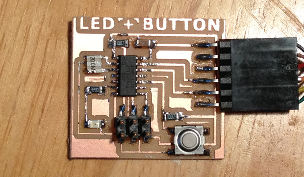

## This week's assignment is to:

*   add a button and LED  to the echo hello-world board,
*   check the design rules,
*   and make it.
*   Review Neil's class page: [http://academy.cba.mit.edu/classes/electronics_design/index.html](http://academy.cba.mit.edu/classes/electronics_design/index.html)

## Contents:

*   [Getting Started With Eagle](#getting_started_with_eagle)*   [Step 1\. Download and Install Eagle](#download_and_install_eagle)
    *   [Step 2\. Sample Echo Board Schematic / Board ](#step2)
    *   [Step 3: What is a Schematic?](#step3)
    *   [Step 4: What is a Board Layout?](#step4)
    *   [Step 5\. Download and Install the Component Libaries](#step5)
    *   [Step 6: How to Use Eagle](#step6)
    *   [Step 7: Edit the Schematic](step7)
    *   [Step 8: How To Add / Connect Components in the Schematic](step8)
    *   [Step 9: How to Route the Traces on the Board](#step9)
*   [Eagle Tips and Tricks](#tips_tricks)
*   [Exporting a Board Design to be Used with Modela](#export_board)
*   [Additional Eagle Resources](#eagle_resources)*   [Where to Get the FT](#FTDI)[DI Headers](#FTDI)
    *   [Eagle Tutorial Links](#links)

## Getting Started With Eagle

### Step 1 Download and Install Eagle

### What is Eagle?

EAGLE (Easily Applicable Graphical Layout Editor) is a flexible and expandable [EDA](http://en.wikipedia.org/wiki/Electronic_design_automation "Electronic design automation") schematic capture, PCB layout, autorouter and CAM program. EAGLE is popular among hobbyists because of its freeware  license and rich availability of component libraries on the web. We will use Eagle to layout and modify a circuit board for this assignment.

#### Download and Install

##### Get Eagle Here:[ http://www.cadsoftusa.com/downloads/](http://www.cadsoftusa.com/downloads/)

##### There are installers for Mac, Linux and Windows. Download for your OS.

*   Eagle has an installer, run it.
*   After you install the application and open it, Eagle will ask you which version you want to install - choose "Freeware"

## Step 2\. Sample Echo Board Schematic / Board

##### Example Files to Start From

To help you along, you can download the Hello Echo schematic and board files. You can then add the necessary components to the schematic in these example files:
[Board Hello Echo and Schematic](Downloads/helloEcho.zip)

1.  Go to  documents and copy the extracted folder into your Eagle folder.
    *   **Mac**: In your "Documents" folder > eagle
    *   **Ubuntu: **In your "home directory" > eagle
    *   **Windows:** In C: > Program Files(x86) > eagle6.4.0 > projects > examples
2.  Open Eagle
3.  The helloEcho folder should be visible under "Projects" in the Control Panel.
    *   Make sure the little dot to the right of the libraries are green.
    *   If they are grey right click on it and check "use" to turn it green.

Windows users - Your files will be listed under "Examples".

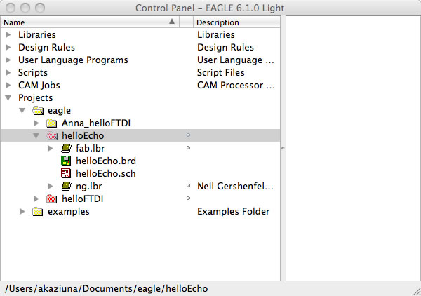

Right click on the grey circle and select "use" from the menu. The circle should turn green.

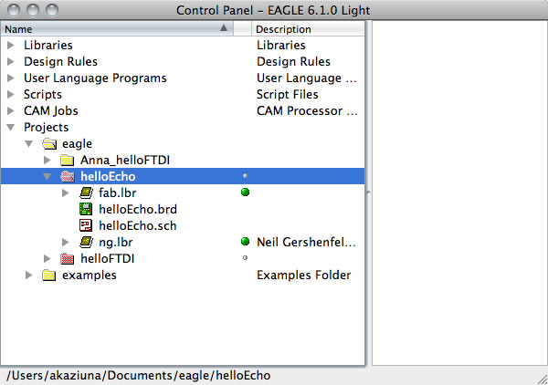

## Step 3: What is a Schematic?

A schematic in electronics is a drawing representing a circuit. It uses symbols to represent real-world electronic components. The most basic symbol is a simple conductor (traces), shown simply as a line. If wires connect in a diagram, they are shown with a dot at the intersection.

This is what the schematic for "Hello Echo" looks like:

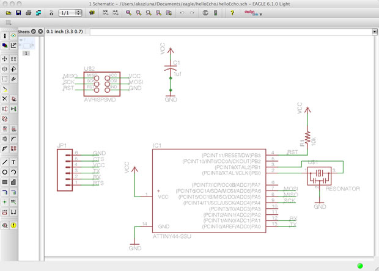

### Electrical Concepts

*   CURRENT  is the directed flow of charge through a conductor.
*   VOLTAGE is the force that generates the current.
*   RESISTANCE is an opposition to current that is provided by a material, component, or circuit.

### Schematic Symbols

<table width="617" cellspacing="2" cellpadding="3" border="0"><tbody><tr><td width="270" align="left">

## resistor

A _resistor_ is part of an electrical circuit that resists the flow of current.

</td><td width="329" align="center"></td></tr><tr><td height="223" align="left">

## capacitor

A capacitor is a device used to store an electric charge, consisting of one or more pairs of conductors separated by an insulator. [Capacitors](http://www.wisegeek.com/what-is-a-capacitor.htm) are often used as filter devices to remove voltage or signal spikes   in electronic circuits

</td><td align="center">

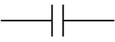

                or

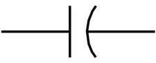

</td></tr><tr><td align="left">

## LED

Light-emitting diode, a semiconductor diode that glows when a voltage is applied.

</td><td align="center">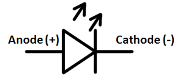</td></tr><tr><td align="left">

## ground

Ground is the reference point relative to which other voltages in the  circuit are measured.  Vcc+ is  positive relative to ground. We usually call the ground "zero volts", to  make the other measurements simpler.

Apply the black (-) end of your meter to ground on a powered circuit and the red (+) end of the meter on VCC to measure the voltage.

</td><td align="center">

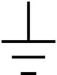

or

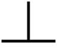

</td></tr><tr><td align="left">

## VCC (power)

Vcc+ is  positive relative to ground.

</td><td align="center"></td></tr></tbody></table>

## Step 4: What is a Board Layout?

The board layout shows how the electrical componets and traces will be laid out on the board.

This is what the board layout looks like:

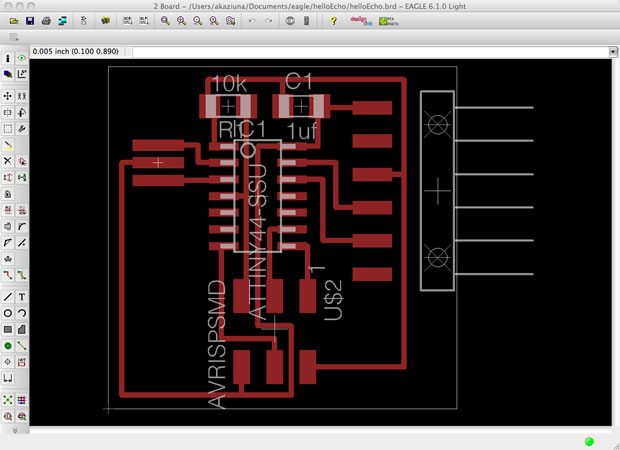

## Step 5: Download and Install the Component Libaries

Eagle has a lot of built in libraries of components that you can  use, but there is one specific library that you will need for this class.

### Download

##### [Download the Libaries ](http://academy.cba.mit.edu/content/tutorials/akf/Downloads/helloEcho.zip)

**UPDATE:** There is also a single "Fab Eagle Library".

[**Download  Component Libary 01_Fab.lbr**](../electronics/fab.lbr.zip). It should have all the components that are shown below, but the part selection will be under a different dropdown menu than shown in some of the screenshots.
>

  >NOTE: I have renamed the libraries with a 01_ before the name of the library, so that they show up at the beginning of the "Add" list when adding new components.

### Install the Libraries

##### Here is how to install the libraries.

After downloading them - unzip them and move them to the appropiate place for your operating system;

*   On the **Mac**, it should be /Applications/EAGLE/lbr/.

    On **Windows**, it is most likely C:\Program Files\EAGLE\lbr\ (fact check this).

    On **Linux**,  the default install location is /opt/eagle-5.3.0/lbr/ (this is for  version 5.3.0, the directory may be different for newer versions)

*   Go to the top toolbar and select the "Library" menu
*   Select  "use".

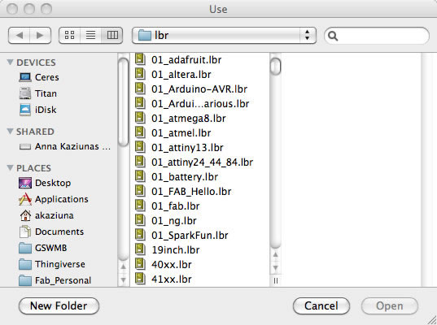

Select all the libraries with 01 in front and click "open".

##### Now when you go to add a component - all of the libraries are available and at the top of the list.

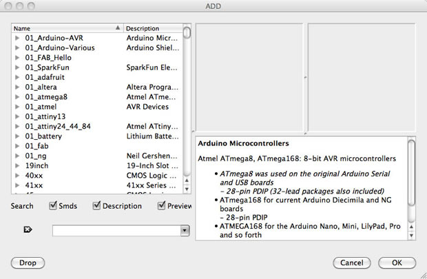

### Step 6: How to Use Eagle

#### Eagle Basics

##### Eagle has two windows that you use simultaneously to design a board:

*   **Schematic (.sch**) - logical components
*   **Board Layout (.brd)** for the actual board that we mill
*   There is a schematic / board button so you can switch between the two 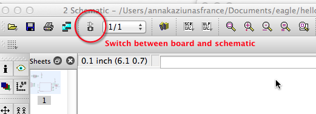

*   Don't close layout and not schematic (or vice versa) - you need to keep both open all the time!
*   Closing one view while the other view is open (and making edits) will break the link between the two
*   If you close / do not open one of the files, Eagle will warn you: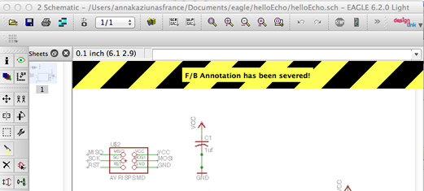

#### Working with the Eagle Interface

There are 2 ways to interact with Eagle.

*   **Graphical Icons Toolbar:** You can use the icons in the left-hand toolbar, mouse over them to see what they do. (enabled by default).
*   The list of command line commands listed below also apply to the icons.
*   ERC and DRC are under "tools" in the top menu.

*   **Command Line**: You can start typing a command at any point, then select the item in the schematic / board that you wish to interact with, see section on commands below.

##### Eagle has a command line (just start typing commands) - basic commands include:

*   **add ** = opens up the libraries so that you can add components in  Schematic view
*   always choose the 1206 components
*   these are the  ones that have 12mm x 6mm packages
*   **move** = moves an item
*   **net **= makes a logical connection
*   **junction** = adds a junction
*   **value** = addes value to components (i.e. ohm rating)
*   **name** = names a component
*   **label **= displays the name of a component in schematic view
*   **copy** = copies an existing component on the schematic.
*   rename pieces you copy
*   **route** = used in Layout view, this tells you if you need to add a connection (follow yellow lines)
*   **ERC** = electronic rules check; this ensures your board will actually work (use in schematic view)
*   **DRC **= design rules check (in board view) - keep all the default  settings (16 mil is fine); it should display a "no error" message in the  bottom left hand corner of the screen
*   **group **= groups components in Layout view together; if you right-click, then you can choose _Move: Group_ to move the grouping
*   **rats** = in board view, tells you if you have airwires
*   **rip** = deletes connections in layout
*   **show** = after typing this, select a component to see information  about it displayed in the bottom left corner of the screen. Also, if  you type show + [name of component] you can see that component  highlighted. You can use this to see all the ground traces, for example.
*   **text** = allows you to add text to your board. You can also edit  the exported .png file in The Gimp to give text and black and white line images. I recommend adding text in The Gimp.)
*   **info** = then click on text to get properties of the text

## Step 7: Edit the Schematic

### What to Do (Overview)

##### First we edit the schematic.

More about how to add components and work with Eagle below in the next section.
1.  We will add components to the schematic view and create connections between them.
2.  Then we verify the design using the ERC (Electrical Rules Check)
3.  After we finish connecting the components and fixing any errors, we will go into the board view and place the components and route the traces.

##### Parts Already on the Hello Echo Board

*   **6-pin programming header:** for programming the board
*   **microcontroller: **attiny44A. Once the microcontroller is programmed,  the program stored in non-volatile memory. This means that it will remember the program.
*   **FTDI header:** powers the board and allows board to talk to computer
*   **20MHz resonator:** external clock. The attiny has a 8Mhz clock but the resonator is faster (increase the clock speed of the processor) and more accurate.

##### You will need to add the following components to the schematic:

*   **Resistor** (value 10k)
                *   Purpose: pull-up resistor.   

  [What is a pull-up resistor?](http://www.sparkfun.com/tutorials/218)
*   **Button **(OMERON switch)
*   **Ground**
*   **VCC **
*   **connect pin 10** (PA3) on the microcontroller to the button
*   **LED **(Light Emitting Diode) - LEDs have polarity - the side with the line is the cathode and connects to the ground side.(see schematic below)
*   **Resistor **(value 499 ohms)
                *   Purpose: current limiting resistor
    *   Why do we need a current limiting resistor? So we don't burn out the LED.
    *   The LEDs we are using are rated for
    *   The typical forward voltage is: 1.8V
    *   The max current the LED can take is:

      See: [http://led.linear1.org/1led.wiz](http://led.linear1.org/1led.wiz)
    *   Look at the datasheet for the LED to get the values to plug in.
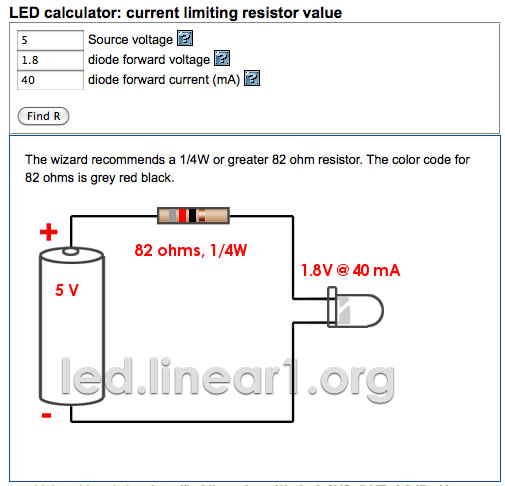

*   We need to use a 82 ohm resistor or above to avoid blowing out the LED. I chose to use a 499 ohm resistor, but you could use a 100 ohm resistor and still be safe.

##### Example Schematic with LED and button added with appropiate resistors and connections to power and ground.

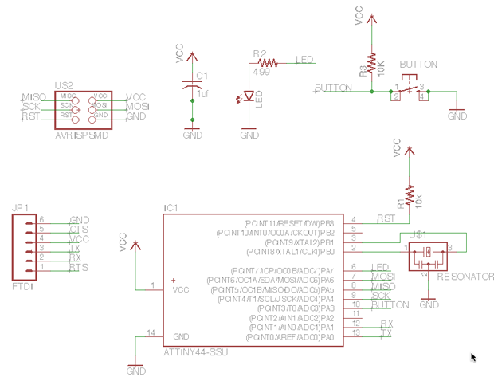

### Step 8: How To Add / Connect Components in the Schematic

#### How to Add the Components

Add a component (either type "add" or select the "add icon from the toolbar". The add menu will open.

You can either look through the listed libraries for a component to add or you can type it into the box above the "drop" button.

##### Add LED (in the FAB_Hello library)

##### Add Resistors (You will need 2 - in the ng library)

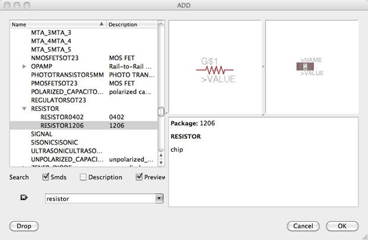

Click "0k" and then click on the schematic to place the component.

##### Add Button (in the fab library)

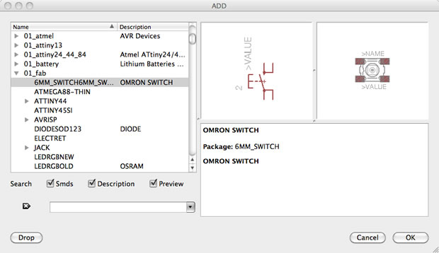

Click "0k" and then click on the schematic to place the component.

##### Add Grounds

##### 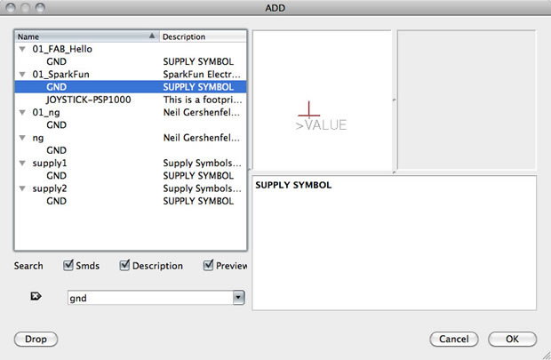

Click "0k" and then click on the schematic to place the component.

##### Add VCC (connection to power)

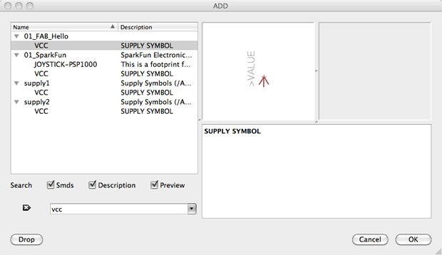

Click "0k" and then click on the schematic to place the component.

#### How to Connect the Components

##### There are two was to connect components in a schematic:

1.  You can connect the components with a wire (also called a "net" in Eagle). This may make connections obvious at first, but can get really messy quickly as nets cross over each other.
*   You can also name the nets attached to components that need to be connected by naming them with the same name. See example schematic above. Eagle will ask you if you want them to be connected. (Say yes!). **After you name the component - label it so the name appears in the diagram.**

  For example:
    *   All of the components in the schematic named GND are all connected to a common ground point.
    *   the button is connected to a net on the button component and a pin on the microcontroller.
3.  **Use pin 10 on the to connect to the button.**
5.  **Use pin 6 on the to connect to the LED.**

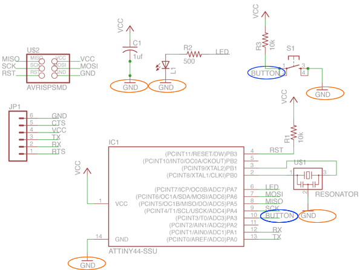

*   Next  to connect two components, NET -- NAME -- LABEL (so you'll need a  net on both the component itself and the microcontroller pin as well)

## Step 9: Route the Traces on the Board

*   Switch to the board view
    *   Go to the top menu > File > switch to board
    *   The board view will open up
    *   The components you just added will be jumbled up in a corner with yellow unrouted traces attached.

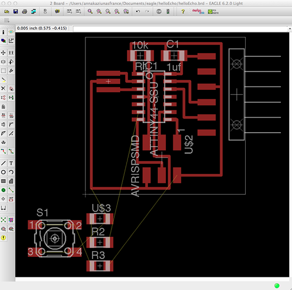
*   Use "move" to move each individual component around.
*   Use "route" to route each trace. The wire will turn red as you route it into place.
*   After you route wires, you can use the "move" tool to move them around as lines.
*   Route all the traces until it looks something like the diagram below.
*   There is also an autorouter feature - it is good for making a general layout, but you will probably have to edit the traces manually. Especially on this circuit.
*   to use the autorouter go to: the "tools" menu in the top toolbar and select "auto"
*   you can also type "auto"
*   It doesn't have to look exactly the same, there is more than one way to route the traces. Just use this as a guide.

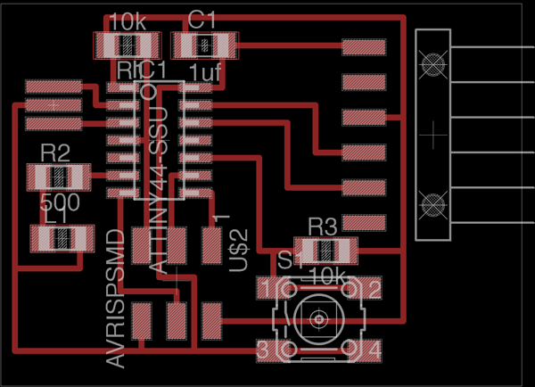

## Eagle Tips and Tricks

*   In free version of eagle, don't put anything below or to the left of the cross (origin) in either schematic or layout.
*   0 ohm resistor trick: place a 0 ohm resistor over a trace to hop over an existing trace
*   junction (symbol is a dot) can be useful when a net splits into  two different nets - indicates whether two nets that crossover are  connected or not...
*   under options you can change the background color of the schematic/layout (User Interfaces)
*   click on display to see the layers which you can show/hide
*   layout pieces in Layout - use right-click to rotate components

# Exporting a Board Design to be Used with Modela

##### To prep board for milling:

in layers menu in the top toolbar, select the only the top layer (traces only) 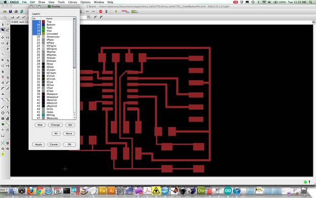

*   then export as a png (file -- export -- image)
*   settings should be MONOCHROME and 1000-1500 DPI - this will export a image with white traces.
*   Make sure the color mode is set to greyscale: image > mode > greyscale
*   then export Dimension layer for milling the outside of the board
*   Remember: the Modela cuts out the DARK and leaves white!

#### Exported PNG

You can also edit your board .pngs in the Gimp. I find that the text added in the Gimp can be bolder (heavier and thicker) and is less likely to tear off when milling the board.

#### Editing Board Files / Creating Traces and Mill-out Files.

*   Open up your board traces .png in The Gimp
*   Crop the file if necessary
*   Go to the "Modify" menu > Canvas > Canvas Size

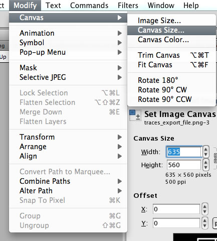

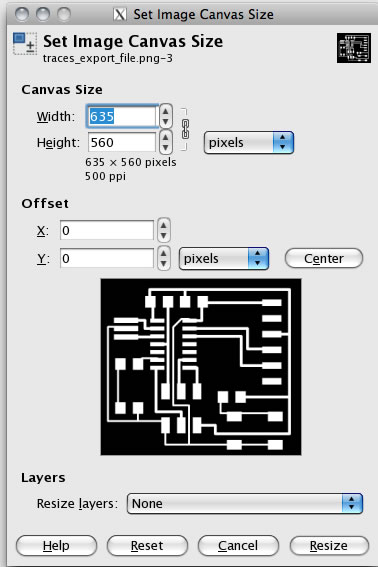

#### Add a White Border around the image

##### Create the Traces PNG

1.  Add 20px to the width (make sure the proportions are linked).
2.  After adding 20px, hit the "center" button to center the image on the resized canvas.
3.  Flatten the image - go to "Image" > flatten image
4.  You will now have a 20px white boarder around the board traces image.
5.  Save the file. This is the file you will use to mill the traces on the Modela.
6.  You can add white text or images if you like and they will be milled out along with the traces.

**Example Traces Board File **

This image is  not to scale.  This is on purpose! You need to create your own board files! If you mill these images below, the pad sizes will be incorrect.

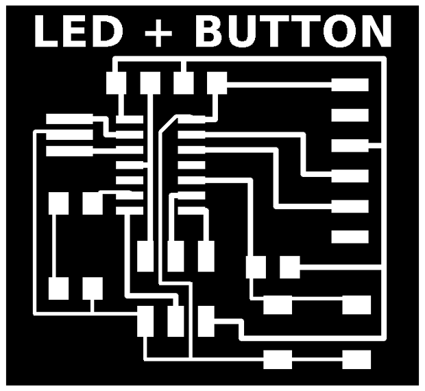

##### Create the Interior (mill out) PNG

1.  Start with the traces png that you have already created.
2.  Save the file with a different name.
3.  Use the bucket / fill tool to fill in the all the white spaces, EXCEPT the BORDER. Leave the white border around the image. This will be used to create the interior file for milling out the board. Using the traces image to start with ensures that your files are properly registered and you won't mill through your traces.
4.  Save the file. This is the file you will use to mill the traces on the Modela.

**Example Interior Board File **

This image is  not to scale.  This is on purpose! You need to create your own board files! If you mill these images below, the pad sizes will be incorrect.

# Additional Eagle Resources

## Where to Get the FTDI Headers

##### To find the surface mount FTDI:

*   You need the SparkFun Eagle Library - see "libraries" section above.
*   Click "add" (toolbar symbol or command line).
*   Search for "Header 6"
*   Click "OK"
*   Place the component.

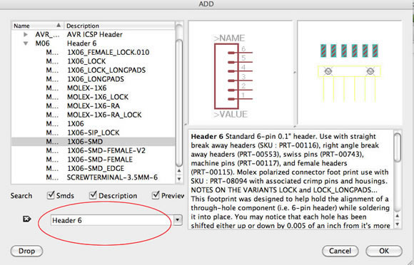

##### 1X06-SMD Board View:

##### 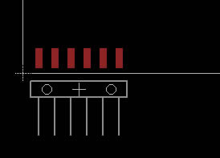

          Through Hole
          FTDI:

You can also use the through-hole component (you do not need to drill out the holes) and it will still work with the surface mount boards.

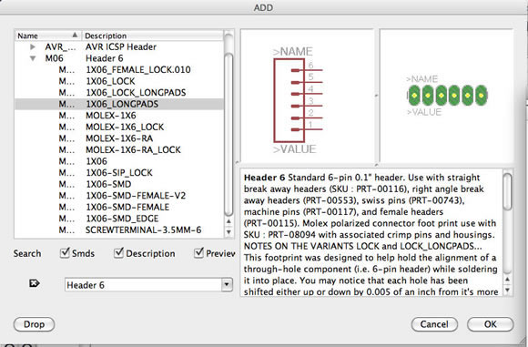

##### 1X06-LONGPADS Board View:

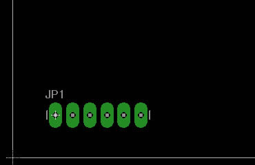

## Eagle Tutorial Links (extra info - not required)

[ATtiny 45 example       ](http://archive.fabacademy.org/archives/2016/fablabalaska/students/992/ElectronicsDesign.html)

[Guide to Eagle by academy student](http://archive.fabacademy.org/archives/2016/fablabkyushu/students/153/exercise06.html)

[Design Rules ](http://archive.fabacademy.org/archives/2016/fablabnanjing/students/203/)

[Common problems solutions](http://archive.fabacademy.org/archives/2016/fablabseoul/students/208/06.html)

[Beginner Tutorial](http://khammami.blogspot.com/2008/10/how-to-use-eagle-for-beginner.html)

[Create A Custom Library Part ](http://www.instructables.com/id/How-to-make-a-custom-library-part-in-Eagle-CAD-too/)

**Original tutorial by:**

* All content © 2013 [Anna Kaziunas France ](http://www.kaziunas.com/site/bio.html)(except where otherwise noted) Some rights reserved.

* Remixed to markdown by [Eduardo Chamorro](http://eduardochamorro.github.io/beansreels/index.html), Fab Lab Seoul 01.2017

Licensed under a [Creative Commons Attribution-NonCommercial-ShareAlike 3.0](https://creativecommons.org/licenses/by-nc-sa/3.0/) Unported License
