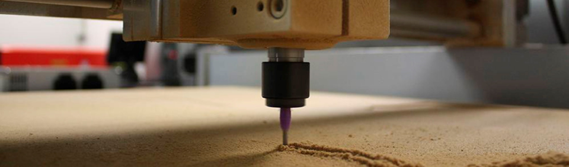
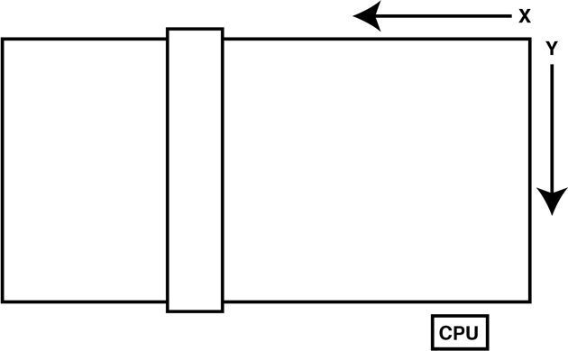
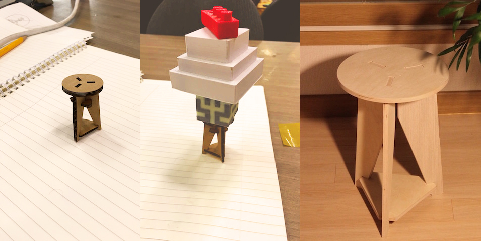
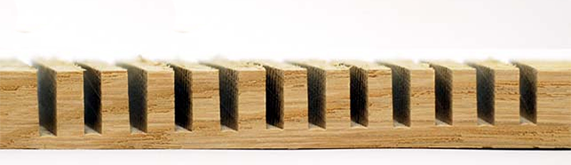
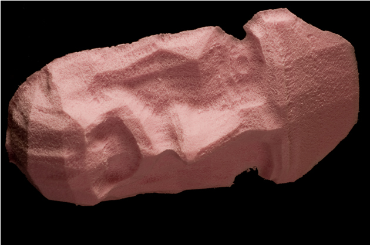

# "Do something Big" Tips

## Basic guide for using a big cnc router from A to Z

**Summary**
* What is it?
* How does it work?
* What materials can I use?
* Safety first
* Shopbot Specifications
* General rules
* Tested Values
* 2D Design *or 2.5D*
* 3D Design

### What is it?
A CNC router,* like the Shopbot* (computer numerically controlled)  is a machine that uses a cutting bit that rotates at a
very high speed to remove material from a part.

### How does it work?
The machine reads a pre‐programed computer file telling it where and how to cut. A cutting bit is
rotated at a very high RPM by a spindle motor, which can move the bit up and down. This mechanism is
moved left, right, front, and back by a cross arm. The machine is therefore known as a three‐axis router
because it can move on the XY & Z axis. The machine can do two dimensional cutouts and etching, as
well as three‐dimensional relief work.

### What materials can I use?
You can cut MDF, plywood, solid wood, foam,plastics and soft metals(like aluminium)
**As for learning we recommend to use plywood and foam**

>The thickness of the material should always be measured using a vernier caliper. Do not think that the material will have exactly the thickness that is specified.**It never does**

* Always try your joinery first and tolerances first before continue your design.

### Safety first

* Always remain with the machine while it is running, and be ready to hit the spacebar to pause the file, or
the stop button to stop the machine in case of an emergency.
* **Always wear eye protection** while the machine is running, and have long hair tied back.
* When changing the endmill,Disengage the spindle.
* Use the dust guard.
* No gloves
* *AIR CUT* to test your design first.
* Caution: Keep collets clean, a piece of debris or dust between the collet and bit can cause the bit to spin elliptically, harming bit, part or even operator.
>Your normal glasses are not safety glasses.[Check this video](https://www.youtube.com/watch?v=DXx_T6CEQ64)

### Shopbot Specifications

Most of you will use a large [Shobpot](http://www.shopbottools.com/mProducts/WhatsCNC.htm)to mill.(like the Modela)
Most of you will have a ShopBot PRSstandard96
The size of the bed of that ShopBot is 4 x 8 feet (or 48 x 96 inches)(2440x1220mm).

    1220mm of travel on the X axis
    2440mm travel feet on the y-axis
    152mm Z-axis travel (with one-inch cutter placed)
    Collet size ER25 for cutters

### General rules

A bit in good condition and running at recommended loads will be at room temperature when a cut is finished

**Chipload**

This is simply the thickness of a chip which is formed during the machining of material
* chip load: ~ 0.001-0.010" = feed rate (inches per minute) / (RPM x number of flutes)
* cut depth: ~ tool diameter
* step-over: ~ tool diameter/2

* **Too high chipload** will cause poor edge finish, and transfer cutting load or thrust to the part, possibly causing it to move.
*Characteristic loud sound when cutting*

* **Too low chipload**,the chip is too small, heat is transferred to the cutting tool causing premature bit failure.
*Characteristic sharp noise when cutting*

**Material placing**
* When you make your design, be sure to leave at least an inch(2-3cm) around the perimeter of the material. We will need to screw the material to the bed of the ShopBot and we do not want the cutter to hit the screws.
* The free space between the pieces will depend on the diameter of the cutter we use.(Tumbs up rule is to leave around 1 inch)
* Is better to hold to much than to less your material.

**File formats**

* 2D design
    * Svg
    * DXF (old format,like 2004)
    * AI  (old format,like AI8)
    * PDF

* 3D design
    * STL
    * OBJ

### Tested Values

[Guide for endmills](http://www.newwoodworker.com/updowncutbits.html)

All the values and parameters change depending on the materials and endmills used. So consider this as a guide to start from, not some *magic values*

**Plywood**
  * 2 Flutes Up cut
    - 12.000-14000rpm
    - Feed rate 180 inch/min
    - Plunge rate 90 inch/min
  * 1 Flutes Down cut
      - 16000rpm
      - Feed rate 80 inch/min
      - Plunge rate 40 inch/min
      - Pass depth 65%
  * 1 Flutes Straight
      - 14000rpm
      - Feed rate 100 inch/min
      - Plunge rate 40 inch/min
      - Pass depth 65%

**Foam**
* 2 Flutes Up cut
  - 15000rpm
  - Feed rate 240 inch/min
  - Plunge rate 120 inch/min
* 1 Flutes Straight
  - 18000rpm
  - Feed rate 250 inch/min
  - Plunge rate 100 inch/min
  - Pass depth 120%

**HDPE**
* 2 Flutes Up cut
  - 16000rpm
  - Feed rate 120 inch/min
  - Plunge rate 40 inch/min
  - Step down 65%

**Wax**
* 2 Flutes Up cut
  - 10000rpm
  - Feed rate 120 inch/min
  - Plunge rate 30 inch/min
  - Step down 65
  **Aluminium**
  * 2 Flutes Up cut
    - 12000rpm
    - Feed rate 10 mm/sec
    - Plunge rate 5 mm/sec
    - Step down 0.5mm

### 2D Design *or 2.5D*

**2D** design software can be used to create ShopBot files the same as those used for the laser cutter.
>If you want to make joints you have to be carefull of the [cnc kerf and design with T-bones or DogBones](http://makezine.com/projects/make-33/cnc-panel-joinery-2/)

As you can *most of times* use the same files in the laser is nice to scale down your model and do a test to see if it works nice.

**2.5D** is the kind of design/cut when we don't cut completely trough the material, like making a pocketing or fillets.

Then we can import the designs into any toolpath tool (like [fabmodules](http://fabmodules.org/)) to create files that we can cut into the ShopBot.

### 3D Design

You can use the 3D design software used in the corresponding practice (or any other software). **It takes much longer to mill three-dimensional designs than two-dimensional ones.**

In this case we need a two endmills

* Flat endmills
* Round endmills

#### Foam

It is faster to cut foam than wood because it offers less resistance and can be milled with a fast speed without breaking the cutter. In order to mill a 3D design it is advisable to use foam.

[More images of 3d cutting](http://blog.kaziunas.com/?p=4839)

### Chocolate

Difficult to get smooth result but tasty!

**Original tutorial by:**

* [Anna Kaziunas France](http://www.kaziunas.com/site/404.php)
| v1.0 | 2013

* Remixed and updated by [Eduardo Chamorro](http://eduardochamorro.github.io/beansreels/index.html), Fab Lab Seoul 01.2017

Licensed under a [Creative Commons Attribution-NonCommercial-ShareAlike 3.0](https://creativecommons.org/licenses/by-nc-sa/3.0/) Unported License
