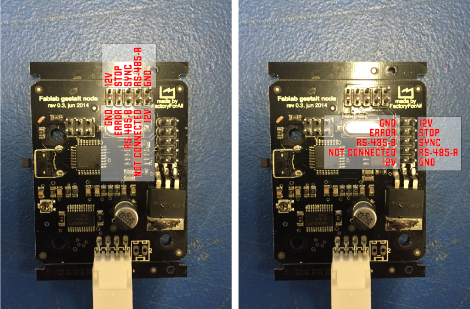
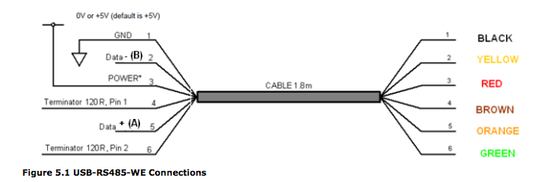
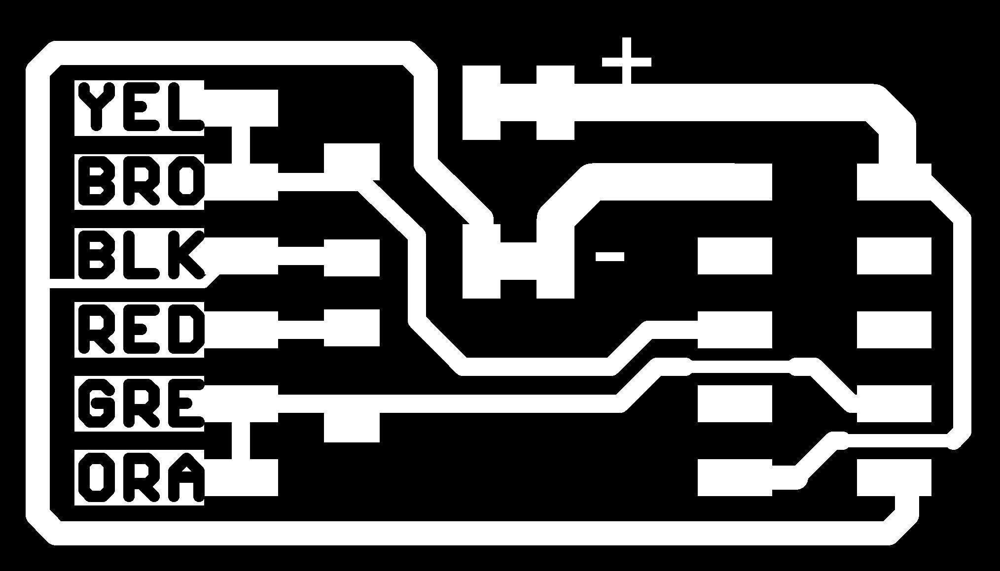
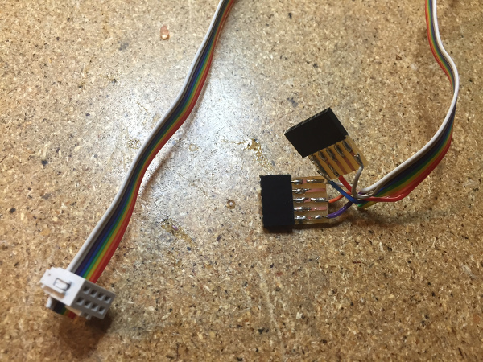

# Getting Started With Gestalt Nodes

Here's some context and some notes to help you get the Gestalt nodes up and running.

### Hooking It Up

The physical layer we're using here is called Fabnet ([described here](http://mtm.cba.mit.edu/fabinabox/dev/fabnet/overview.html)). Fabnet is essentially an RS-485 bus with a few additional signals. Fabnet has evolved a little bit since the web page above was published; the latest pinout for a Fabnet header looks like this:

The FTDI cable provided is a little different than the other FTDI cables we've been using; it is an RS-485 version. Here's its pinout for reference:

The first thing you need do is create a bridge board that adapts that cable to Fabnet. Download the board files from here:

[http://mtm.cba.mit.edu/fabinabox/dev/fabnet/files.html](http://mtm.cba.mit.edu/fabinabox/dev/fabnet/files.html)

This board will also provide power to the network. All of the nodes have a regulator and are getting power from the line marked "high" on the board. Nadya's notes mention that this should be 12V, which was determined by the specs of the stepper motors. In Providence we're just using our bench supply; make sure you have a supply that can provide at least a couple of amps.

The FTDI cable comes with bare wires on one side; solder them to the pads as labelled.

Oh, you'll also have to solder the provided 600 ohm pull up/down resistors as shown.

The header on the other side provides power, ground, and the A and B RS-485 signals (or plus and minus; RS-485 uses a differential voltage to help make noise matter less). Here's what those signals are on that header:

UPDATE: Here's a board from Bas that allows you to use a straight through ribbon cable.

You'll need to make one cable that connects from this header to the Fabnet header on the first node. Fabnet is a I think an earlier version of the Fab Lab inventory had 9 strand ribbon cable and connectors rather than the current 10 wires (Fabnet is a 2x5 header). Because we still have a giant roll of 9 wire ribbon cable, I made two little 5 pin adapters instead of using crimped connectors.

As noted in the instructions, this first cable is not the same on each side; you need to match up the signals according to the pinouts above. The other nodes are daisy chained together using a regular straight through ribbon cable. Double check your grounds and powers for shorts before powering up!

### Getting the Software Running

As per Nadya's instructions, download the pygestalt code from here:

[http://github.com/nadya/pygestalt](http://github.com/nadya/pygestalt)

Note that this is an update to the previous version of these instructions; this fork fixes an import error on macs.

Change to the directory and run setup.py to install:

        sudo python ./setup.py install

Now change into the directory examples/machines/htmaa. Look for the script singlenode.py to start with. On Linux it should work right out of the box. On the Mac you'll need to hardcode the name of your FTDI cable (they all have unique IDs when they enumerate). Type:

        ls /dev/tty.usb*

And copy the device name that looks something like:

        tty.usbserial-FTXW7FE2

(that's my cable.) Edit the line in singlenode.py:

        else: self.fabnet = interfaces.gestaltInterface('FABNET',
              interfaces.serialInterface(baudRate = 115200,
              interfaceType = 'ftdi', portName = '/dev/ttyUSB0'))

and change portName to whatever your potname is. Now power it up and type:

          python single_node.py

If you haven't installed Pyserial in previous classes you'll need to do that as well. Instructions [here.](https://learn.adafruit.com/arduino-lesson-17-email-sending-movement-detector/installing-python-and-pyserial)

**Should work!**

#### A few other notes and references:

*   Here is the source and hex file for the node firmware: [https://github.com/imoyer/086-005](https://github.com/imoyer/086-005)
*   Here's the link to the FTDI cable product page: [http://www.ftdichip.com/Products/Cables/USBRS485.htm](http://www.ftdichip.com/Products/Cables/USBRS485.htm) We have the USB-RS485-WE-1800-BT (1.8 meters) cable.
*   You'll need to [install ftdi drivers](http://www.ftdichip.com/Drivers/VCP.htm) if you haven't already.
*   GUI interface for Gestalt in wxPython: [https://github.com/openp2pdesign/wxGestalt](https://github.com/openp2pdesign/wxGestalt)

Licensed under a [Creative Commons Attribution-NonCommercial-ShareAlike 3.0 Unported License](http://creativecommons.org/licenses/by-nc-sa/3.0/)
